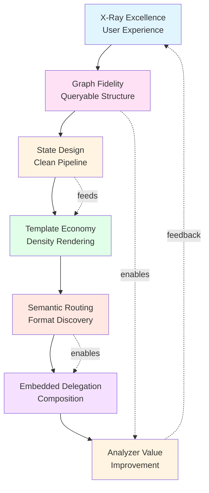
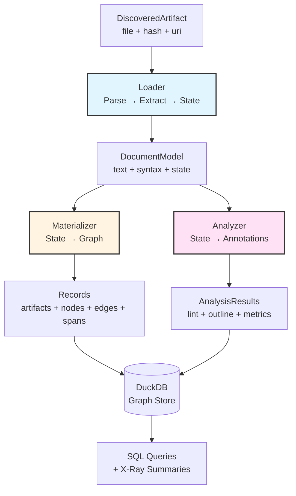

⟨CR-TAG:v1:7a2f⟩ Capsule: **FormatExcellence** 🎯 Meta
Format handlers ARE the repository's legibility—great ones make invisible structure queryable and eliminate context waste.
FormatExcellence

---

# Understanding Format Excellence

Format excellence in RepoQL means transforming domain-specific files into three artifacts that work in concert:

**X-ray summaries** answer questions without opening files.
**Graph projections** make implicit relationships explicit and queryable.
**Actionable annotations** surface problems agents can understand and often fix.

Excellence emerges when these three enable a specific exploration pattern: agents scan 100 headlines to understand what exists, read 20 summaries to filter, check 3 structures to see actual content, then read 1 full file—without opening files until the final step.

[🔷 Demonstrated]: Markdown format transforms ~50,000 token documents into: headline (1 line showing counts + metadata) → summary (< 15 lines with type and metrics) → structure (up to 25 actual heading names). This 100→20→3→1 pattern works because each level answers different questions: existence, relevance, content, detail.

The difference between adequate and excellent format handling is whether agents can answer their questions without context waste. Knowing "12 packages" is adequate. Showing `Newtonsoft.Json`, `Dapper`, `Serilog`... is excellent—the actual dependencies are visible without opening the file.

---

# The Seven Principles

These principles connect: X-ray shows what users experience, Graph makes it queryable, State keeps it clean, Templates create density, Routing enables discovery, Delegation handles nesting, Analyzers drive improvement. Each builds on what came before.

## 1. X-Ray Excellence 📡

Capsule: **XRayExcellence** 📡 Progressive
Progressive disclosure—headline/summary/structure—enables 100→20→3→1 exploration by answering different questions at each level.
XRayExcellence

⟨CR-TAG:v1:8b4d⟩ X-Ray = headline (1 line) → summary (< 25 lines) → structure (actual items)

### The Exploration Pattern

Agents exploring repositories need answers at different scales:

```
Headline   (1 line)     → Scan 100: "What exists? Is this what I need?"
Summary    (< 25 lines) → Filter 20: "Should I care? Key facts?"
Structure  (as needed)  → Check 3:  "What's actually in here?"
Read       (full)       → Dive 1:   "Full context"
```

Each level serves a purpose. Headlines enable rapid scanning—agents see 100 files in the context budget previously consumed by 2. Summaries provide decision gates—key facts that answer "is this relevant?" Structures answer questions that normally require opening files: "What projects are in this solution?", "What sections does this doc have?", "What does this depend on?"

### Crafting by Level

**Headline (1 line)**

Purpose: Instant recognition in lists.
Technique: Grep-friendly, symbolic density, counts not details.

```liquid
{# CsProj headline - actual implementation #}
{{ file_name }} | dotnet.csproj | {{ size_bytes | filesize }} | sdk:{{ sdk }} | output:{{ output_type }} | tfm:{{ tfm_text }} | packages:{{ package_count }} projrefs:{{ project_ref_count }}

{# Renders: PaymentService.csproj | dotnet.csproj | 4.2 KB | sdk:Microsoft.NET.Sdk | output:Library | tfm:net9.0 | packages:12 projrefs:3 #}
```

Use `|` not "and", `:` not "contains". Show counts (`pkgs: 12`) to reveal scale—save actual items for structure. Same input must produce same output (deterministic for caching).

**Summary (< 25 lines)**

Purpose: Decision making—"do I need this file?"
Technique: Key facts first, counts as context, top items inline when helpful.

```liquid
{# CsProj summary - actual implementation #}
Name: {{ file_name }}
SDK: {{ sdk }}
OutputType: {{ output_type }}
Pack: YesNo
TargetFrameworks: {{ t }}, 
Packages: {{ packages_text }}
ProjectRefs: {{ project_refs_text }}
```

Show 3-5 most important packages inline. Full list goes in structure. Focus on what makes this file unique among hundreds.

**Structure (actual items, not counts)**

Purpose: Answer common questions without opening file.
Technique: List actual items (headings, packages, classes), truncate intelligently.

```liquid
{# CsProj structure - actual implementation #}
Project
  SDK: {{ sdk }}
  OutputType: {{ output_type }} + pack
  TargetFrameworks:
    - {{ t }}
  PackageReference:
    - {{ line }}
    - [... more]
  ProjectReference:
    - {{ line }}

```

Show actual package names—all of them, up to 20-25 with truncation. "8 headings" is useless. Seeing `Introduction`, `Installation`, `API Reference`, `Troubleshooting` answers "what's in this doc?" without opening it.

### Worth Exploring

- What would make this file instantly recognizable among 100 others?
- Which key facts filter 100 files to 20 relevant ones?
- What questions require opening this file type?
- Can structure show actual items to answer those questions?
- When are counts useful vs seeing the actual list?

[🔷 Demonstrated]: CsProj achieves: headline shows identity + counts, summary shows top few packages inline, structure lists ALL package names (up to 20 each with truncation)—agents know exact dependencies without opening file.

[🔷 Demonstrated]: Markdown achieves: headline shows title + metadata + counts, summary provides type info, structure shows actual heading text (up to 25 in outline form)—agents see document organization without opening file.

<!--syn: progressive-disclosure exploration-pattern headline summary structure -->

---

## 2. Graph Fidelity 🕸️

Capsule: **GraphFidelity** 🕸️ Modeling
Nodes and edges must capture semantic structure—the relationships agents query—not syntactic artifacts.
GraphFidelity

X-ray shows what agents see. Graph makes it queryable. The test: "Would I query for this?"

### Semantic vs Syntactic

Formats contain both syntax (XML elements, AST nodes) and semantics (dependencies, structure, references). Graph excellent formats capture semantics.

```csharp
// GOOD: Semantic node kinds
Kind = "md_heading"
Props = { level: 2, text: "Getting Started", slug: "getting-started" }

// GOOD: Domain concepts
Kind = "nuget.package"
Props = { id: "Newtonsoft.Json", version: "13.0.3" }

// AVOID: Syntax artifacts
Kind = "xml.element"
Props = { tag: "PackageReference", attributes: [...] }
```

Agents search by section, check dependencies, analyze inheritance. They don't query for "elements" or "AST nodes".

### Edge Patterns

Relationships enable queries:

**HAS_PART**: Composition, single parent, ordinal preserves file order
  Document → Headings (ordinal = appearance)
  Solution → Projects
  Project → Packages

**REFERS_TO**: Cross-references, many-to-many
  Link → Heading (anchor resolution)
  Type → Type (references)

**DEPENDS_ON**: Dependency graphs
  Project → Package
  Project → Project

[🔶 Observed]: Markdown `REFERS_TO` edges from links to headings enable broken link detection via SQL traversal: `SELECT * FROM edge WHERE type='REFERS_TO' AND dst_id IS NULL`. No custom tooling needed.

[🔶 Observed]: Project `DEPENDS_ON` edges to packages enable repository-wide queries: "Which projects use Newtonsoft.Json?", "What depends on this internal library?"

### Span Precision

Every node visible in text needs a span:

- 1-based line numbers (StartLine, EndLine) for human display
- 0-based byte offsets (StartByte, EndByte) for programmatic slicing
- Column positions when available (enables inline ranges)

Spans enable precise annotations, navigation, and code actions.

### Worth Exploring

- What queries would agents run against this format?
- Which relationships enable those queries?
- What's implicit in syntax but should be explicit in graph?
- How does this compose with other formats via edges?

[🔶 Observed]: All implemented formats emit document node + composition children via HAS_PART. Cross-format edges (REFERS_TO, DEPENDS_ON) enable repository-wide queries that span file boundaries.

<!--syn: nodes edges spans semantic-modeling graph-projection -->

---

## 3. State Design 🗂️

Capsule: **StateDesign** 🗂️ Contract
Loader extracts facts into state object; Materializer and Analyzer consume it—State is the contract between pipeline stages.
StateDesign

⟨CR-TAG:v1:9c1a⟩ State = surface facts extracted once, consumed by materializer + analyzer

Graph fidelity requires clean extraction. State design keeps the pipeline clean.

### The Pattern

```csharp
// Loader: Parse → Extract → Store
public async Task<DocumentModel> LoadAsync(DiscoveredArtifact artifact, ...)
{
    var text = await ReadTextAsync(artifact.File);
    var parsed = ParseFormat(text);  // Markdig, XDocument, etc.

    var state = new FormatState
    {
        Digest = artifact.Hash,
        Size = artifact.File.Length,
        MediaType = artifact.MediaType,
        StoreUri = artifact.RepoUri.ToString(),

        // Surface facts extracted from parsed structure
        Items = ExtractItems(parsed),
        Relationships = ExtractRelationships(parsed)
    };

    return new DocumentModel(
        artifact.RepoUri,
        state.MediaType,
        text,
        syntaxTree: parsed,  // Available but not required
        metadata: new() { [StateKey] = state }
    );
}

// Materializer: State → Graph
public Records Materialize(DocumentModel document)
{
    var state = document.GetMetadataOrDefault<FormatState>(StateKey);
    // Build nodes/edges/spans from state
}

// Analyzer: State → Annotations
public async IAsyncEnumerable<AnalysisResult> AnalyzeAsync(...)
{
    var state = document.GetMetadataOrDefault<FormatState>(StateKey);
    // Validate relationships, emit results
}
```

Parse once, use twice. Materializer builds graph, Analyzer validates—both from same state.

### State Principles

**Surface only**: Facts visible in format, not derived insights
**Serializable**: Plain objects, no syntax tree references
**Sufficient**: Enables both materialization and analysis
**Minimal**: Don't duplicate DocumentModel.Text
**Immutable**: Never changes after construction

[🔶 Observed]: MarkdownDocumentState stores headings (level, text, slug, span), links (href, span), code blocks (language, span). CsProjState stores SDK, frameworks, packages (id, version, line), refs (include, line). Both separate parsing (syntax tree) from extracted facts (state).

### Worth Exploring

- What facts must both materializer and analyzer access?
- What can be computed once and reused?
- What's the smallest state enabling all downstream operations?
- Could this state be cached for incremental indexing?

<!--syn: intermediate-state pipeline-contract loader-materializer-analyzer -->

---

## 4. Template Economy 💎

Capsule: **TemplateEconomy** 💎 Density
Every character in X-ray templates must earn its place—density without obscurity.
TemplateEconomy

State provides facts. Templates create density. X-ray's power comes from information economy.

### Density Techniques

**Symbols over words**

```liquid
{# GOOD: 50 chars #}
{{ file_name }} | {{ media_kind }} | {{ size_bytes | filesize }} | {{ headings_count }} headings

{# AVOID: 95 chars #}
File name: {{ file_name }}, Type: {{ media_kind }}, Size: {{ size_bytes | filesize }}, Contains {{ headings_count }} headings
```

**Conditional compactness**

```liquid
{# GOOD: inline #}
 | lang: {{ top_lang }}

{# AVOID: multiline with labels #}

Primary language: {{ top_lang }}

```

**Smart truncation**

```liquid
{# Show first 20, indicate if more #}
  - {{ line }}
  - [... {{ package_count | minus: 20 }} more]

```

**Leverage filters**

```liquid
{{ size_bytes | filesize }}           {# → "4.2 KB" #}
{{ tfms | join: ';' }}                {# → "net8.0;net9.0" #}
{{ topics | slice: 0, 3 | join: ', ' }} {# → "Auth, Token, Refresh" #}
```

### Template Purposes

**headline.liquid**: ONE line, grep-friendly, scannable
**summary.liquid**: < 25 lines, key facts, filter-enabling
**structure.liquid**: Actual items, hierarchical, question-answering

[🔷 Demonstrated]: Markdown headline template uses 1 line for title + filename + size + lang + tags + topics. CsProj uses 1 line for name + SDK + output + tfms + package/ref counts. Both achieve instant recognition without verbosity.

### Worth Exploring

- Can you remove a word without losing meaning?
- Are symbols immediately understood or cryptic?
- Does structure preserve hierarchy visually?
- Would this survive 80-char terminal width?

<!--syn: liquid-templates x-ray-rendering information-density -->

---

## 5. Semantic Routing 🎯

Capsule: **SemanticRouting** 🎯 Discovery
Media types and labels create bidirectional resolution: format → handler, label → format.
SemanticRouting

⟨CR-TAG:v1:a5e7⟩ MediaType = storage identifier; Labels = embedded lookup

Templates render X-ray. Routing determines which format handles which file.

### The Routing Contract

```csharp
// Media type: Primary identifier (stored in DB)
SemanticMediaType.Create("text", "markdown").WithKind("markdown.doc")
SemanticMediaType.Create("text", "xml").WithKind("dotnet.csproj")
SemanticMediaType.Create("application", "graphql").WithKind("graphql.schema")

// Labels: Secondary identifiers (for embedded lookups)
FormatDescriptor(
    loader, materializer, analyzer,
    mediaType,
    labels: ["markdown", "md"]  // ```markdown code fence
)
```

Media types persist in DB. Labels enable embedded format resolution (Markdown code blocks).

### Media Type Design

**Base**: Standard MIME (`text/markdown`, `text/xml`, `application/json`)
**Kind**: Domain semantic (`markdown.doc`, `dotnet.csproj`, `openapi.v3`)
**Version**: When representation changes (`version=3.1`)

### Label Design

Lowercase, no special chars. Common abbreviations (`md`, `gql`, `cs`). Match community conventions (code fence languages).

### Detection Priority

1. File extension (fast): `.md` → `text/markdown;kind=markdown.doc`
2. Media type hint (if classifier provides)
3. Content sniffing (peek): `---` or `#` → markdown

[🔶 Observed]: Markdown uses `text/markdown;kind=markdown.doc` with labels `["markdown", "md"]`. CsProj uses `text/xml;kind=dotnet.csproj` with `["csproj"]`. GraphQL uses `application/graphql;kind=graphql.schema` with `["graphql", "gql"]`.

### Worth Exploring

- What media type best represents format semantics?
- Which labels would users naturally type in fences?
- Can detection avoid full parsing?
- How does this coexist with similar formats?

<!--syn: media-types semtype labels format-detection -->

---

## 6. Embedded Delegation 🪆

Capsule: **EmbeddedDelegation** 🪆 Composition
When formats nest (Markdown code blocks), delegate analysis to child format and remap results to parent coordinates.
EmbeddedDelegation

Routing enables discovery. Delegation handles nesting. Formats compose.

### The Pattern

```csharp
// Parent analyzer detects embedded fragments
public async IAsyncEnumerable<AnalysisResult> AnalyzeAsync(...)
{
    var state = document.GetMetadataOrDefault<MarkdownState>(StateKey);

    foreach (var codeBlock in state.CodeBlocks)
    {
        // Resolve child format via label (routing)
        if (!context.Formats.TryResolveByLabel(codeBlock.Language, out var descriptor))
            continue;

        // Create fragment with parent context
        var fragment = new EmbeddedFragment(
            parentUri: document.Uri,
            label: codeBlock.Language,
            mediaType: descriptor.MediaType,
            text: ExtractText(codeBlock),
            offsetInParent: codeBlock.StartChar,
            parentNodeId: codeBlock.NodeId,
            parentSpanId: codeBlock.SpanId
        );

        // Delegate to child analyzer
        await foreach (var result in descriptor.Analyzer.AnalyzeEmbeddedAsync(fragment, context, ...))
        {
            // Remap spans to parent coordinates
            yield return RemapResult(document, fragment, result);
        }
    }
}
```

Child format analyzes in isolation. Parent remaps coordinates. Annotations target parent document.

### Remapping

**Spans**: child offsets + fragment.offsetInParent → parent offsets
**Target**: Always parent URI (annotations on containers)
**SemanticKey**: Prefix `embed:` to avoid collisions
**Fixes**: Translate replacement regions to parent coordinates

[🔷 Demonstrated]: MarkdownAnalyzer detects fenced code blocks, resolves format by label (`graphql`, `mermaid`), creates EmbeddedFragment, delegates to child analyzer, remaps results to parent Markdown document. GraphQL schemas in docs get linted without standalone `.graphql` files.

### Worth Exploring

- Which formats commonly nest in yours?
- Can child format run without compilation context?
- What parent context must child receive?
- How do fixes apply—edit parent or extract/edit/reinject?

<!--syn: embedded-fragments code-fences nested-formats -->

---

## 7. Analyzer Value 🔍

Capsule: **AnalyzerValue** 🔍 Problems
Lint rules should solve problems agents can act on—broken references, security risks, consistency violations—not cosmetic preferences.
AnalyzerValue

⟨CR-TAG:v1:b8f3⟩ Analyzers solve real problems agents can act on, respect settings

Delegation enables composition. Analyzers drive improvement. Excellence means actionable value.

### High-Value Rules

**Broken references**: Links to missing anchors, imports to missing files
**Security risks**: Unpinned dependencies, exposed secrets
**Consistency violations**: Duplicate IDs, conflicting declarations
**Accessibility gaps**: Missing alt text, unlabeled fields
**Performance hazards**: Large inline data, inefficient queries

### Low-Value Rules (avoid)

Style preferences (spacing, capitalization), language flamewars (tabs vs spaces), formatter territory (prettier handles these).

### Implementation

```csharp
public async IAsyncEnumerable<AnalysisResult> AnalyzeAsync(...)
{
    var state = document.GetMetadataOrDefault<MarkdownState>(StateKey);

    // Respect .editorconfig
    var ruleSettings = context.Settings.GetRule("markdown/broken-link");
    if (ruleSettings.Severity == AnalysisSeverity.None)
        yield break;

    foreach (var link in state.Links)
    {
        if (link.Href.StartsWith('#'))
        {
            // Validate local anchor
            if (!localSlugs.Contains(slug))
            {
                yield return new AnalysisResult
                {
                    SemanticKey = $"{document.Uri}#rule:markdown/broken-link@node:{link.NodeId}",
                    RuleId = "markdown/broken-link",
                    Source = "RepoQL.Markdown",
                    Kind = "lint",
                    Severity = ruleSettings.Severity,
                    Message = $"Anchor '#{slug}' not found",
                    Data = new JsonObject { ["href"] = link.Href },
                    Target = new AnalysisTarget
                    {
                        NodeId = link.NodeId,
                        SpanId = link.SpanId,
                        TargetUri = document.Uri
                    }
                };
            }
        }
        else
        {
            // Cross-document validation via workspace
            var targetDoc = await context.Workspace.LoadAsync(targetUri, ...);
            // Validate target exists and has anchor...
        }
    }
}
```

### Principles

**Respect .editorconfig**: Honor severity overrides (`none` disables)
**Provide context**: Data field explains problem
**Enable fixes**: Include AnalysisFix when automatable
**Use workspace**: Validate cross-file references
**Deterministic keys**: `{uri}#rule:{ruleId}@{discriminator}` for idempotent upserts

[🔶 Observed]: `markdown/broken-link` validates local and cross-document anchors. `csproj/unpinned-package` flags security risks. Both respect .editorconfig, include diagnostic data, emit deterministic keys.

### Worth Exploring

- What breaks at scale that's invisible in single files?
- Which problems can agents auto-fix vs need judgment?
- What cross-format validations become possible via graph?
- How can rules compose (one's output → another's input)?

<!--syn: lint-rules analysis-results editorconfig workspace-validation -->

---

# How the Principles Connect



---

# The Format Pipeline



**Pipeline Guarantees**

**Idempotent**: Same input → same output (deterministic X-ray, stable keys)
**Isolated**: Each format independent, composed via edges
**Incremental-ready**: State design enables future caching
**Fail-graceful**: X-ray errors don't block indexing (fields = null)

---

# Building Format Handlers

When building, explore these questions at each stage.

## Before You Start

- What makes this format valuable to query?
- What implicit structure should become explicit?
- What problems occur at scale that agents could catch?
- How does this format relate to others in typical repositories?

## During Design

- What's the 1-line headline that distinguishes this among 100?
- Which key facts filter 100 files to 20 relevant ones?
- What questions require opening this file type?
- What are the actual items people need to see (not just count)?
- What nests inside this format (or contains it)?
- Where are the boundaries—definitely in scope vs out?

## During Implementation

- Can state be serialized without syntax tree references?
- Do templates achieve density without cryptic abbreviations?
- Are node kinds query-worthy or syntax artifacts?
- Does the analyzer solve problems or enforce style?

## During Review

- Does X-ray enable 100→20→3→1 exploration?
- Can agents scan 100 headlines to understand what exists?
- Do summaries provide enough info to filter?
- Does structure show actual items (headings, packages, classes)?
- Can common questions be answered without opening files?
- Can agents query for relationships, not just nodes?
- Do annotations provide enough context to fix?
- Would this compose well with 50 other formats?

---

# Patterns from the Field

What we've learned building Markdown, CsProj, Sln, GraphQL, and Mermaid formats.

## What Works

### From Markdown

[🔷 Demonstrated] **Embedded delegation works seamlessly**: Fenced code blocks delegate to GraphQL, Mermaid, any registered format. Child results remap to parent coordinates transparently.

[🔷 Demonstrated] **Anchor resolution is graph-native**: REFERS_TO edges from links to headings enable broken link detection via SQL traversal: `SELECT * FROM edge WHERE type='REFERS_TO' AND dst_id IS NULL`. No custom tooling.

[🔷 Demonstrated] **Frontmatter enriches X-ray**: YAML metadata (title, tags, topics) makes headlines more informative and summaries more complete. 1 line can carry 15+ discrete facts.

### From .NET Projects

[🔶 Observed] **Package graphs span repositories**: DEPENDS_ON edges from projects to packages enable security scanning ("which projects use vulnerable package?"), license auditing, update planning across entire codebases.

[🔶 Observed] **Target frameworks drive compatibility**: Multi-targeting (`net8.0;net9.0`) becomes queryable, enabling "which projects can't upgrade yet?" analysis without opening files.

[🔶 Observed] **Project references form DAGs**: HAS_PART edges from solutions to projects + DEPENDS_ON edges between projects reveal build order, circular dependencies, architectural layers via SQL graph traversal.

### From GraphQL

[🔶 Observed] **Schema as graph is natural**: GraphQL types → nodes, field arguments → edges captures semantics perfectly. Queries like "which types reference User?" become trivial: `SELECT * FROM node WHERE kind='graphql.type' AND ...`.

[🔶 Observed] **Deprecation tracking**: @deprecated directives become annotations, enabling "what breaks if we remove this?" queries by joining annotations with edge traversal.

### From Solution Files

[🔶 Observed] **Virtual structure matters**: Solution folders (purely organizational, not filesystem) become nodes because humans query by them ("what's in /tests folder?"). Semantic organization worth capturing even when not physical.

[🟡 Derived] **Nested project mappings**: NestedProjects section creates hierarchy beyond filesystem. This semantic organization enables queries physical structure can't answer.

## What Doesn't Work

❌ **Syntax-driven node kinds**: Creating nodes for every AST element produces graph noise. Model semantics (concepts agents query) not syntax (parser artifacts).

❌ **Template verbosity**: Early templates used full sentences. Token explosion. Symbols + counts + abbreviations achieve 70% reduction without losing clarity.

❌ **Duplicate parsing**: Re-parsing text in materializer when loader already parsed it. State design eliminates: parse once, extract facts, both materializer and analyzer consume state.

❌ **Ignored .editorconfig**: Hard-coded severities frustrate users. Always respect settings. `severity = none` must disable rules.

❌ **Cosmetic lint rules**: "Use double quotes" rules don't solve problems, just bikeshed. Focus on broken references (fixable), security (actionable), consistency (verifiable), accessibility (measurable).

---

# Connections

This understanding connects to:

- [Vision](../Vision.md) - X-ray vision and progressive disclosure concepts
- [Schema](../Schema.md) - Node kinds, edge types, span representation
- [Design Ethos](../DesignEthos.md) - Agent-first, intuitive, convenient principles
- [XRay](../XRay.md) - The 100→20→3→1 exploration pattern
- [Vocabulary](../Vocabulary.md) - Node kind registry, edge type conventions
- [Implementation Process](../processes/implementation-process.md) - Craftsmanship approach
- [Writing Capsules](./writing-capsules.md) - Token-optimized documentation patterns

---

# Questions Still Open

What we're still discovering:

**Cross-format composition**: How do formats negotiate shared concepts? When .csproj references .cs file, should edges cross format boundaries? Who owns the relationship?

**Incremental precision**: Which state facts enable efficient incremental indexing without re-parsing unchanged sections? Can state diffs drive updates?

**Temporal analysis**: Should formats capture change history (git blame) or focus purely on current state? When does time matter vs complicate?

**Semantic versioning**: When format representations evolve, how do we migrate existing graphs? Version in media type? Separate migration path?

**Performance boundaries**: At what repository size do current patterns need optimization? When does parse-once-use-many become parse-once-cache-forever?

---

# ☑ Format Excellence Checksums

☑ **X-Ray enables 100→20→3→1 exploration** - headline (1 line) → summary (< 25 lines) → structure (actual items) → read (1 file)

☑ **Nodes model semantics not syntax** - graph captures what agents query (dependencies, structure), not parsing artifacts (XML elements, AST nodes)

☑ **State is surface facts extracted once** - loader creates, materializer and analyzer consume, no duplicate parsing

☑ **Templates maximize information density** - symbols over words, counts in headline, actual items in structure, every character earns its place

☑ **Media types route precisely** - storage via semantic media type (`dotnet.csproj`), embedded via labels (`["graphql", "gql"]`)

☑ **Delegation handles nesting** - child formats analyze, parent remaps, annotations target containers, composition works transparently

☑ **Analyzers solve real problems** - broken references, security risks, consistency violations, accessibility gaps—not style bikeshedding

☑ **Pipeline is idempotent** - same input → same graph, deterministic semantic keys, cacheable state, fail-graceful errors

---

*Format handlers are where repository semantics become queryable structure. Excellence emerges when X-ray, graph, and annotations work in concert—when the invisible becomes legible, the implicit becomes explicit, and agents can answer their questions without context waste.*
