# Mermaid Diagram Guide

**Purpose**: Create information-dense, accessible diagrams that enhance understanding

**Core Principle**: Diagrams reveal relationships that prose cannot express efficiently. If a list or table works, use that instead.

---

## Table of Contents

1. [When to Use Diagrams](#when-to-use-diagrams)
2. [Universal Rules](#universal-rules)
3. [Choosing the Right Diagram Type](#choosing-the-right-diagram-type)
4. [Diagram Type Reference](#diagram-type-reference)
5. [Color and Accessibility](#color-and-accessibility)
6. [Validation Checklist](#validation-checklist)
7. [Summary](#summary)

---

## When to Use Diagrams

### The Decision Test

**Ask these questions before creating a diagram**:

1. **Does it show relationships?** If no relationships, use a table or list.
2. **Are there branches or decisions?** If linear (A→B→C→D), use a numbered list.
3. **Would prose be clearer?** Simple things don't need diagrams.
4. **Is it scannable in 10 seconds?** Complex diagrams waste time.

### Value Proposition

**Good diagrams**:
- Reveal patterns instantly (architecture, flows, relationships)
- Show multiple dimensions simultaneously (actors, time, state)
- Make complex systems comprehensible
- Enable pattern recognition

**Bad diagrams**:
- Waste tokens on information better shown in lists
- Confuse readers with unnecessary complexity
- Look impressive but convey little
- Require more time to understand than prose

---

## Universal Rules

### Rule 1: NEVER Diagram Linear Sequences

This is the cardinal rule that must never be violated.

❌ **NEVER do this**:

```mermaid
graph LR
    A[Step 1] --> B[Step 2] --> C[Step 3] --> D[Step 4]
```

✅ **Always use list**:
```markdown
1. Step 1
2. Step 2
3. Step 3
4. Step 4
```

**Test**: If there are no branches, decisions, or parallel paths → use a list, not a diagram.

### Rule 2: Escape All Labels with Spaces

**Critical**: Labels containing spaces MUST be quoted or rendering breaks.

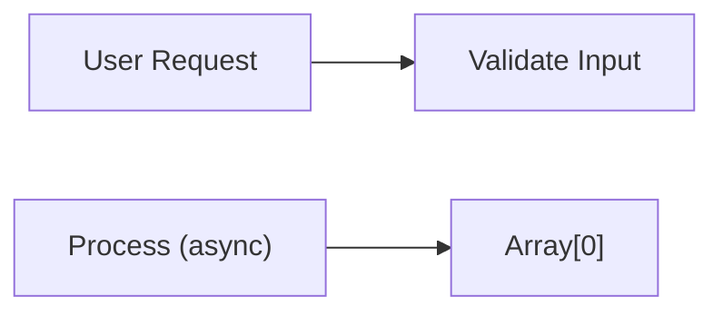
```mermaid
graph LR
    A["User Request"] --> B["Validate Input"]
    C["Process (async)"] --> D["Array[0]"]

    %% CRITICAL: Quotes required for spaces and special characters
```

**Characters requiring quotes**:
- Spaces: `"User Request"`
- Parentheses: `"Process (async)"`
- Brackets: `"Array[0]"`
- Colons: `"Key: Value"`
- Commas: `"Name, Inc"`

### Rule 3: Add Meaning Comments

**Pattern**: Use `%%` to explain non-obvious aspects for AI agents and future maintainers

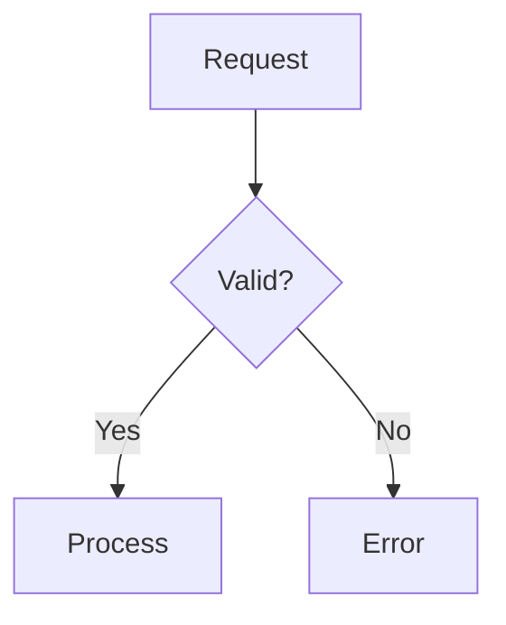
```mermaid
graph TD
    Request["Request"] --> Valid{Valid?}
    Valid -->|Yes| Process["Process"]
    Valid -->|No| Error["Error"]

    %% MEANING: Request validation and processing flow
    %% TIMING: Validation happens synchronously before processing
    %% GOTCHA: Retries not shown for clarity
    %% COLOR: Green = success, Red = error
```

**Essential comments**:
- **MEANING**: What the diagram represents
- **TIMING**: When things happen (sync/async/sequential)
- **GOTCHA**: Edge cases omitted for clarity
- **COLOR**: What colors signify (always explain color usage)
- **NAVIGATION**: How to read the diagram

---

## Choosing the Right Diagram Type

### Decision Tree

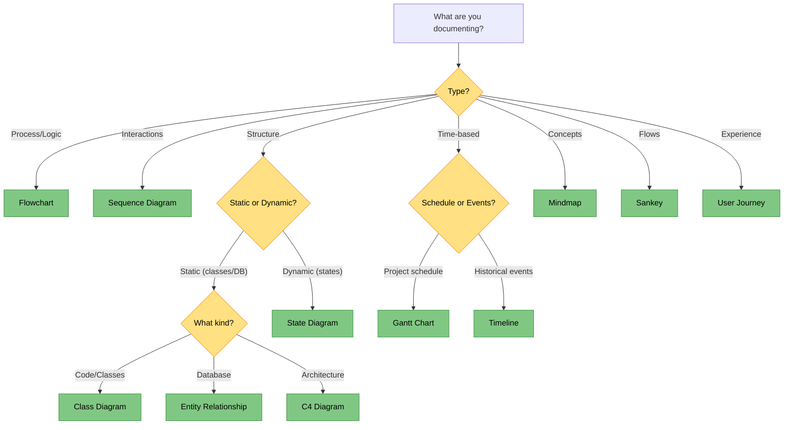
```mermaid
graph TD
    Start["What are you documenting?"] --> Type{Type?}

    Type -->|"Process/Logic"| Flow["Flowchart"]
    Type -->|"Interactions"| Seq["Sequence Diagram"]
    Type -->|"Structure"| Struct{Static or Dynamic?}
    Type -->|"Time-based"| Time{Schedule or Events?}
    Type -->|"Concepts"| Mind["Mindmap"]
    Type -->|"Flows"| Sankey["Sankey"]
    Type -->|"Experience"| Journey["User Journey"]

    Struct -->|"Static (classes/DB)"| StaticChoice{What kind?}
    Struct -->|"Dynamic (states)"| State["State Diagram"]

    StaticChoice -->|"Code/Classes"| Class["Class Diagram"]
    StaticChoice -->|"Database"| ER["Entity Relationship"]
    StaticChoice -->|"Architecture"| C4["C4 Diagram"]

    Time -->|"Project schedule"| Gantt["Gantt Chart"]
    Time -->|"Historical events"| Timeline["Timeline"]

    classDef decisionNode fill:#FFE082,stroke:#F57C00,color:#000
    classDef diagramType fill:#81C784,stroke:#388E3C,color:#000

    class Type,Struct,Time,StaticChoice decisionNode
    class Flow,Seq,State,Class,ER,Gantt,Timeline,Mind,Sankey,Journey,C4 diagramType

    %% MEANING: Yellow = decision points, Green = diagram types to use
    %% NAVIGATION: Follow arrows by answering questions
    %% TIP: If none fit, use list or table instead
```

### Quick Reference Matrix

| Need | Use | Avoid |
|------|-----|-------|
| Process with branches/decisions | Flowchart | Linear sequences |
| Multi-party interactions over time | Sequence | Single function calls |
| State transitions | State diagram | One-way workflows |
| Class hierarchy | Class diagram | Database schema |
| Database schema | ER diagram | Code classes |
| Software architecture levels | C4 diagram | Data flows |
| Project schedule with dependencies | Gantt | Historical events |
| Historical events/releases | Timeline | Future planning |
| Concept hierarchy | Mindmap | Workflows |
| Prioritization (2 dimensions) | Quadrant chart | >2 dimensions |
| Performance/trend data | XY chart | Conceptual data |
| Quantity flows/transformations | Sankey | Circular flows |
| Customer experience | User Journey | Technical architecture |
| Git branching strategy | GitGraph | Non-git workflows |
| Proportions (≤7 categories) | Pie chart | Trends over time |

---

## Diagram Type Reference

### Flowchart

**Use for**: Processes with branches, decision trees, algorithms

**Don't use for**: Linear sequences (use list), simple hierarchies

**Example**:
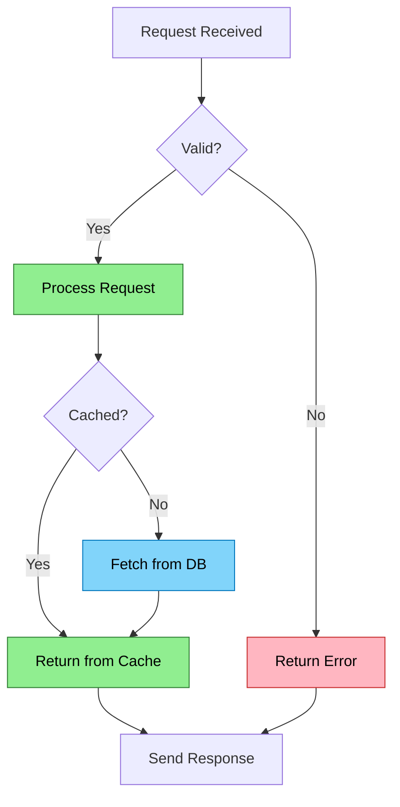
```mermaid
flowchart TD
    Start["Request Received"] --> Validate{Valid?}
    Validate -->|Yes| Process["Process Request"]:::success
    Validate -->|No| Error["Return Error"]:::error

    Process --> Cache{Cached?}
    Cache -->|Yes| Return["Return from Cache"]:::success
    Cache -->|No| Fetch["Fetch from DB"]:::info

    Fetch --> Return
    Return --> End["Send Response"]
    Error --> End

    classDef success fill:#90EE90,stroke:#2E7D32,color:#000
    classDef error fill:#FFB6C1,stroke:#C62828,color:#000
    classDef info fill:#81D4FA,stroke:#0277BD,color:#000

    %% MEANING: Request processing with validation and caching logic
    %% COLOR: Green = success paths, Red = error paths, Blue = data operations
    %% DECISIONS: Diamond shapes indicate branching logic
```

**Value**: Shows all possible paths through logic including error handling.

**Best practices**:
- Use diamonds `{}` for decisions (visually distinct)
- Color-code paths (success/error/info)
- Keep to ≤12 nodes (split complex flows)
- Label edges with conditions `|Yes|` `|No|`

**Advanced: Group-Level Relationships**

When many nodes share a relationship, use subgraphs to represent at group level:

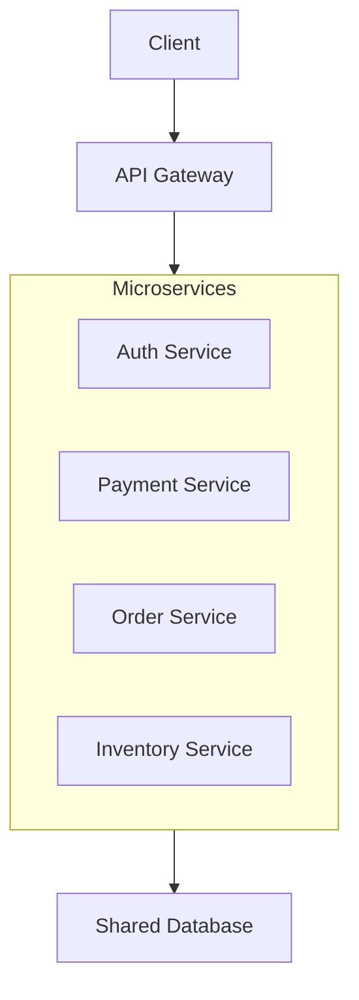
```mermaid
flowchart TD
    Client["Client"] --> Gateway["API Gateway"]

    Gateway --> Services

    subgraph Services["Microservices"]
        Auth["Auth Service"]
        Payment["Payment Service"]
        Orders["Order Service"]
        Inventory["Inventory Service"]
    end

    Services --> Database["Shared Database"]

    %% ADVANCED: Gateway → Services shows relationship to entire group
    %% CLARITY: 1 arrow instead of 4 arrows to individual services
    %% VALUE: Reduces visual complexity dramatically
```

**Common mistakes**:
- ❌ Using for linear sequences (cardinal sin)
- ❌ Too many nodes (>15)
- ❌ Unclear decision conditions
- ❌ Missing error paths

---

### Sequence Diagram

**Use for**: Multi-party interactions, API calls, protocol flows, message exchanges

**Don't use for**: Single function execution, linear workflows

**Example**:
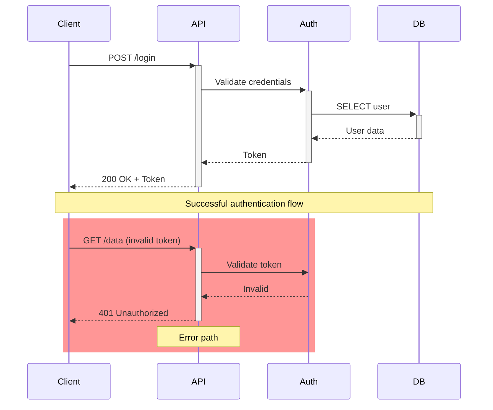
```mermaid
sequenceDiagram
    participant Client
    participant API
    participant Auth
    participant DB

    Client->>+API: POST /login
    API->>+Auth: Validate credentials
    Auth->>+DB: SELECT user
    DB-->>-Auth: User data
    Auth-->>-API: Token
    API-->>-Client: 200 OK + Token

    Note over Client,DB: Successful authentication flow

    rect rgb(255, 150, 150)
        Client->>+API: GET /data (invalid token)
        API->>Auth: Validate token
        Auth-->>API: Invalid
        API-->>-Client: 401 Unauthorized
        Note over API: Error path
    end

    %% MEANING: Authentication flow with success and error paths
    %% SYMBOLS: ->> = synchronous, -->> = response, +/- = activation
    %% RECT: Coral/salmon highlight shows error scenario (readable in both modes)
    %% VALUE: Reveals timing and dependencies between services
```

**Value**: Shows temporal ordering and service dependencies. Critical for distributed systems.

**Best practices**:
- Use `rect` to highlight error/alternate scenarios
- Activation boxes (`+`/`-`) show active processing
- Notes for context at key points
- Keep to ≤6 participants

**Common mistakes**:
- ❌ Using for single-function call chain
- ❌ Too many participants (>6)
- ❌ Missing return arrows
- ❌ No error scenarios shown

---

### State Diagram

**Use for**: Lifecycle management, status transitions, state machines

**Don't use for**: Static structure, one-time processes

**Example**:
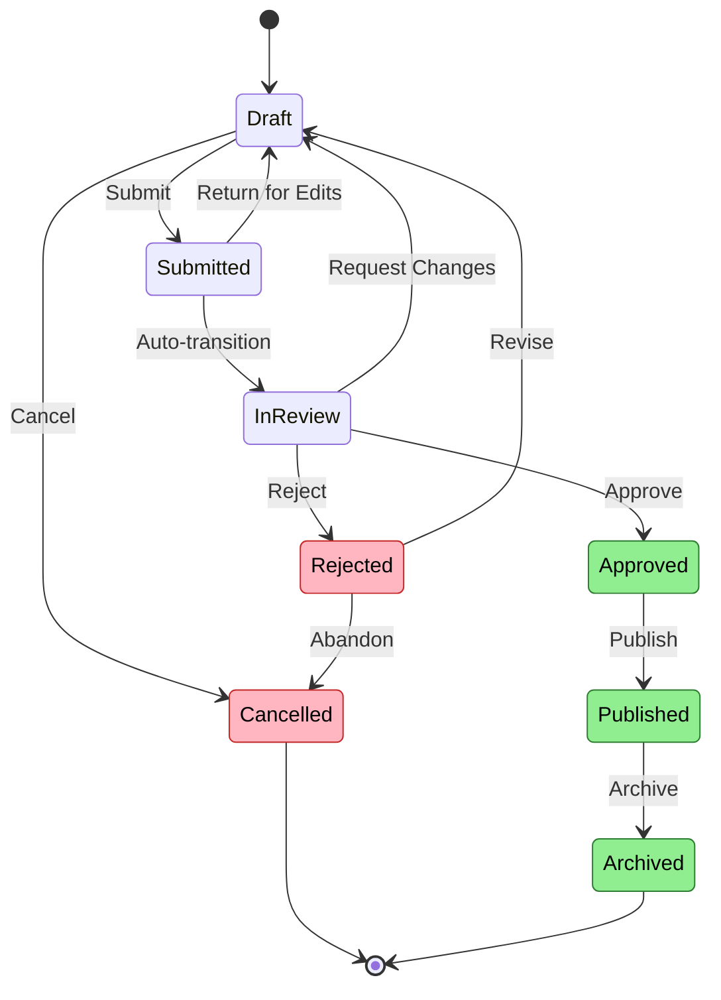
```mermaid
stateDiagram-v2
    [*] --> Draft

    Draft --> Submitted: Submit
    Draft --> Cancelled: Cancel

    Submitted --> InReview: Auto-transition
    Submitted --> Draft: Return for Edits

    InReview --> Approved: Approve
    InReview --> Rejected: Reject
    InReview --> Draft: Request Changes

    Approved --> Published: Publish
    Published --> Archived: Archive

    Rejected --> Draft: Revise
    Rejected --> Cancelled: Abandon

    Cancelled --> [*]
    Archived --> [*]

    classDef success fill:#90EE90,stroke:#2E7D32,color:#000
    classDef error fill:#FFB6C1,stroke:#C62828,color:#000

    class Approved,Published,Archived success
    class Rejected,Cancelled error

    %% MEANING: Document approval workflow with all transitions
    %% COLOR: Green = success states, Red = rejection states
    %% SYNTAX: State diagrams use 'class StateName className' not ':::className'
    %% VALUE: Shows all valid transitions and terminal states
```

**Value**: Documents all valid state transitions, reveals dead-ends and cycles.

**Best practices**:
- Show ALL valid transitions (completeness matters)
- Color terminal states (success/failure)
- Label transitions with trigger events
- Include reverse transitions

**Common mistakes**:
- ❌ Missing reverse transitions
- ❌ Incomplete state coverage
- ❌ Using for one-directional flow

---

### Class Diagram

**Use for**: Object-oriented design, inheritance hierarchies, interface contracts

**Don't use for**: Database schema (use ER), instances

**Example**:
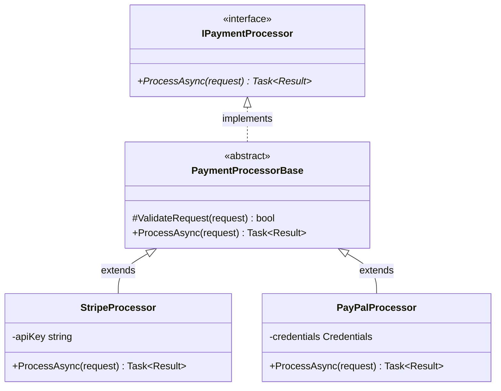
```mermaid
classDiagram
    class IPaymentProcessor {
        <<interface>>
        +ProcessAsync(request)* Task~Result~
    }

    class PaymentProcessorBase {
        <<abstract>>
        #ValidateRequest(request) bool
        +ProcessAsync(request) Task~Result~
    }

    class StripeProcessor {
        -apiKey string
        +ProcessAsync(request) Task~Result~
    }

    class PayPalProcessor {
        -credentials Credentials
        +ProcessAsync(request) Task~Result~
    }

    IPaymentProcessor <|.. PaymentProcessorBase : implements
    PaymentProcessorBase <|-- StripeProcessor : extends
    PaymentProcessorBase <|-- PayPalProcessor : extends

    %% MEANING: Payment processor inheritance hierarchy
    %% SYMBOLS: + public, # protected, - private, * abstract
    %% VALUE: Shows OOP structure before implementation
```

**Value**: Designs API surface before implementation. Identifies reusable base classes.

**Best practices**:
- Use `<<interface>>` and `<<abstract>>` stereotypes
- Show visibility (`+` public, `-` private, `#` protected)
- Include key methods with return types
- Keep to ≤8 classes

**Common mistakes**:
- ❌ Too much implementation detail
- ❌ Too many classes (>10)
- ❌ Using for database tables

---

### Entity Relationship Diagram

**Use for**: Database schema, data models, entity relationships

**Don't use for**: Code classes (use class diagram)

**Example**:
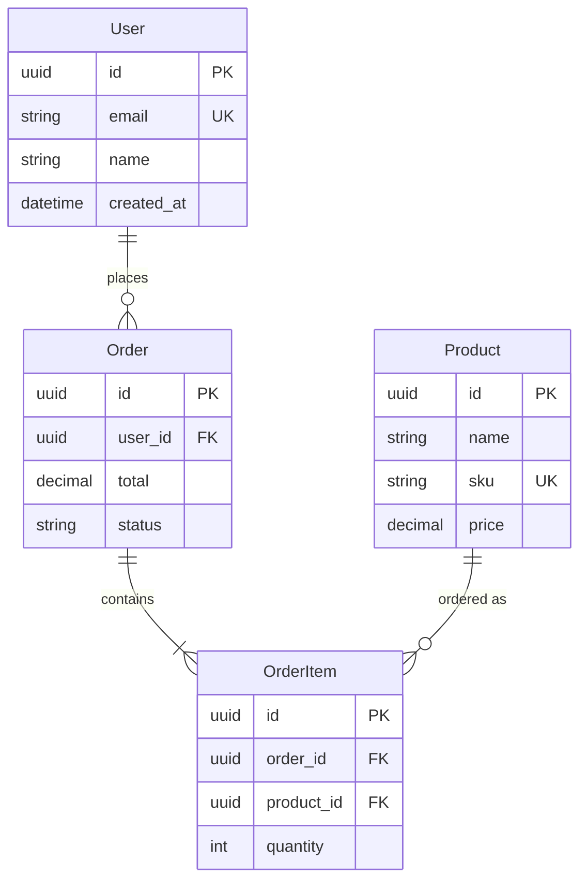
```mermaid
erDiagram
    User ||--o{ Order : places
    User {
        uuid id PK
        string email UK
        string name
        datetime created_at
    }

    Order ||--|{ OrderItem : contains
    Order {
        uuid id PK
        uuid user_id FK
        decimal total
        string status
    }

    Product ||--o{ OrderItem : "ordered as"
    Product {
        uuid id PK
        string name
        string sku UK
        decimal price
    }

    OrderItem {
        uuid id PK
        uuid order_id FK
        uuid product_id FK
        int quantity
    }

    %% MEANING: E-commerce database schema
    %% CARDINALITY: ||--o{ = one-to-many
    %% KEYS: PK = primary, FK = foreign, UK = unique
    %% VALUE: Complete schema before migrations
```

**Value**: Visualizes data model, reveals missing foreign keys.

**Best practices**:
- Show cardinality (one-to-one, one-to-many, many-to-many)
- Mark keys (PK, FK, UK)
- Use descriptive relationship labels
- Include key columns with types

**Common mistakes**:
- ❌ Missing foreign key relationships
- ❌ Unclear cardinality
- ❌ Using for code objects

---

### Gantt Chart

**Use for**: Project schedules, task dependencies, milestone tracking

**Don't use for**: Historical events (use timeline)

**Example**:
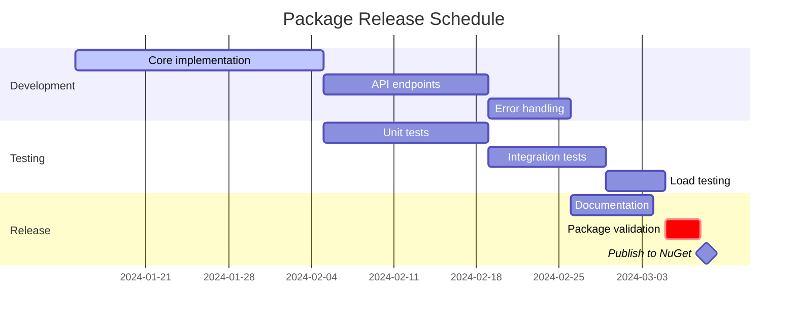
```mermaid
gantt
    title Package Release Schedule
    dateFormat YYYY-MM-DD

    section Development
    Core implementation       :active, dev, 2024-01-15, 21d
    API endpoints            :api, after dev, 14d
    Error handling           :err, after api, 7d

    section Testing
    Unit tests               :test, after dev, 14d
    Integration tests        :integ, after api, 10d
    Load testing            :load, after integ, 5d

    section Release
    Documentation           :docs, after err, 7d
    Package validation      :crit, valid, after load, 3d
    Publish to NuGet       :milestone, pub, after valid, 1d

    %% MEANING: Project timeline with dependencies and critical path
    %% MARKERS: 'crit' = critical path, 'milestone' = key event
    %% VALUE: Identifies bottlenecks and parallel work
```

**Value**: Reveals critical path, shows parallelizable work, identifies blockers.

**Best practices**:
- Mark critical tasks with `crit`
- Use sections to group related work
- Show dependencies with `after taskId`
- Mark milestones

**Common mistakes**:
- ❌ Using for historical timeline
- ❌ No dependencies shown
- ❌ Unrealistic durations

---

### Timeline

**Use for**: Historical events, version releases, chronological milestones

**Don't use for**: Project planning (use Gantt)

**Example**:
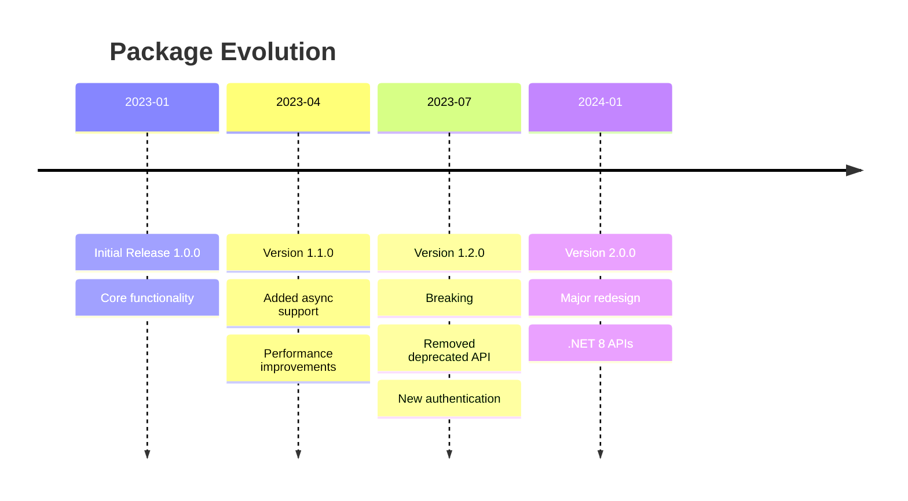
```mermaid
timeline
    title Package Evolution

    2023-01 : Initial Release 1.0.0
           : Core functionality

    2023-04 : Version 1.1.0
           : Added async support
           : Performance improvements

    2023-07 : Version 1.2.0
           : Breaking: Removed deprecated API
           : New authentication

    2024-01 : Version 2.0.0
           : Major redesign
           : .NET 8 APIs

    %% MEANING: Package version history
    %% FORMAT: Period : Event : Details
    %% VALUE: Visual evolution and breaking changes
```

**Value**: Shows progression over time, highlights milestones.

**Best practices**:
- Consistent time intervals
- Multiple events per period allowed
- Highlight breaking changes
- Keep descriptions concise

**Common mistakes**:
- ❌ Using for future planning
- ❌ Inconsistent time granularity
- ❌ Too much detail per event

---

### Mindmap

**Use for**: Concept hierarchies, brainstorming output, topic breakdowns

**Don't use for**: Workflows (use flowchart), code structure

**Example**:
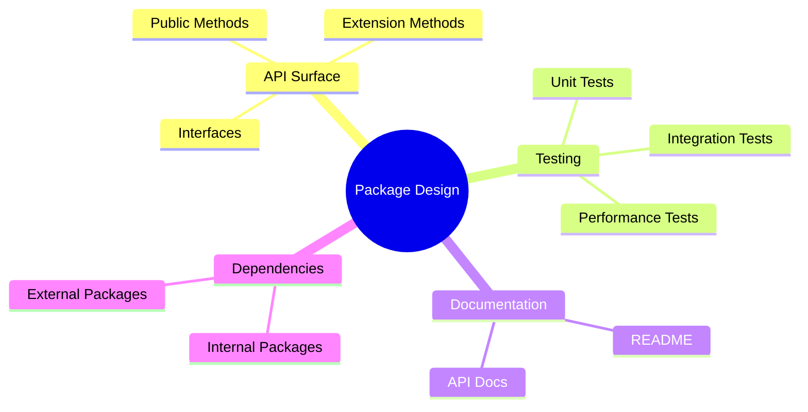
```mermaid
mindmap
    root((Package Design))
        API Surface
            Public Methods
            Extension Methods
            Interfaces
        Testing
            Unit Tests
            Integration Tests
            Performance Tests
        Documentation
            README
            API Docs
        Dependencies
            Internal Packages
            External Packages

    %% MEANING: Hierarchical breakdown of design considerations
    %% ROOT: Central concept in double parentheses
    %% VALUE: Captures structure, identifies gaps
```

**Value**: Captures hierarchical thinking, shows relationships, identifies gaps.

**Best practices**:
- Keep to 3-4 levels deep
- Balance branches (equal detail)
- Root node in `((double parens))`
- Use for brainstorming capture

**Common mistakes**:
- ❌ Using for sequential workflows
- ❌ Unbalanced depth
- ❌ Too many levels (>5)

---

### Quadrant Chart

**Use for**: Prioritization matrices, 2×2 comparisons, risk assessment

**Don't use for**: >2 dimensions, precise data (use XY chart)

**Example**:
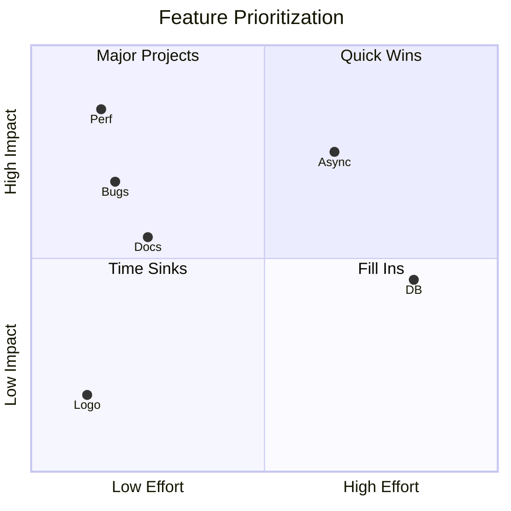
```mermaid
quadrantChart
    title Feature Prioritization
    x-axis Low Effort --> High Effort
    y-axis Low Impact --> High Impact

    quadrant-1 Quick Wins
    quadrant-2 Major Projects
    quadrant-3 Time Sinks
    quadrant-4 Fill Ins

    Perf: [0.15, 0.85]
    Async: [0.65, 0.75]
    Docs: [0.25, 0.55]
    Logo: [0.12, 0.18]
    DB: [0.82, 0.45]
    Bugs: [0.18, 0.68]

    %% MEANING: Feature prioritization by effort vs impact
    %% QUADRANTS: Q1 = do first (high impact, low effort)
    %% COORDINATES: Values between 0.01-0.99 (extremes unreadable)
    %% LABELS: Short names (≤12 chars) prevent overlaps
```

**Value**: Makes prioritization visual, identifies quick wins.

**Best practices**:
- Label quadrants meaningfully
- Upper-left = highest priority
- Use short labels (≤12 chars)
- Keep to ≤10 items

**Critical constraints**:
- **Values: 0.01 < x,y < 0.99** (extremes unreadable)
- **Avoid duplicate coordinates** (items stack)
- **Space items apart** (prevent label collisions)
- **≤7 slices ideal** (more becomes rainbow)

**Common mistakes**:
- ❌ Values at/near 0.0 or 1.0
- ❌ Long labels (overlap)
- ❌ Duplicate coordinates
- ❌ Too many items (>12)

---

### XY Chart

**Use for**: Data visualization, performance trends, benchmark comparisons

**Don't use for**: Conceptual diagrams

**Example**:
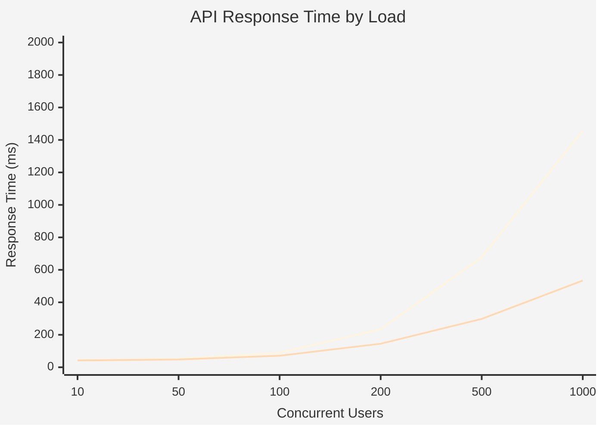
```mermaid
%%{init: {'theme':'base'}}%%
xychart-beta
    title "API Response Time by Load"
    x-axis "Concurrent Users" [10, 50, 100, 200, 500, 1000]
    y-axis "Response Time (ms)" 0 --> 2000

    line "Sync API" [45, 52, 89, 234, 678, 1456]
    line "Async API" [42, 48, 71, 145, 298, 534]

    %% MEANING: Compares sync vs async performance
    %% AXES: Users vs milliseconds
    %% TREND: Async scales better at high concurrency
    %% VALUE: Shows quantitative performance differences
```

**Value**: Shows actual measured data, reveals trends.

**Best practices**:
- Label axes with units
- Compare ≤4 lines
- Choose appropriate Y-axis range
- Document what was measured

**Common mistakes**:
- ❌ Using for conceptual data
- ❌ Unlabeled axes
- ❌ Too many lines (>5)

---

### GitGraph

**Use for**: Git branching strategy documentation

**Don't use for**: Non-git workflows

**Example**:
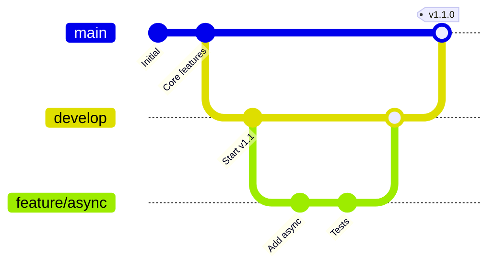
```mermaid
gitGraph
    commit id: "Initial"
    commit id: "Core features"

    branch develop
    checkout develop
    commit id: "Start v1.1"

    branch feature/async
    checkout feature/async
    commit id: "Add async"
    commit id: "Tests"

    checkout develop
    merge feature/async

    checkout main
    merge develop tag: "v1.1.0"

    %% MEANING: Git Flow branching strategy
    %% BRANCHES: main (stable), develop (integration), feature (work)
    %% VALUE: Clarifies team conventions
```

**Value**: Documents branching strategy, shows merge patterns.

**Best practices**:
- Show representative branch types
- Include merge flow
- Tag releases
- Keep to 3-4 branches

**Common mistakes**:
- ❌ Too many commits
- ❌ Using for non-git processes
- ❌ Unclear merge direction

---

### Pie Chart

**Use for**: Proportions/parts of whole (3-7 categories only)

**Don't use for**: Trends, >7 categories, precise comparisons

**Example**:
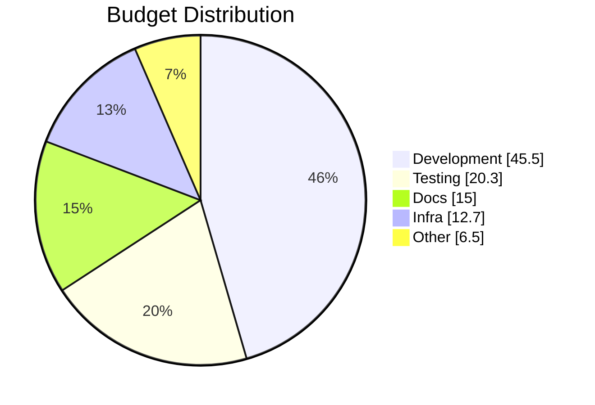
```mermaid
pie showData
    title Budget Distribution
    "Development" : 45.5
    "Testing" : 20.3
    "Docs" : 15.0
    "Infra" : 12.7
    "Other" : 6.5

    %% MEANING: Budget allocation
    %% SLICES: Ordered largest to smallest
    %% CONSTRAINT: 5 slices (ideal 3-7)
```

**Value**: Shows dominant categories and proportions.

**Best practices**:
- Limit to 3-7 slices
- Order by size
- Use `showData` for exact values
- Group small (< 5%) into "Other"
- **Consider if table clearer** (often is)

**Critical constraints**:
- **Values must be positive** (> 0)
- **Labels must be quoted**
- **Practical limit: 7 slices**

**Common mistakes**:
- ❌ Using for trends
- ❌ More than 7 slices
- ❌ Similar-sized categories
- ❌ When table would be clearer

---

### User Journey

**Use for**: Customer experience mapping with satisfaction scores

**Don't use for**: Technical architecture, branching processes

**Example**:
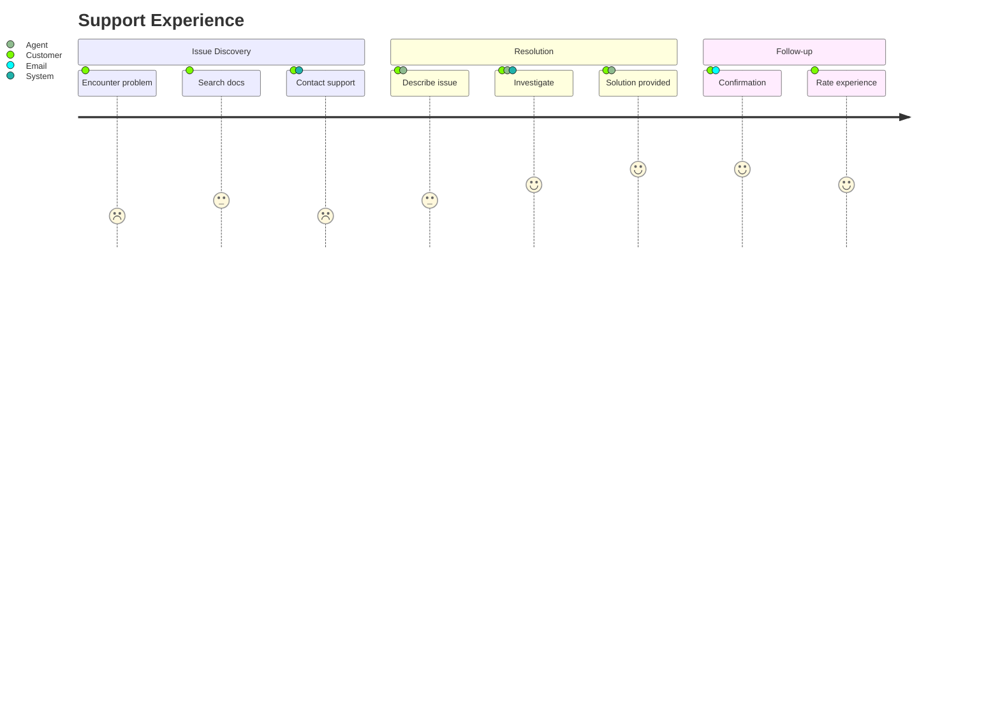
```mermaid
journey
    title Support Experience
    section Issue Discovery
        Encounter problem: 2: Customer
        Search docs: 3: Customer
        Contact support: 2: Customer, System
    section Resolution
        Describe issue: 3: Customer, Agent
        Investigate: 4: Customer, Agent, System
        Solution provided: 5: Customer, Agent
    section Follow-up
        Confirmation: 5: Customer, Email
        Rate experience: 4: Customer

    %% MEANING: Support journey with satisfaction
    %% SCORES: 1=very poor, 3=neutral, 5=excellent
    %% VALUE: Identifies pain points (low scores)
```

**Value**: Reveals pain points, shows multi-party interactions.

**Best practices**:
- Consistent scoring rubric
- Keep to 10-15 tasks
- Include all actors
- Use action verbs
- Group into logical sections

**Critical constraints**:
- **Scores: 1-5 integers only** (no 0, 6+, decimals)
- **No branching** (linear only)
- **No parallel paths**
- **~15 task limit**

**Common mistakes**:
- ❌ Inconsistent scoring
- ❌ Too many tasks (>20)
- ❌ Vague task names
- ❌ Using for technical workflows

---

### C4 Diagram

**Use for**: Software architecture at multiple abstraction levels

**Don't use for**: Data flows, user experience, detailed sequences

**System Context Example**:
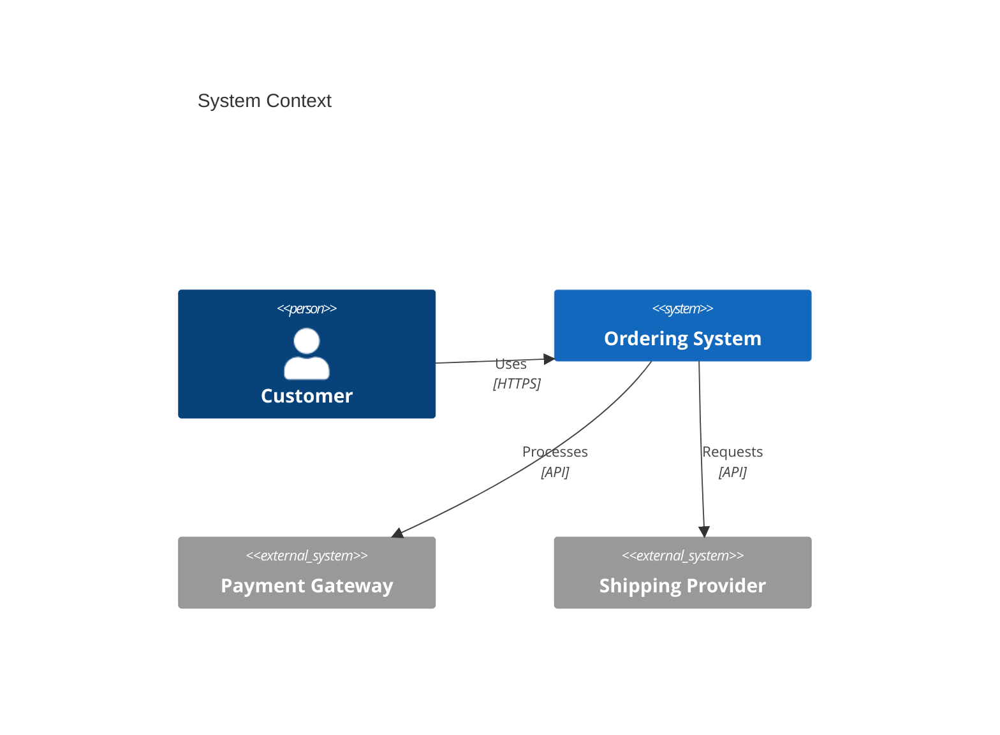
```mermaid
C4Context
    title System Context

    Person(customer, "Customer")
    System(ordering, "Ordering System")
    System_Ext(payment, "Payment Gateway")
    System_Ext(shipping, "Shipping Provider")

    Rel(customer, ordering, "Uses", "HTTPS")
    Rel(ordering, payment, "Processes", "API")
    Rel(ordering, shipping, "Requests", "API")

    %% MEANING: Ordering system in ecosystem
    %% LEVEL: Context (highest abstraction)
    %% AUDIENCE: Stakeholders
```

**Container Example**:
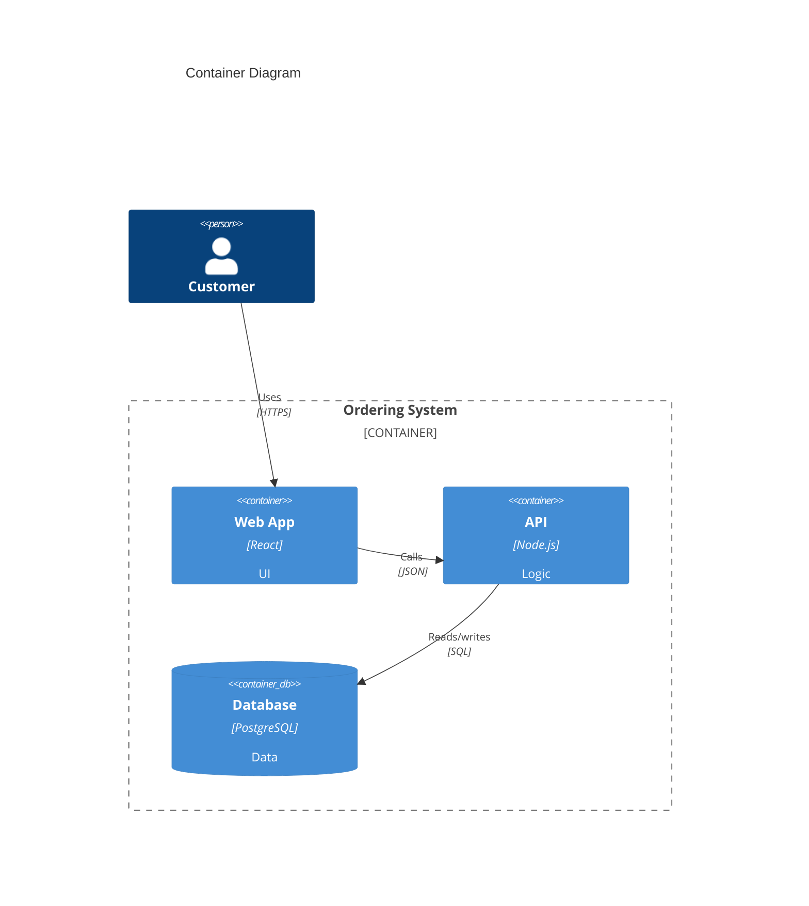
```mermaid
C4Container
    title Container Diagram

    Person(customer, "Customer")

    Container_Boundary(ordering, "Ordering System") {
        Container(web, "Web App", "React", "UI")
        Container(api, "API", "Node.js", "Logic")
        ContainerDb(db, "Database", "PostgreSQL", "Data")
    }

    Rel(customer, web, "Uses", "HTTPS")
    Rel(web, api, "Calls", "JSON")
    Rel(api, db, "Reads/writes", "SQL")

    %% MEANING: Major technical components
    %% LEVEL: Container (technology choices)
    %% AUDIENCE: Technical team
```

**Value**: Documents architecture at appropriate levels for different audiences.

**Best practices**:
- **Start with Context** (ecosystem)
- **Drill to Container** (technology)
- **Detail with Component** (code) only where needed
- Use boundaries for grouping
- Include technology labels
- Keep to 15-20 elements per diagram

**Readability limits**:
- Context: Max 15 systems
- Container: Max 20 containers
- Component: Max 25 components

**Common mistakes**:
- ❌ Wrong abstraction level
- ❌ Too much detail (40+ elements)
- ❌ Skipping Context level
- ❌ Missing technology tags

**Note**: Experimental - syntax may evolve.

---

### Sankey

**Use for**: Flow visualization, transformations, quantity movements

**Don't use for**: Circular flows (unsupported), hierarchies

**Example**:
```mermaid
sankey-beta

Budget,Development,450
Budget,Testing,200
Budget,Infrastructure,150

Development,Frontend,180
Development,Backend,200
Development,Database,70

Testing,Unit,80
Testing,Integration,70
Testing,Performance,50

    %% MEANING: Budget allocation and breakdown
    %% FORMAT: Source,Target,Value (CSV)
    %% CONSTRAINT: Positive values only
    %% VALUE: Proportional relationships
```

**Value**: Shows how quantities flow and transform.

**Best practices**:
- Keep to 5-15 nodes
- Consistent units
- Aggregate small flows (< 5%) into "Other"
- Meaningful node names (2-4 words)
- Order strategically

**Critical constraints**:
- **CSV format**: `Source,Target,Value`
- **Values: positive only** (> 0)
- **No circular flows** (A→B→C→A breaks)
- **Quote commas**: `"Name, Inc",Target,100`
- **Optimal: 5-15 nodes**

**Common mistakes**:
- ❌ CSV formatting errors
- ❌ Circular flows
- ❌ Negative/zero values
- ❌ Too many nodes (30+)
- ❌ Wildly different scales

**Note**: Experimental (v10.3.0+) - syntax may change.

---

## Color and Accessibility

### Purpose of Color

**Color should convey meaning consistently and remain readable across all viewing conditions.**

Three core principles:
1. **Consistency**: Colors must mean the same thing throughout the diagram
2. **Readability**: Must work in both light and dark modes with sufficient contrast
3. **Documentation**: Always explain what colors represent (semantic or arbitrary)

### Color Approaches

**Both approaches are valid - choose what fits your diagram**:

**Semantic Colors** (status/severity):
- Green = success/valid, Red = error/invalid, Yellow = warning, Blue = info
- Natural interpretation, works well for error flows, validations, health checks
- Example: Authentication flow with success/error paths

**Arbitrary Groupings** (categories):
- Colors represent categories: services, teams, layers, features, modules
- No inherent meaning - document what each color represents
- Example: Microservices grouped by team (Blue = Platform, Green = Payment, Orange = Identity)

**The Rule**: Whatever approach you choose, be consistent within the diagram and document it in comments.

### Suggested Semantic Palette (Optional)

If using semantic colors, these are tested for light/dark mode compatibility:

```css
/* Success / Valid / Recommended */
--success: fill:#90EE90,stroke:#2E7D32,color:#000

/* Error / Invalid / Deprecated */
--error: fill:#FFB6C1,stroke:#C62828,color:#000

/* Warning / Conditional / Caution */
--warning: fill:#FFE082,stroke:#F57C00,color:#000

/* Information / Neutral / Primary */
--info: fill:#81D4FA,stroke:#0277BD,color:#000

/* Disabled / Not Recommended */
--disabled: fill:#E0E0E0,stroke:#616161,color:#000
```

**These are suggestions, not requirements.** Use any colors that meet accessibility standards.

### Accessibility Requirements

**Non-negotiable standards**:
- **Always explain colors** in `%% COLOR:` comment
- **Never rely on color alone** - use shapes, labels, patterns, borders as additional indicators
- **Maintain 3:1 contrast ratio minimum** (WCAG AA) for all text and borders
- **Test in both light and dark mode** - ensure readability in both

**Example 1: Semantic Colors**:
```mermaid
graph LR
    A[Start] --> B{Valid?}
    B -->|✓ Yes| C[Process]:::success
    B -->|✗ No| D[Reject]:::error

    classDef success fill:#90EE90,stroke:#2E7D32,stroke-width:3px,color:#000
    classDef error fill:#FFB6C1,stroke:#C62828,stroke-width:3px,color:#000

    %% COLOR: Green = success path, Red = error path
    %% ACCESSIBILITY: Checkmarks/X + 3px borders provide non-color indicators
```

**Example 2: Arbitrary Groupings**:
```mermaid
graph TD
    Gateway --> AuthSvc:::platform
    Gateway --> PaySvc:::payment
    Gateway --> UserSvc:::identity

    classDef platform fill:#81D4FA,stroke:#0277BD,stroke-width:3px,color:#000
    classDef payment fill:#90EE90,stroke:#2E7D32,stroke-width:3px,color:#000
    classDef identity fill:#FFE082,stroke:#F57C00,stroke-width:3px,color:#000

    %% COLOR: Blue = Platform team, Green = Payment team, Orange = Identity team
    %% GROUPING: Colors represent team ownership, not semantic status
```

**When creating diagrams** (agents/humans):
- Use colors from suggested palette (tested for dual-mode compatibility)
- Include non-color indicators: shapes (diamonds for decisions), labels, borders (3px), symbols (✓/✗)
- Add `%% COLOR:` comment explaining what each color represents
- Ensure text is black on light backgrounds (`color:#000`)

**Before committing** (humans):
- Render and view in both light and dark mode
- Verify contrast ratios if using custom colors: https://webaim.org/resources/contrastchecker/


## Validation Checklist

Before committing any diagram:

### Content ✓
- [ ] **No linear sequences** (use list instead) - CARDINAL RULE
- [ ] All labels with spaces are quoted
- [ ] Meaning comment explains purpose
- [ ] Color usage explained (if used)
- [ ] <12 nodes (or split into multiple diagrams)
- [ ] Right diagram type for the content

### Accessibility ✓
- [ ] Black text on light backgrounds (`color:#000`)
- [ ] 3:1 contrast minimum (WCAG AA)
- [ ] Not relying on color alone (shapes/labels/borders)
- [ ] Readable in both light and dark mode
- [ ] Legend provided (via comment) if colors used

### Clarity ✓
- [ ] Could this be simpler? (list, table)
- [ ] Is relationship/flow clear?
- [ ] Are edge labels descriptive?
- [ ] Scannable in <10 seconds?
- [ ] One clear message/purpose

### Technical ✓
- [ ] Renders without errors
- [ ] Preview in target viewer (GitHub, VS Code)
- [ ] Mobile-friendly (not too wide)
- [ ] Follows syntax rules for diagram type

---

## Summary

### Golden Rules

1. **NEVER diagram linear sequences** - Always use lists (cardinal rule)
2. **Quote all labels with spaces** - Prevents rendering failures
3. **Use color consistently** - Semantic or arbitrary groupings, always document meaning
4. **Add metadata comments** - Explain non-obvious aspects
5. **Test both modes** - Ensure dark/light readability
6. **Keep diagrams focused** - <12 nodes, split if needed
7. **Choose right type** - Use decision tree/matrix
8. **Validate before commit** - Use checklist

### When to Use Each Type

**Process & Logic**:
- Branches/decisions → Flowchart
- Multi-party interactions → Sequence
- State transitions → State diagram

**Structure**:
- Code classes → Class diagram
- Database → ER diagram
- Architecture levels → C4 diagram

**Time-Based**:
- Project schedule → Gantt
- Historical events → Timeline

**Flows & Relationships**:
- Quantity flows → Sankey
- Experience mapping → User Journey
- Concepts → Mindmap

**Data & Analysis**:
- Prioritization (2D) → Quadrant
- Performance data → XY chart
- Proportions (≤7) → Pie chart

**Special Purpose**:
- Git workflow → GitGraph

### Value Proposition

**Great diagrams**:
- Reveal relationships prose cannot express efficiently
- Show multiple dimensions simultaneously
- Enable instant pattern recognition
- Reduce cognitive load

**Bad diagrams**:
- Waste tokens on information better shown as lists
- Add complexity without clarity
- Look impressive but convey little
- Require more time than prose

**The Test**: Can you delete the diagram and lose critical information? If no → delete it. If yes → it's earning its place.

---

**Philosophy**: Diagrams are expensive (tokens, maintenance, comprehension time). Use them only when they reveal relationships or patterns that would require paragraphs to explain. When you do use them, make them dense with information, accessible to all readers, and instantly scannable. Every diagram must earn its place by providing value no other format can deliver as efficiently.
