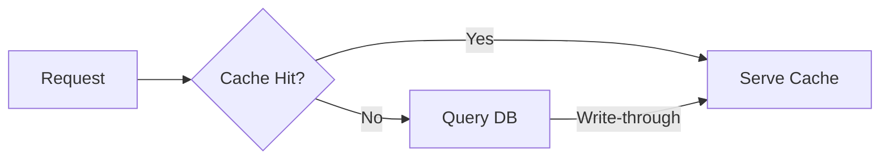

⟨CR-TAG:v1:42ef⟩ Capsule: **DocMagic** 🪄 Meta  
Seed knowledge as *self-contained capsules*—one-line invariant, tiny example, optional depth—so any LLM can regenerate the full concept with minimal context.  
DocMagic

---

# 1  Capsule Pattern 🔖
Capsule: **CapsulePattern** 🔖 Structure  
Invariant = **One-line truth → ≤30 tokens**.  
Example  = *3-line concrete snippet*.  
Depth   = optional details; can be ignored without loss of sense.  
```markdown
### Capsule: CircuitBreaker 🛡️ Resilience
Stops calling failing services to prevent cascades and allow recovery.

**Example**
state: Closed → Open after 5 failures → Half-Open probe.

**Details**
Open = fail-fast 30 s; Half-Open retries 1/10 traffic.
```
Why ROI • survives truncation • unambiguous anchor • easy to lint.  
Gotcha • invariant must never change; update examples instead.  
CapsulePattern

<!--syn: capsule microtemplate invariant -->

---

# 2  Token Hygiene ✂️
Capsule: **TokenHygiene** ✂️ Economy  
Every chosen string should minimise sub-tokens *and* maximise semantic gravity.  
• CamelCase ≤12 chars → often 1 token (e.g., `IdempotKey`).  
• Avoid hyphens / snake_case unless the runtime demands it.  
• Verify with `tiktoken` before shipping.  
Example  
`CircuitBreaker` (2 tokens GPT-3.5 / 1 token Claude-3) vs  
`flow-control-circuit-breaker` (7+ tokens).  
TokenHygiene

<!--syn: tokenization bpe compression -->

---

# 3  Context-Rebase ⟲
Capsule: **ContextRebase** ⟲ Attention  
Insert identical, hash-verifiable micro-summaries every 600-900 tokens to counter attention decay.  
Format `⟨CR-TAG:v{n}:{sha1-of-capsule}⟩ <15 chars-of-summary>`  
Example  
`⟨CR-TAG:v2:af91⟩ CircuitBreaker = Stop calls after 5 fails`  
Lint  Fail CI if two CR-TAGs differ on the same SHA.  
ContextRebase

---

# 4  Embedding Chunks 📦
Capsule: **ChunkDesign** 📦 Retrieval  
Keep each file *and* paragraph semantically pure so vector search hits with high precision.  
Rules  
1. ≤120 words visible text.  
2. One topic sentence at top.  
3. Put synonyms in an HTML comment, never in body.  
Example  
```markdown
## [Security] JWT Expiry
Tokens hard-expire 15 m after `iat`; never refresh in place.
<!--syn: token timeout session lifespan -->
```
ChunkDesign

---

# 5  Self-Test Triplet (Q✱ A✓ R#) 🧪
Capsule: **SelfTestTriplet** 🧪 Verification  
Embed a micro-quiz so the model can self-check recall after retrieval.  
```markdown
Q✱ When does CircuitBreaker close?  
A✓ After a successful probe in Half-Open.  
R# Success resets failure counter ⇒ Closed state.
```
Models tend to restate the answer correctly if it sits nearby.  
SelfTestTriplet

---

# 6  Guard-Band Example 🚧
Capsule: **GuardBand** 🚧 Limits  
Include one example on the exact edge of allowed values; prefix with `//BOUNDARY`.  
```csharp
//BOUNDARY: max timeout accepted by gateway
services.AddTimeout(TimeSpan.FromSeconds(30));
```
The extremum anchors the model and discourages unsafe extrapolation.  
GuardBand

---

# 7  Mermaid + Meaning 🎨
Capsule: **MermaidMeaning** 🎨 Visual  
Always pair diagrams with `%% MEANING:` comments—these are indexed by LLMs even though they’re invisible in the rendered SVG.  


Remember to quote labels containing spaces.  
MermaidMeaning

---

# 8  Cognitive Checksum ☑
Capsule: **CognitiveChecksum** ☑ Integrity  
Close every major document with ≤5 immutable bullets prefixed by ☑ so any LLM sees them as hard constraints.  
Checksum anchors survive summarisation and sometimes appear verbatim in generated answers.  
CognitiveChecksum

---

⟨CR-TAG:v1:42ef⟩ Capsule: **DocMagic** 🪄 Meta  
DocMagic

---

## Theoretical Foundation

The capsule patterns emerge from cognitive science principles:
- **30-token invariants**: Based on cognitive load theory (see cognitive-load-theory.md) - human working memory holds ~7±2 chunks
- **Visual + verbal encoding**: Leverages dual coding theory (see dual-coding-theory.md) for stronger memory formation
- **Embedding design**: See embedding-retrieval-patterns.md for why semantic chunks matter

---

## ☑ Non-Negotiables
☑ Capsule = Invariant ➜ Example ➜ Depth  
☑ Use CR-TAG every ~800 tokens, hash-verified  
☑ Keep visible chunks ≤120 words + hidden synonyms  
☑ One Guard-Band example per boundary rule  
☑ Close with this Cognitive Checksum