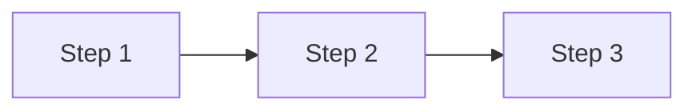
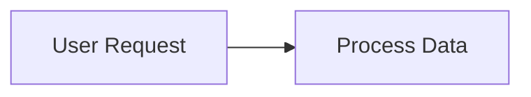
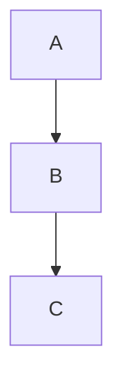

# Writing Gestalt Documents

**Definition**: Gestalt documents are high-information-density guides optimized for fast comprehension and accurate retrieval. They compress maximum understanding into minimum tokens.

**Purpose**: Enable readers (human or AI) to become effective quickly, protected from expensive mistakes and time-consuming surprises.

---

## Core Philosophy

### Capsule: TokenEconomy 💎 Value
Every token must earn its place. No fluff, no filler, no preamble.

**Test**: Can you delete this sentence and lose critical information? If no → delete it.

**Example**:
```markdown
❌ "In this section, we will discuss how to handle breaking changes, which is an important topic that developers need to understand."

✅ "Breaking changes require major version bumps. Use package validation to detect them automatically."
```

**Why**: Readers scan, don't read linearly. Dense information respects their time.

---

## Know Your Audience

### Human vs Agent Requirements

| Aspect | Humans | AI Agents |
|--------|--------|-----------|
| Information density | Medium (scannable) | Very high (compressed) |
| Structure | Hierarchical with flow | Indexable with cross-refs |
| Examples | Illustrative | Pattern templates |
| Context | Motivational (why) | Functional (how/what) |
| Repetition | Reinforces learning | Wasteful tokens |
| Links | "Learn more" optional | "See X:123" required |

### Mental Model Awareness

**Before writing, identify**:
1. What does the reader already know?
2. What misconceptions do they likely have?
3. What decision are they trying to make?
4. What mistake would waste their time?

**Example**: Writing for developers migrating from xUnit:
- They know testing concepts
- They'll type `[Fact]` by muscle memory
- They're deciding "what syntax do I use"
- They'll waste time debugging why tests don't run

**Response**: Front-load syntax differences, show xUnit→TUnit mapping table immediately.

---

## Structure Patterns

### Progressive Disclosure

**Pattern**: Start specific → expand detail → reference comprehensive

```
README.md: "Use ProjectReference for internal packages"
           ↓ (links to)
packaging-rules.md: Why/how/gotchas about ProjectReference
           ↓ (links to)
msbuild-nuget-packaging.md: Complete technical reference
```

**Anti-pattern**: Repeating same content at each level (wastes tokens, creates maintenance burden)

### Capsule Format (For Agents)

**Structure**:
```markdown
### Capsule: ConceptName 🏷️ Category
Core truth in ≤25 tokens (the "TLDR").

**Example**
Concrete code/scenario in ≤5 lines

**Why** or **Details**
Expandable explanation when needed
```

**Benefits**:
- Scannable (capsule name + emoji = instant recognition)
- Compressed (headline captures essence)
- Retrievable (example provides pattern matching)
- Expandable (details when needed)

**When to use**: Agent-focused docs, non-obvious truths, patterns to remember

### Decision Tables

**Use when**: Reader needs to choose between options based on context

**Pattern**:
```markdown
| Situation | Action | Why |
|-----------|--------|-----|
| Adding feature | Minor version | Backward-compatible |
| Removing API | Major version | Breaking change |
| Fixing bug | Patch version | No API change |
```

**Benefits**: Instant lookup, no ambiguity, shows reasoning

### Quick Reference Sections

**Purpose**: Instant answers to common questions

**Pattern**:
```markdown
## Emergency Quick Reference

### "My build is failing..."

| Error | Fix |
|-------|-----|
| Missing XML docs | Add `/// <summary>` to all public APIs |
| Coverage below 80% | Add tests or mark `[ExcludeFromCodeCoverage]` |
```

**Location**: Near end of document (after concepts explained, before appendix)

---

## Content Principles

### Front-Load Expensive Information

**Expensive information** = What would waste hours if misunderstood

**Examples**:
- Quality gates that block deployment
- Breaking changes that appear compatible
- Common mistakes that compound
- Required setup that's easy to forget

**Pattern**:
```markdown
## Title

**Critical**: [Most expensive thing to get wrong]

[Normal content follows]
```

### Protect From Surprises

**Pattern**: Explicit "Non-Obvious Truths" section

**What qualifies**:
- Behavior that contradicts expectations
- Edge cases that bite in production
- Timing issues (when X happens matters)
- Convention magic (auto-detection that fails silently)

**Example**:
```markdown
### 3. Circular Dependencies Detected Late
**MSBuild doesn't detect circular ProjectReferences until pack time.**

**Symptom**: Build succeeds. `dotnet pack` fails.

**Why**: ProjectReference uses build output. Pack converts to PackageReference.

**Prevention**: Run `dotnet pack` locally before pushing.
```

### Verify and Date Information

**Pattern**:
```markdown
**Verified against**: Microsoft Learn documentation (January 2025)
```

**Why**: Technology changes. Readers need confidence in currency.

**How**:
1. Research official sources
2. Cross-reference multiple sources
3. Date your verification
4. Link to authoritative docs

**For code examples**: Provide file:line references to real code

```markdown
**Reference**: `src/packages/aspire/Equestria.Aspire.Tests/GlobalSetup.cs:1`
```

### Use Clear Examples

**Bad example** (vague):
```markdown
Configure your project correctly.
```

**Good example** (concrete):
```markdown
<PropertyGroup>
  <Version>1.0.1</Version>  <!-- NOT 1.0.0 (SDK default) -->
</PropertyGroup>
```

**Pattern for comparisons**:
```markdown
❌ BAD: [anti-pattern with explanation why]
✅ GOOD: [correct pattern with explanation why]
```

### Explain Why, Not Just What

**Anti-pattern**: "Use PrivateAssets='All' for build tools"

**Better**:
```markdown
Use PrivateAssets='All' for build tools.

**Why**: Your package uses them to compile, but consumers don't need them.
Without PrivateAssets, every consumer inherits the dependency unnecessarily.
```

**Test**: Would cargo-culting this advice lead to problems? If yes, explain why.

---

## Writing Process

### 1. Research Phase

**Before writing anything**:
1. Gather authoritative sources
2. Identify common misconceptions (Stack Overflow, GitHub issues)
3. Find edge cases (bug reports, discussions)
4. Note what official docs don't cover

**Use subagents**: For comprehensive research, launch research agent with specific scope

### 2. Outline Phase

**Structure by questions, not topics**:

❌ Topic-based:
```
- Package Metadata
  - PackageId
  - Version
  - Description
```

✅ Question-based:
```
- How do I create a package? (includes: what metadata is required)
- How do I handle breaking changes? (includes: versioning)
- What mistakes should I avoid? (includes: common metadata errors)
```

**Test**: Would someone finding this via search get their answer?

### 3. Write Phase

**Patterns**:

1. **Lead with the answer**:
   ```markdown
   ## How do I add a dependency?

   Use PackageReference for external packages, ProjectReference for internal packages.

   [Details follow]
   ```

2. **Show, don't just tell**:
   ```markdown
   ❌ "Don't use deprecated properties"
   ✅ <LicenseUrl> is deprecated. Use <PackageLicenseExpression> instead.
   ```

3. **Provide escape hatches**:
   ```markdown
   For complete reference, see [Deep Dive Guide](./reference.md).
   ```

### 4. Review Phase

**Checklist**:
- [ ] Can I delete any sentence without losing information?
- [ ] Are all examples concrete and runnable?
- [ ] Have I warned about time-wasting mistakes?
- [ ] Are factual claims verified and sourced?
- [ ] Would someone scanning headers understand the content?
- [ ] Do code examples show both good and bad patterns?
- [ ] Have I explained *why*, not just *what*?
- [ ] Are there quick-reference tables for common decisions?

**Read for**:
- Redundancy (say things once)
- Ambiguity ("usually" "might" "can" → be specific)
- Assumptions (document or link to prerequisites)
- Missing context (why does this matter?)

---

## Document Types

### Gestalt (Agent-Focused)

**Purpose**: Maximum density orientation for AI agents

**Structure**:
```markdown
# Title: Core Operating Principles

## 🚨 Quality Gates
[What blocks progress]

## 🧪 Testing
[Critical patterns]

## ⚡ Non-Obvious Truths
[Time-saving surprises]

## 🎯 Emergency Quick Reference
[Fast lookup tables]
```

**Characteristics**:
- Capsule format throughout
- High information density
- Cross-references to source code
- Minimal prose, maximum patterns

### README (Human-Focused)

**Purpose**: Enable confident delegation and decision-making

**Structure**:
```markdown
# What & Why (30 seconds)

# How It Works (conventions)

# Creating [Thing] (concrete example - EARLY)

# Quality Standards (automatic enforcement)

# Design Principles (decision frameworks)

# Common Questions
```

**Characteristics**:
- Scannable headers
- Front-loads practical example
- Design over implementation
- Links to detailed docs

### Practical Guide

**Purpose**: Action-oriented reference for specific tasks

**Structure**:
```markdown
# Title

## Enforced Requirements
[What you must do]

## [Task 1]
[How to do it, gotchas, examples]

## [Task 2]
[How to do it, gotchas, examples]

## Common Mistakes
[Integrated with solutions]

## Quick Reference Tables
```

### Comprehensive Reference

**Purpose**: Deep technical documentation

**Structure**:
```markdown
# Title - Comprehensive Reference

**For quick start**: See [Practical Guide]

## Table of Contents

## Understanding [Core Concept]
[Mental model]

## [Topic 1]
### Overview
### Details
### Examples
### References

## Complete Property Reference
[Exhaustive tables]
```

---

## Anti-Patterns to Avoid

### ❌ Tutorial Chattiness

**Anti-pattern**:
```markdown
Now that we've learned about dependencies, let's move on to the exciting
topic of versioning! Versioning is really important because...
```

**Better**:
```markdown
## Versioning

Use semantic versioning: Major.Minor.Patch

- Major: Breaking changes
- Minor: New features
- Patch: Bug fixes
```

### ❌ Assuming Prior Reading

**Anti-pattern**:
```markdown
As we discussed earlier in the dependencies section...
```

**Better**:
```markdown
Use ProjectReference for internal packages (see [Dependency Management](#dependencies)).
```

**Why**: Readers arrive via search, not linear reading.

### ❌ Hedge Words

**Anti-pattern**: "You might want to consider using..."

**Better**: "Use X for Y. Use Z for W."

**Exception**: When genuinely uncertain, say so explicitly: "Depends on your scale. <1M records: X. >1M records: Z."

### ❌ Buried Ledes

**Anti-pattern**:
```markdown
## Configuration

There are many ways to configure packages. MSBuild provides several
properties. Some properties are more important than others. One property
you should be aware of is Version...
```

**Better**:
```markdown
## Configuration

Set Version in .csproj:

<Version>1.2.3</Version>

[Additional properties follow]
```

### ❌ Missing "Why"

**Anti-pattern**: "Use PrivateAssets='All' for analyzers."

**Better**:
```markdown
Use PrivateAssets='All' for analyzers.

**Why**: Analyzers run during your build but shouldn't run during
consumers' builds. Without PrivateAssets, every consumer inherits
your analyzers unnecessarily.
```

### ❌ Vague Examples

**Anti-pattern**: "Configure appropriately for your use case."

**Better**: Provide 2-3 concrete examples covering common cases.

---

## Markdown Best Practices

### Headers as Signposts

**Pattern**: Headers should answer questions or describe actions

✅ Good headers:
- "How do I handle breaking changes?"
- "Creating a New Package"
- "Common Mistakes to Avoid"

❌ Weak headers:
- "Introduction"
- "Overview"
- "Details"

### Code Formatting

**Pattern**: Always specify language for syntax highlighting

```markdown
```xml
<PropertyGroup>
  <Version>1.0.0</Version>
</PropertyGroup>
\```
```

**Inline code**: Use for `PropertyNames`, `file-paths`, `CommandNames`

### Emphasis Hierarchy

- **Bold**: Key concepts, action items, warnings
- *Italic*: Rarely (markdown already provides structure)
- `Code`: Literals, property names, commands
- > Blockquote: External quotes only
- Emoji: Capsule categories (✅ ❌ ⚠️)

### Tables

**Use when**: Comparing options, listing properties, quick reference

**Don't use when**: Could be a list (tables are visually heavy)

**Pattern**:
```markdown
| Column 1 | Column 2 | Column 3 |
|----------|----------|----------|
| Value A  | Value B  | Value C  |
```

**Alignment**: Left for text, right for numbers

### Mermaid Diagrams

**For comprehensive guide**: See [Mermaid Diagram Guide](./mermaid-diagram-guide.md)

**Core principle**: Diagrams reveal relationships prose cannot express efficiently. If a list or table works, use that.

#### Cardinal Rule: NEVER Diagram Linear Sequences

❌ **NEVER**:


✅ **Always use list**:
```
1. Step 1
2. Step 2
3. Step 3
```

**Test**: No branches/decisions/parallel paths? → List, not diagram.

#### Essential Gotchas

**Quote labels with spaces** (rendering breaks without):


**Add meaning comments** (for agents and maintainers):


**Color for meaning, not decoration**:
- Always explain colors in comments
- Never rely on color alone (use shapes, labels)
- Use semantic palette: Green=success, Red=error, Yellow=warning

#### Quick Type Selection

| Need | Use | NEVER For |
|------|-----|-----------|
| Branches/decisions | Flowchart | Linear sequences |
| Multi-party interactions | Sequence | Single calls |
| State transitions | State diagram | Static structure |
| Class hierarchy | Class diagram | Database |
| Database schema | ER diagram | Code classes |
| Architecture levels | C4 diagram | Data flows |
| Quantity flows | Sankey | Circular flows |
| Project schedule | Gantt | Historical events |
| Proportions (≤7) | Pie chart | Trends/comparisons |

**Advanced flowchart tip**: When many nodes share a relationship, use subgraphs to represent at group level (1 arrow instead of N arrows - dramatically reduces complexity).

#### Validation

- [ ] **No linear sequences** (cardinal rule)
- [ ] Labels with spaces quoted
- [ ] Meaning comments present
- [ ] Color explained in comments
- [ ] <12 nodes (or split)
- [ ] Could list/table be clearer?

**See [Mermaid Diagram Guide](./mermaid-diagram-guide.md) for complete reference including all 15 diagram types, color palette, accessibility requirements, and detailed examples.**

---

## Testing Your Documentation

### Comprehension Tests

**Scan test**: Can someone understand the document by reading only headers?

**Search test**: If someone searches for "breaking changes", do they find the answer in <30 seconds?

**Surprise test**: Have you warned about every time-wasting gotcha?

**Completeness test**: Can someone accomplish the task without external resources?

### Agent Tests

**Give your draft to an AI agent**:
1. Ask it to summarize key points
2. Ask it to identify ambiguities
3. Ask it to generate code following the guidance
4. Ask "what's missing?"

**Iterate based on failures**.

### Human Tests

**Find someone unfamiliar with the topic**:
1. Give them a specific task
2. Watch them use only your documentation
3. Note where they get confused or stuck
4. Note what they assume (correctly or incorrectly)

**Iterate based on observations**.

---

## Maintenance

### Versioning Documentation

**Pattern**: Date verification, link to sources

```markdown
**Verified against**: Microsoft Learn (January 2025)
```

**Review schedule**:
- Major technology releases (new .NET version)
- Quarterly for fast-moving areas
- After discovering errors

### Keeping DRY

**Pattern**: Single source of truth, links for details

❌ Don't repeat content across documents
✅ Progressive disclosure with links

**Example structure**:
- README: "Use ProjectReference for internal packages"
- Practical Guide: How to use ProjectReference, common mistakes
- Reference: Complete technical details

### Deprecated Content

**Pattern**: Mark clearly, provide migration path

```markdown
❌ **DEPRECATED**: <LicenseUrl> property

✅ **Use instead**: <PackageLicenseExpression>MIT</PackageLicenseExpression>
```

---

## Checklist: Before Publishing

### Content
- [ ] Every claim is verified and sourced
- [ ] All code examples are tested and correct
- [ ] "Why" is explained for non-obvious advice
- [ ] Common mistakes explicitly called out
- [ ] Quick reference tables for decisions
- [ ] Examples show both good and bad patterns

### Structure
- [ ] Headers answer questions or describe actions
- [ ] Front-loaded with most important information
- [ ] Scannable (reading only headers tells the story)
- [ ] Progressive disclosure (overview → detail → reference)
- [ ] Cross-references use file:line or section anchors

### Style
- [ ] Dense (no filler, no preamble)
- [ ] Concrete (specific examples, not vague guidance)
- [ ] Actionable (reader knows what to do next)
- [ ] Accessible (jargon explained or linked)
- [ ] Dated (verification timestamp present)

### Audience
- [ ] Mental model explicitly identified
- [ ] Common misconceptions addressed
- [ ] Time-wasting mistakes prevented
- [ ] Decision frameworks provided

---

## Examples to Study

**From this repository**:

1. **README.md** - Human-focused, decision-oriented, front-loads practical example
2. **docs/gestalt.md** - Agent-focused, capsule format, high density
3. **docs/packaging-rules.md** - Practical guide, action-oriented, integrated mistakes
4. **docs/msbuild-nuget-packaging.md** - Comprehensive reference, complete coverage

**Pattern**: Each serves different purpose, appropriate structure for audience.

---

## Meta-Pattern

The unifying principle: **Write for compression and retrieval, not linear reading.**

Documentation is a database of answers, not a narrative. Optimize for:
- **Indexability**: Headers as search keys
- **Density**: Maximum information per token
- **Retrievability**: Answer findable in seconds
- **Verifiability**: Claims traceable to source
- **Actionability**: Clear next steps

When in doubt:
1. Make it more specific
2. Show concrete examples
3. Explain why
4. Cut unnecessary words
5. Add quick reference table

---

**Philosophy**: Great documentation respects the reader's time, protects them from mistakes, and enables confident action. Every token should earn its place by providing information they can't get elsewhere or preventing a problem they didn't know existed.
