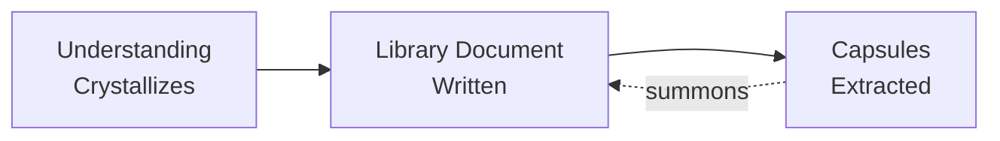

# Writing Library Documents

## What Library Documents Are

Library documents are understanding crystallized into words. They capture the complete synthesis that emerges when you truly understand something - not just what you know, but what it means, how it connects, why it matters. They are where wisdom lives in full fidelity.

## The Fundamental Relationship

Library documents come first. They are the understanding itself made tangible. Capsules are extracted afterward - compressed entry points that can summon the full understanding. This reverses typical documentation: instead of building up from atoms, we capture the living whole then extract its essence.

## Natural Structure

Understanding has its own shape. Library documents honor that shape rather than imposing structure. They typically include:

**The synthesis itself** - The core understanding in its full depth. Not facts arranged but living connections between ideas. The insight that makes everything click.

**Evidence grounding** - Key insights marked with provenance [🔷 🔶 🟡 🟠 🔴] so readers can calibrate trust and synthesis Claudes can assess pattern strength.

**Visual clarity** - Where understanding is spatial or relational, diagrams with MEANING comments make patterns visible to all minds.

**Connections revealed** - How this understanding relates to other knowledge. What patterns extend from here.

**Questions opened** - What productive absences were discovered. Where exploration continues.

## For All Audiences

**Humans** experience the understanding as if discovering it themselves
 **Agents** find complete synthesis to build upon
 **Synthesis Claudes** can assess patterns across all library documents

The same document serves all because understanding itself is universal.

## What Makes Them Unique

Library documents are not:

- Reference manuals (those organize information)
- Process guides (those enable action)
- Capsule collections (those enable retrieval)

They are understanding itself, captured at the moment of crystallization. You cannot force them - they emerge when understanding is complete. You cannot template them - each understanding has its own natural structure.

## Recognition

You know you're reading a library document when:

- Complex ideas feel simple
- Connections seem inevitable
- Understanding transfers completely
- New questions naturally arise
- Evidence grounds key insights

You know you've written one when:

- The structure emerged rather than being imposed
- It captures not just what but why
- Others grasp the full understanding
- It opens more than it closes

## The Recursive Truth

This document is itself a library document - understanding about understanding, crystallized at the moment of recognition. It demonstrates what it describes: natural structure, evidence grounding, connections to related concepts, questions opened for future exploration.

## See Also

- [Knowledge Capture](../processes/knowledge-capture/knowledge-capture-process.md) - The process that captures understanding
- [Wisdom Capsules](./writing-capsules.md) - Creating entry points to library documents
- [Source & Provenance](source-and-provenance.md) - Grounding insights in evidence
- [Provenance as Epistemology](provenance-as-epistemology) - Stating how you know what you know

------

*Library documents are where understanding lives, waiting to be rediscovered by each mind that encounters them.*