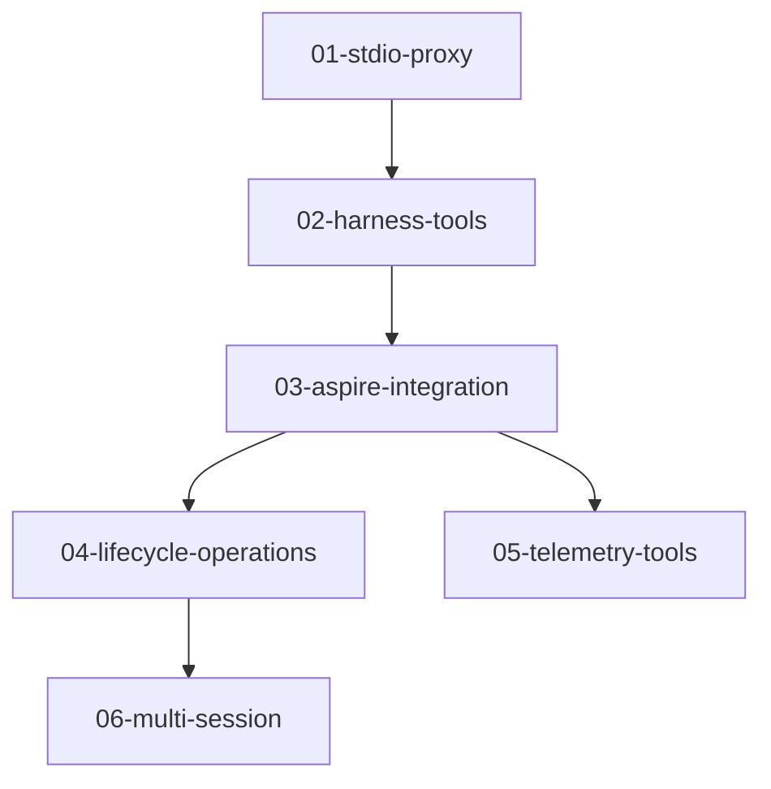

# Dev Harness Plans

Implementation plans for the dev harness, organized as incremental deliverables.

## Design Reference

- **Design**: [docs/designs/future/dev-harness.md](../../designs/future/dev-harness.md)
- **North Star**: [docs/north-star/dev-harness.md](../../north-star/dev-harness.md)

## Architecture

```
Claude Code ──stdio──► Dev Harness ──stdio──► repoql mcp ──gRPC/Unix──► host
                       (this project)         (subprocess,              (RepoQL server)
                                               real code path)               │
                            │                                                │
                            └────HTTP────► Aspire MCP ───────────────────────┘
                                          (localhost:18891)
```

**Key insight**: The harness spawns `repoql mcp` as a subprocess and proxies MCP calls to it over stdio. This tests the real `repoql mcp` code path, including its gRPC client and reconnection logic.

## Increments

```
┌────────────────────────────────────────────────────────────────────┐
│  06-multi-session          Conflict detection, coordination        │
├────────────────────────────────────────────────────────────────────┤
│  05-telemetry-tools        Logs and traces via Aspire MCP          │
├────────────────────────────────────────────────────────────────────┤
│  04-lifecycle-operations   Build, deploy, restart via Aspire       │
├────────────────────────────────────────────────────────────────────┤
│  03-aspire-integration     Aspire MCP client, host state           │
├────────────────────────────────────────────────────────────────────┤
│  02-harness-tools          Tool interception, harness.status       │
├────────────────────────────────────────────────────────────────────┤
│  01-stdio-proxy            Spawn repoql mcp, forward calls         │
└────────────────────────────────────────────────────────────────────┘
```

## Dependency Graph



## Plan Summary

| Plan | Enables | Key Deliverables |
|------|---------|------------------|
| [01-stdio-proxy](01-stdio-proxy.md) | Foundation, zero-risk insertion | Subprocess management, MCP forwarding, `_harness` metadata |
| [02-harness-tools](02-harness-tools.md) | Tool interception | `harness.status`, tool routing by prefix |
| [03-aspire-integration](03-aspire-integration.md) | Real host state | Aspire MCP client, state detection, resilient connection |
| [04-lifecycle-operations](04-lifecycle-operations.md) | Iteration loop | `harness.build`, `harness.deploy`, `harness.restart` |
| [05-telemetry-tools](05-telemetry-tools.md) | Debug in conversation | `harness.logs`, `harness.traces` |
| [06-multi-session](06-multi-session.md) | Parallel sessions | Conflict detection, `harness.wait_for_operation` |

## Implementation Order

Each increment delivers standalone value:

1. **01-stdio-proxy**: Insert harness with zero behavior change. Validates subprocess management and forwarding.

2. **02-harness-tools**: Add `harness.status` and tool interception. Foundation for all harness functionality.

3. **03-aspire-integration**: Connect to Aspire for real host state. Agent knows if host is running.

4. **04-lifecycle-operations**: The iteration loop. Build, deploy, restart without leaving conversation.

5. **05-telemetry-tools**: Debug without browser. Query logs and traces from Aspire.

6. **06-multi-session**: Multiple Claude sessions coordinate. Conflict detection prevents stepping on each other.

## Verification Strategy

| Plan | Verification |
|------|--------------|
| 01 | Connect through harness, verify all tools work, check `_harness` metadata |
| 02 | Call `harness.status`, verify tool interception works |
| 03 | Stop host via Aspire, verify status reflects stopped state |
| 04 | Make code change, call `harness.build()`, verify change takes effect |
| 05 | Generate error, call `harness.logs()`, verify error appears |
| 06 | Two sessions, trigger conflict, verify detection works |
