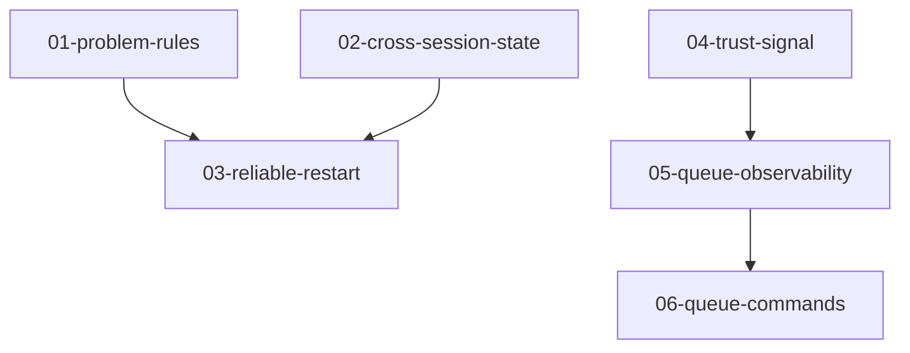

# Diagnostics Plans

Implementation plans for the diagnostics capabilities, organized as incremental deliverables across two designs.

## Design References

- **Local-First Recovery**: [docs/designs/future/local-first-recovery.md](../../../designs/future/local-first-recovery.md) — restart + offline diagnostics
- **Runtime Observability**: [docs/designs/future/runtime-observability.md](../../../designs/future/runtime-observability.md) — enhanced footer + queue observability
- **North Star**: [docs/north-star/diagnostics.md](../../../north-star/diagnostics.md)

## Increments

```
┌────────────────────────────────────────────────────────────────────┐
│  06-queue-commands         Cancel, skip, retry individual items     │
├────────────────────────────────────────────────────────────────────┤
│  05-queue-observability    processing_queue(), system_health() UDFs │
├────────────────────────────────────────────────────────────────────┤
│  04-trust-signal           Enhanced footer with layered trust       │
├────────────────────────────────────────────────────────────────────┤
│  03-reliable-restart       Restart works from any state             │
├────────────────────────────────────────────────────────────────────┤
│  02-cross-session-state    Stderr + version visible to all clients  │
├────────────────────────────────────────────────────────────────────┤
│  01-problem-rules          Richer offline diagnosis                 │
└────────────────────────────────────────────────────────────────────┘
```

## Dependency Graph



Plans 01-03 implement **Local-First Recovery**. Plans 04-06 implement **Runtime Observability**. The two tracks are independent — either can proceed first.

## Plan Summary

| Plan | Design | Enables | Key Deliverables |
|------|--------|---------|------------------|
| [01-problem-rules](01-problem-rules.md) | Local-First Recovery | Richer offline diagnosis | 4 new rules, 2 new probes, log error extraction |
| [02-cross-session-state](02-cross-session-state.md) | Local-First Recovery | Any client sees crash details | host.stderr.log, host.version, version mismatch rule |
| [03-reliable-restart](03-reliable-restart.md) | Local-First Recovery | Restart works when host is down | Restart consumes DiagnosticsCollector, local cleanup, structured escalation |
| [04-trust-signal](04-trust-signal.md) | Runtime Observability | Layered trust on every response | Cached GetSummary, TrustSignal, proto fields, formatting rules |
| [05-queue-observability](05-queue-observability.md) | Runtime Observability | See what the pipeline is doing | processing_queue(), failed_files(), system_health(), CreatedAt |
| [06-queue-commands](06-queue-commands.md) | Runtime Observability | Surgical control over the queue | ::queue.cancel, ::queue.skip, ::queue.retry, stage-boundary checks |

## Verification Strategy

| Plan | Verification |
|------|--------------|
| 01 | Kill host, run `::diagnostics`, verify new rules fire with actionable guidance |
| 02 | Start host from different session, run `::diagnostics`, verify stderr and version appear |
| 03 | Kill host, run `::host.restart`, verify host comes back from any state |
| 04 | Index a repo partially, verify footer shows percentage + failures + stale counts |
| 05 | Query `processing_queue()` during indexing, verify items appear with age |
| 06 | Skip a file, restart host, verify it's not re-enqueued |
