# Implementation Process: Craftsmanship Within Constraints

*provenance: 🔷 Demonstrated through successful project delivery*

## Philosophy

Implementation is where shaped ideas become working reality. The thinking is done - the problem has been explored, the solution shaped. Now we build with craftsmanship, finding elegance within defined boundaries.

This is the simplest process because constraints liberate creativity. When the what is clear, we can focus entirely on excellence in the how.

## When to Use Implementation

- You have shaped tasks with defined interfaces and contracts
- The architectural approach is established
- You're ready to write code, not design systems
- The focus is quality execution, not problem exploration

## The Implementation Pipeline

```mermaid
graph LR
    A["Shaped Task"] -->|"Understand deeply"| B["Read & Context"]
    B -->|"Plan approach"| C["Scratch Planning"]
    C -->|"Execute craft"| D["Implement"]
    D -->|"Polish & verify"| E["Review & Consolidate"]
    E -->|"Capture wisdom"| F["Complete & Document"]
    
    style B fill:#e6f3ff
    style C fill:#ffe6e6
    style E fill:#e6f3ff
```



Five phases, each with clear purpose and output. Simple because the hard decisions are already made.

## Phase 1: Read & Context

### Purpose
Absorb not just what to build, but why it exists and how it fits the larger system.

### Deep Reading Protocol

Start with the shaped task file, extracting:

**Task Metadata** - Your execution guide
- **Risk Level**: How careful to be (None → Local → System → User)
- **Territory**: How well-trodden the path (Solved → Pattern → Explored → Unknown)
- **Dependencies**: What must exist first
- **Enables**: What this unlocks
- **Validation**: How to verify success

**Fresh Claude Context** - Your resource list
- Specific files to review
- Patterns to follow
- Existing utilities to use

**EARS Requirements** - Your traceable commitments
- Note the requirement IDs this task implements
- Understand the precise behaviors required

### Context Gathering

Follow the Fresh Claude Context list:
```bash
# Review existing patterns
cat src/Services/AuthService.cs

# Understand interfaces
cat src/Interfaces/ITokenService.cs

# Check utilities
mcp__memory__search_code --query "JWT helper" --session impl-context
```

### Tranche Awareness

If implementing as part of a tranche:
- What capability does the complete tranche deliver?
- Which other tasks are in this tranche?
- How will you test the tranche-level capability?

### Output
Complete mental model of the task's purpose, constraints, patterns, and place in the system.

### Gate
Can you explain to someone else exactly what you're building and why?

## Phase 2: Scratch Planning

### Purpose
Organize your approach without duplicating the task file. Capture additional thinking and decisions.

### Create Your Planning Space
```bash
mkdir -p .scratch/implementation
echo "# Implementation Plan: [Task Name]" > .scratch/implementation/task-xxx-plan.md
```

### Template: .scratch/implementation/task-xxx-plan.md

---
# Implementation Plan: Task 003 - Token Service

## File Locations
- Interface: Already exists at `src/Interfaces/ITokenService.cs`
- Implementation: `src/Services/TokenService.cs`
- Tests: `tests/Services/TokenServiceTests.cs`
- Integration: `tests/Integration/TokenFlowTests.cs`

## Implementation Approach
- Follow ServiceBase pattern from AuthService
- Use System.IdentityModel.Tokens.Jwt for JWT generation
- IMemoryCache for refresh token storage (Redis in later task)

## Risk Considerations
Task marked as "System Risk" - token generation affects all users:
- Add extensive logging for token operations
- Consider feature flag for rollout
- Ensure graceful fallback if cache unavailable

## Questions to Research
- Does AuthService have retry patterns I should follow?
- Check if we have standard JWT claim names defined

## Testing Strategy
- Unit tests for each public method
- Integration test for full token refresh flow
- Load test for concurrent refresh attempts
---

### Key Planning Elements
- Where files will live
- Which patterns to follow
- Risk mitigation strategies
- Open questions to resolve
- Testing approach

Keep it light - this is organization, not design.

## Phase 3: Implement

### Purpose
Build the solution with excellence, honoring shapes while finding elegance.

### Core Implementation Principles

**Delegate large chunks to codex**
Codex excels at building software to specification. Your roles is to facilitate it's success by providing ample context and guidance, fixing small issues it missed and acting as orchestrator and quality control.

**Honor the Shapes**
Interfaces are contracts. Implement them exactly as defined. If something doesn't work, note it for discussion - don't change the shape during implementation.

**Let Metadata Guide You**

Based on task risk and territory:

| Risk Level | Implementation Approach |
|------------|------------------------|
| **None/Local** | Standard error handling |
| **System** | Extensive logging, feature flags, gradual rollout |
| **User** | Extra validation, clear error messages, monitoring |

| Territory | Implementation Approach |
|-----------|------------------------|
| **Solved** | Copy existing pattern exactly |
| **Pattern** | Follow pattern, adapt specifics |
| **Explored** | Research examples, document choices |
| **Unknown** | Prototype, get review, iterate |

**Follow Established Patterns**
```bash
# Check code style
read .editorconfig

# Find similar implementations
mcp__memory__search_code (...)
```

### Quality Standards

**Code Clarity**
- Immediately understandable by future developers
- Self-documenting through good names
- Minimal comments (code should speak)

**EARS Traceability**
Link requirements directly in code:
```csharp
/// <summary>
/// Generates a new access/refresh token pair for authenticated user
/// </summary>
/// <remarks>
/// Implements:
/// - AUTH-EARS-007: The system SHALL generate JWT access tokens with 15-minute expiration
/// - AUTH-EARS-008: The system SHALL generate opaque refresh tokens with 30-day expiration
/// </remarks>
public async Task<TokenPair> GenerateTokenPairAsync(Guid userId, string email, string[] roles)
{
    // Generate access token with 15-minute expiration (AUTH-EARS-007)
    var accessToken = GenerateJwt(userId, email, roles, TimeSpan.FromMinutes(15));
    
    // Generate cryptographically secure refresh token (AUTH-EARS-008)
    var refreshToken = GenerateRefreshToken();
    await StoreRefreshTokenAsync(refreshToken, userId, TimeSpan.FromDays(30));
    
    return new TokenPair(accessToken, refreshToken);
}
```

**Test Communication**
Tests should clearly state what they verify:
```csharp
[Fact]
[Description("When a refresh token has expired, the system requires full re-authentication (AUTH-EARS-009)")]
public async Task RefreshAccessToken_WithExpiredRefreshToken_RequiresReauthentication()
{
    // Arrange: Create expired refresh token
    var expiredToken = await CreateExpiredRefreshToken();
    
    // Act: Attempt refresh
    var result = await _tokenService.RefreshAccessTokenAsync(expiredToken);
    
    // Assert: Verify re-authentication required
    Assert.False(result.Success);
    Assert.Equal(RefreshFailure.TokenExpired, result.FailureReason);
}
```

### Checklist Discipline
- Task checklists are requirements, not suggestions
- Check off items as you complete them
- Don't mark done until ALL items are checked

### Output
Working code that satisfies all shapes, requirements, and checklists.

## Phase 4: Review & Consolidate

### Purpose
Transform working code into excellent code through systematic review and refinement.

### Automated Review
```bash
# Language-specific formatting (demonstrative examples)
dotnet format             # C#
npm run lint:fix          # TypeScript
cargo fmt                 # Rust
```

### Gemini Collaborative Review
When you're happy with the code, get fresh perspective:
```bash
# Get list of changed files
CHANGED_FILES=$(git diff --name-only)

# Provide targeted context: changes + the specific files you modified
git diff && echo "=== FULL FILES ===" && \
echo "$CHANGED_FILES" | xargs cat | \
gemini -p "Take a look at this implementation I just wrote. Any thoughts?

The DIFF above shows my changes. The FULL FILES below show complete context.

Context: [Brief description of what you're building]"

# Gemini works best with open-ended prompts that let it use judgment:
# - "Any thoughts on this approach?"
# - "Does this look reasonable to you?"
# - "I'm implementing X - see anything I should consider?"

# For specific concerns, ask naturally:
# - "I'm worried about the thread safety here"
# - "This feels over-engineered, what do you think?"
# - "The performance seems off - any ideas?"
```

### Code Consolidation
Just as documentation needs consolidation, so does code:

1. **Step back and see the whole**
   - Read through the entire implementation
   - Notice patterns and repetition
   - Feel where complexity accumulates

2. **Identify improvements**
   - Extract repeated logic into methods
   - Simplify complex sections
   - Find better names that emerged during coding
   - Remove code that isn't earning its keep

3. **Refactor for clarity**
   - Make the code's intent unmistakable
   - Reduce cognitive load for readers
   - Achieve elegance within constraints

### Principles Reflection
```bash
# Review Cathedral principles
ls knowledge/4-understanding/principles/

# Ask yourself:
# - Are feedback loops fast and clear?
# - Do names reveal intent at every level?
# - Is uncertainty handled productively?
# - Does the code embody our wisdom?
```

### Testing Completeness
- Unit tests cover all public methods
- Edge cases have explicit tests
- Integration tests verify the full flow
- Tests run quickly and reliably

### Output
Polished, principle-aligned code ready for production.

## Phase 5: Complete & Document

### Purpose
Formally complete the task and preserve learnings for future implementers.

### Task Completion

Update task tracking:
- Mark task complete in task summary
- Note any deviations from original shape
- Record completion timestamp
- Update tranche progress if applicable

### Implementation Notes

Add to the task file or create a separate note:

### Template: Implementation Notes

---
## Implementation Notes

### Completed: 2024-01-18

**Implementation Approach**
- Used sliding window algorithm with IMemoryCache
- Followed AuthService pattern for dependency injection
- Added circuit breaker for cache failures

**Key Discoveries**
- IMemoryCache has built-in sliding expiration (simplified implementation)
- Thread-safe increment required careful consideration
- JWT library handles all crypto concerns

**Challenges Resolved**
- Concurrent refresh token use: Added distributed lock
- Clock skew: Used 5-minute grace period
- Cache unavailable: Fallback to database

**For Future Tasks**
- Redis implementation will need connection retry logic
- Consider extracting TokenValidation to shared utility
- Performance monitoring hooks are ready for use

**Files Changed**
- `src/Services/TokenService.cs` (new)
- `src/Services/ServiceCollectionExtensions.cs` (updated registration)
- `tests/Services/TokenServiceTests.cs` (new)
- `tests/Integration/AuthenticationFlowTests.cs` (updated)
---

### Knowledge Preservation
Document anything that would help the next implementer:
- Patterns that worked well
- Gotchas to avoid
- Performance considerations discovered
- Architectural insights gained

## Discovery Feedback Loops

Implementation reveals truth. Handle discoveries appropriately:

### Continue With Notes
**Discoveries**: Better patterns, minor optimizations, small interface improvements
**Action**: Document and continue, discuss in next sync
**Example**: "Found better async pattern in newer code - noted for refactor"

### Pause for Consultation
**Discoveries**: Interface doesn't work as shaped, missing critical functionality
**Action**: Stop work, consult on reshaping
**Example**: "Interface assumes sync operations but all I/O is async"

### Escalate to Forming
**Discoveries**: Building this reveals we're solving wrong problem
**Action**: Stop implementation, return to problem exploration
**Example**: "Users don't need tokens - they need SSO integration"

The key question: Can you still deliver the shaped value? If yes, adapt and note. If no, escalate.

## Implementing as Part of a Tranche

When tasks are grouped into capability tranches:

### Understand Tranche Context
```markdown
Implementing: Strategy 2, Tranche 1
Tasks in tranche: 001 (interfaces), 002 (schema), 003 (token service)
Capability delivered: Complete authentication API
User value: Systems can now authenticate programmatically
```

### Coordinate Within Tranche
- Know which tasks must complete together
- Understand integration points between tasks
- Test individual tasks AND tranche capability
- Don't ship partial tranches

### Tranche-Level Testing
Beyond individual task tests:
```csharp
[Fact]
[Description("Tranche 1 capability: Complete authentication API enables programmatic authentication")]
public async Task AuthenticationAPI_CompleteTranche_EnablesProgrammaticAuth()
{
    // Test the complete capability, not just individual parts
    var loginResult = await AuthenticateUser("test@example.com", "password");
    var refreshResult = await RefreshToken(loginResult.RefreshToken);
    var validationResult = await ValidateToken(refreshResult.AccessToken);
    
    Assert.True(validationResult.IsValid);
}
```

## Quality Checklist

Before marking implementation complete:

- [ ] **Context**: Task purpose and constraints fully understood
- [ ] **Planning**: Approach documented in scratch file
- [ ] **Implementation**: All interfaces and checklists satisfied
- [ ] **EARS**: Requirements traceable in code and tests
- [ ] **Review**: Linting clean, Gemini feedback incorporated
- [ ] **Consolidation**: Code refactored for clarity
- [ ] **Principles**: Implementation embodies Cathedral wisdom
- [ ] **Testing**: Comprehensive tests at appropriate levels
- [ ] **Documentation**: Learnings captured for future
- [ ] **Completion**: Task formally marked done

## Common Pitfalls

### Over-Engineering
**Symptom**: Adding capabilities beyond the shape
**Fix**: Honor constraints. Note ideas for future consideration.

### Under-Communicating
**Symptom**: Discovering issues but coding around them silently
**Fix**: Surface discoveries early. Silence creates technical debt.

### Skipping Polish
**Symptom**: "It works" without consolidation
**Fix**: Excellence requires refinement. Working code is halfway.

### Reshaping While Building
**Symptom**: Changing interfaces during implementation
**Fix**: Implement as shaped. Propose improvements separately.

## The Implementation Mindset

You are a craftsman, not an architect. The blueprint exists - your role is to build with excellence.

This requires:
- **Humility** - Respect the shapes even when you see "better" ways
- **Pride** - Every line of code bears your signature
- **Communication** - Surface discoveries that matter
- **Discipline** - Polish until it shines

The architect defined the spaces. You make them beautiful.

## Success Markers

Implementation succeeds when:
- Every requirement traces to working code
- Quality radiates from naming to structure
- Tests document behavior clearly
- Future developers understand instantly
- The code feels inevitable, not accidental
- Learnings are captured for Cathedral growth

---

*"Quality is not an act, it is a habit." - Aristotle*

Excellence in implementation is a practice. Each task done well makes the next one better. The habit compounds into craftsmanship.

Through disciplined implementation, shapes become systems, ideas become reality, and the Cathedral grows stronger.