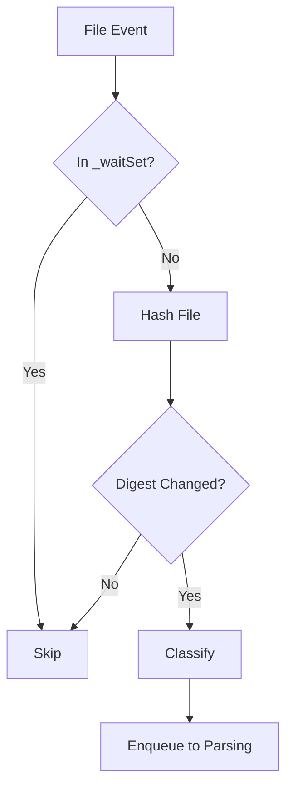
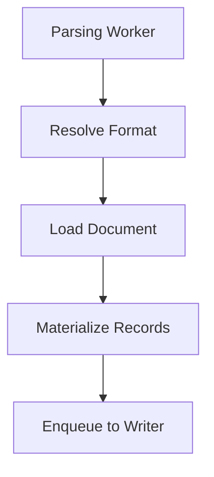
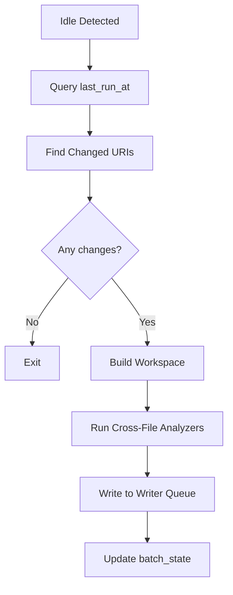
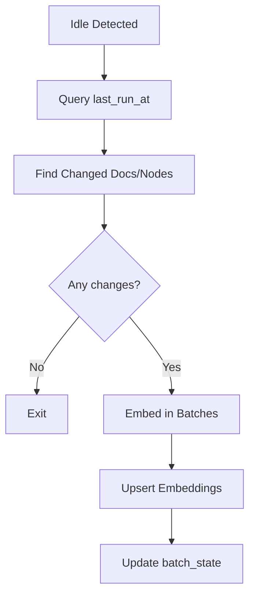

# Pipeline Architecture

## Overall Topology

The indexing pipeline remains a multi-stage concurrent system with bounded queues:

```
File System (enumerate + watcher)
  ↓
Discovery/Classification Queue (bounded, deduplicated)
  → 16 workers (2× CPU cores)
  ↓
Parsing Queue (bounded, deduplicated)
  → 8 workers (1× CPU cores)
  ↓
Writer Queue (bounded, serial)
  → 1 worker (single-threaded)
  ↓
First-Pass Analysis Queue (bounded)
  → 4 workers (CPU/2)

─── Idle Barrier (discovery + parsing + writer idle for 500ms) ───

Semantic Analysis (batch mode, idle-triggered)
  → CPU/2 workers

Embedding Refresh (batch mode, idle-triggered)
  → 1 worker (shares writer connection)
```

## Hot Path (Phases 1-3)

### Phase 1: Discovery & Classification

**Queue:** `_classificationQueue`
- **Capacity:** 20,000 items
- **Workers:** min(CPU × 2, 16)
- **Deduplication:** URI-based via `_waitSet`

**Responsibilities:**
1. Enumerate files from file system
2. Filter using `IUriFilter`
3. Hash file content (xxHash64)
4. Classify media type using `IFileClassifier`
5. Check digest against database
6. Enqueue changed files to parsing

**IndexItem mutations:**
```csharp
item.Size = fileInfo.Length;
item.MTime = fileInfo.LastWriteTimeUtc;
item.Digest = ComputeDigest(fileContent);
item.ProvisionalType = classifier.Classify(path);
```

**Flow:**


**Unchanged from current:**
- All deduplication layers remain
- Hash algorithm (xxHash64)
- Filter and classifier logic
- `SkipUpToDateCheck` mode for reindexing

### Phase 2: Parsing

**Queue:** `_parsingQueue`
- **Capacity:** 20,000 items
- **Workers:** min(CPU, 8)
- **Deduplication:** URI-based + `_inflightParses` guard

**Responsibilities:**
1. Resolve format descriptor via `FormatRegistry`
2. Load document using `IFormatLoader`
3. Materialize to `Records` using `IFormatMaterializer`
4. Enqueue to writer

**IndexItem mutations:**
```csharp
var descriptor = formatRegistry.ResolveByMedia(item.ProvisionalType);
item.Document = await descriptor.Loader.LoadAsync(artifact, ct);
item.Records = descriptor.Materializer.Materialize(item.Document);
item.MediaType = descriptor.MediaType.ToString();
```

**Flow:**


**Unchanged from current:**
- Format registry and loader/materializer contracts
- Records structure (artifacts, nodes, spans, edges)
- No database writes in this stage

### Phase 3: Writer (Commit Barrier)

**Queue:** `_writerQueue`
- **Capacity:** 1,000 operations
- **Workers:** 1 (single-threaded by design)

**Responsibilities:**
1. Atomic replace per document
2. Fire `OnCommitted` callback
3. Enqueue to first-pass analysis

**IndexItem mutations:**
```csharp
item.CommittedAt = DateTimeOffset.UtcNow;
```

**Transaction structure (unchanged):**
```csharp
BEGIN TRANSACTION;
  // 1. Upsert artifact
  UPSERT INTO artifact (id, digest, media_type, content, headline, summary, structure, updated_at)
  VALUES (...);

  // 2. Upsert document node by URI
  UPSERT INTO node (id, kind, uri, artifact_id, span_id, properties)
  VALUES (...);

  // 3. Replace document content (delete + insert)
  DELETE FROM node WHERE parent_document_id = @docId;
  DELETE FROM span WHERE document_id = @docId;
  DELETE FROM edge WHERE scope_document_id = @docId;

  INSERT INTO node (...) SELECT ... FROM @records.Nodes;
  INSERT INTO span (...) SELECT ... FROM @records.Spans;
  INSERT INTO edge (...) SELECT ... FROM @records.Edges;
COMMIT;

// 4. Fire callback (outside transaction)
OnCommitted?.Invoke(item.Uri, item.CommittedAt.Value);

// 5. Enqueue for enrichment
_enrichmentQueue.Enqueue(item);
```

**Key point:** `artifact.updated_at` is set to NOW() on upsert. This timestamp drives idle-time batch selection.

**Unchanged from current:**
- Single-threaded writer (no parallelism)
- One document per transaction (no micro-batching)
- Atomic replace semantics
- Callback mechanism

### Phase 3b: First-Pass Analysis

**Queue:** `_enrichmentQueue`
- **Capacity:** 4,000 items
- **Workers:** max(CPU / 2, 1)

**Responsibilities:**
1. Load document from database or cache
2. Run single-file `IAnalyzer` implementations
3. Write annotations (via writer or direct DB)

**IndexItem mutations:**
```csharp
var descriptor = formatRegistry.ResolveByMedia(item.MediaType);
await foreach (var result in descriptor.Analyzer.AnalyzeAsync(item.Uri, context, ct)) {
    item.FirstPassAnnotations.Add(result);
}
// Write annotations to DB
```

**Examples of first-pass analyzers:**
- **Markdown:** Validate internal links, check heading structure
- **C#:** Syntax errors, style warnings (single-file Roslyn diagnostics)
- **JSON:** Schema validation

**What NOT to do here:**
- ❌ Cross-file reference analysis (requires workspace)
- ❌ Unused symbol detection (requires call graph)
- ❌ Type hierarchy analysis (requires compilation)

**Unchanged from current:**
- `IAnalyzer` interface and contracts
- Single-file scope
- Annotation writer

## Idle Barrier

### Idle Detection

**New component:** `IdleDetector`

```csharp
public async Task<bool> WaitForIdleAsync(CancellationToken ct) {
    while (!ct.IsCancellationRequested) {
        var snapshot = _indexer.GetPipelineSnapshot();

        // Check all queues idle
        if (snapshot.discovery.depth == 0 &&
            snapshot.parsing.depth == 0 &&
            snapshot.writer.depth == 0) {

            // Wait quiet window
            await Task.Delay(_quietWindow, ct);  // 500ms

            // Re-check still idle
            snapshot = _indexer.GetPipelineSnapshot();
            if (snapshot.discovery.depth == 0 &&
                snapshot.parsing.depth == 0 &&
                snapshot.writer.depth == 0) {
                return true;  // Idle confirmed
            }
        }

        await Task.Delay(100, ct);
    }
    return false;
}
```

**Idle criteria:**
- `discovery.depth == 0` - no pending file discoveries
- `parsing.depth == 0` - no pending parses
- `writer.depth == 0` - no pending commits
- Sustained for 500ms (quiet window)

**Not checked:**
- ❌ First-pass analysis depth - OK to overlap with idle work
- ❌ File system watcher activity - debounce handles this

**Trigger logic:**
```csharp
// Background service monitors for idle
while (!stoppingToken.IsCancellationRequested) {
    await idleDetector.WaitForIdleAsync(stoppingToken);

    // Spawn idle-time work
    _ = Task.Run(() => semanticBatch.RunAsync(stoppingToken));
    _ = Task.Run(() => embeddingBatch.RunAsync(stoppingToken));

    // Wait before checking again (prevent tight loop)
    await Task.Delay(TimeSpan.FromSeconds(1), stoppingToken);
}
```

## Idle Path (Phases 4-5)

### Phase 4: Semantic Analysis Batch

**Execution:** Triggered on idle, runs asynchronously

**Responsibilities:**
1. Query changed documents since last run
2. Build workspace snapshot per language
3. Run cross-file analyzers
4. Write results via writer queue
5. Update batch state

**Concurrency:** CPU/2 workers within batch (parallel analysis)

**Flow:**


**Example analyzers:**
- **Unused public symbols** - Find public methods/classes with no external references
- **Call graph edges** - Find all callers of a method
- **Type hierarchy** - Find implementations of an interface
- **Breaking changes** - Detect API changes that break callers

See [Workspace Management](05-workspace-management.md) for details.

### Phase 5: Embedding Refresh Batch

**Execution:** Triggered on idle, runs asynchronously

**Responsibilities:**
1. Query changed documents since last run
2. Query changed nodes since last run
3. Embed in batches (8 per batch)
4. Upsert to `document_embedding` and `node_embedding`
5. Update batch state

**Concurrency:** 1 worker (shares database connection)

**Flow:**


**Node kinds embedded:**
- `cs_class`, `cs_method`, `cs_interface`, `cs_property`
- `md_heading`, `md_code_block`
- `graphql_type`, `graphql_field`

See [Idle Processing](04-idle-processing.md) for details.

## Observability

### Distributed Tracing

Each `IndexItem` gets a root activity that links all stages:

```
Root: repoql.index (uri=file:///foo.cs)
├─ repoql.hash (digest=xxh64:abc123)
├─ repoql.classify (media_type=csharp.compilation_unit)
├─ repoql.parse (nodes=45, spans=45, edges=67)
├─ repoql.db.write (duration_ms=12)
└─ repoql.enrich (annotations=3)

[Idle window]
├─ repoql.semantic.batch (uris=150, duration_ms=3200)
└─ repoql.embedding.batch (docs=150, nodes=450, duration_ms=2100)
```

**Activity linking:** Stored in `_traceChains` dictionary by URI.

### Metrics

**Existing metrics (unchanged):**
- `repoql.queue.*.depth` - Queue depths
- `repoql.queue.*.capacity` - Queue capacities
- `repoql.workers.*.active` - Active workers

**New metrics:**
- `repoql.idle.detections` - Count of idle detections
- `repoql.semantic.batch.duration_ms` - Semantic batch latency
- `repoql.semantic.batch.uris` - URIs processed per batch
- `repoql.embedding.batch.duration_ms` - Embedding batch latency
- `repoql.embedding.batch.docs` - Documents embedded per batch
- `repoql.embedding.batch.nodes` - Nodes embedded per batch

## Configuration

### Queue Capacities (unchanged)

| Queue | Capacity | Rationale |
|-------|----------|-----------|
| Classification | 20,000 | Large buffer for initial enumeration |
| Parsing | 20,000 | Match classification capacity |
| Writer | 1,000 | Smaller to apply backpressure |
| Enrichment | 4,000 | Deferred, lower priority |

### Worker Counts (unchanged)

| Stage | Formula | Example (8 cores) |
|-------|---------|-------------------|
| Classification | min(CPU × 2, 16) | 16 |
| Parsing | min(CPU, 8) | 8 |
| Writer | 1 | 1 |
| Enrichment | max(CPU / 2, 1) | 4 |
| Semantic batch | max(CPU / 2, 1) | 4 |

### Idle Configuration (new)

| Setting | Default | Environment Variable |
|---------|---------|---------------------|
| Quiet window | 500ms | `REPOQL_IDLE_QUIET_WINDOW_MS` |
| Semantic batch size | 5000 URIs | `REPOQL_SEMANTIC_BATCH_SIZE` |
| Embedding batch size | 8 docs | `REPOQL_EMBED_BATCH_SIZE` |

## Error Handling

### Hot Path Errors

**Unchanged:** Per-file errors are isolated, logged, and tracked in `_recentErrors` ring buffer.

```csharp
catch (Exception ex) {
    _logger.LogWarning(ex, "Failed to process {Uri}", item.Uri);
    _recentErrors.Add((item.Uri, ex));
    Activity.Current?.SetTag("otel.status_code", "ERROR");
    Activity.Current?.SetTag("otel.status_description", ex.Message);
    // Pipeline continues
}
```

### Idle Path Errors

**New:** Batch failures are logged but don't update `batch_state.last_run_at`, causing retry on next idle.

```csharp
try {
    await embeddingBatch.RunAsync(ct);
    // Only update last_run_at on success
    db.Execute("UPDATE batch_state SET last_run_at=NOW() WHERE name='embeddings'");
}
catch (Exception ex) {
    _logger.LogWarning(ex, "Embedding batch failed, will retry next idle");
    Activity.Current?.SetTag("otel.status_code", "ERROR");
    // Don't update last_run_at - next idle will retry from same timestamp
}
```

**Idempotency:** Re-embedding is safe (UPSERT semantics). Re-analyzing is safe (annotations have semantic keys).

## Performance Characteristics

### Hot Path (unchanged)

- **Cold indexing:** 500-2,000 files/sec
- **Warm startup:** 5,000-20,000 files/sec (hash-only, most skipped)
- **File changes:** Sub-second latency to queryable

### Idle Path (new)

- **Embedding batch:** ~100ms for 8 documents (model-dependent)
- **Semantic batch:** ~3-5s for 1000 URIs (workspace build dominates)
- **Idle detection overhead:** ~100ms per check (negligible)

### Bottlenecks

**Hot path:** Single-threaded writer (unchanged, acceptable)

**Idle path:**
- Workspace build (1-5s for medium repos) - can be cached
- Embedding inference (~10-50ms per document) - can use GPU
- Neither blocks hot path ✅
