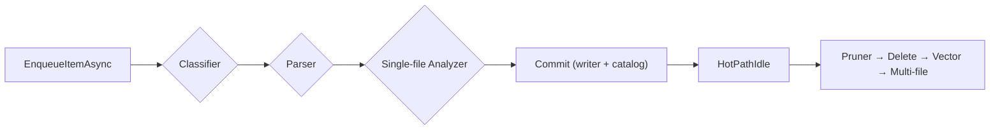

# RepoQL.Indexing

## Overview
`RepoQL.Indexing` is the hot‑path service that turns raw repository artifacts into the graph, embeddings, and repo index rows that drive `search()` / `related()` queries. It owns:

- **Work queues** for classifier / parser / analyzer stages (`WorkQueue<T>`).
- **Document catalog** for incremental decisions (skip vs reindex).
- **Committer** that writes records + annotations via the database writer contract.
- **Idle/post‑index orchestration** (pruner → writer delete → vector refresh → multi‑file analyzers).
- **State and telemetry** so callers can observe `Started`, `ClassificationBusy`, `AllIdle`, etc.

## Pipeline at a Glance
| Stage | Responsibility | Key Types |
| --- | --- | --- |
| Classification | Determine `SemanticMediaType`, filter excluded files | `ClassificationPipeline`, `StageContext` |
| Parsing | Produce `Records` (nodes/spans/edges) | `ParsingPipeline`, `Records` |
| Single-file analysis | Emit annotations / enrich metadata | `SingleFileAnalysisPipeline`, `Annotation` |
| Commit | Persist via `IIndexingCommitter` and `IDatabaseWriter` | `IndexingCommitter`, `WriteOperation` |
| Idle dispatch | When hot path drains, run pruner/vector/multi-file | `_analysisEpochChannel`, `HotPathIdleEventArgs` |

## Hot Path Mechanics
1. `EnqueueItemAsync` stamps each `IndexItem` with an epoch counter and schedules it on the indexing queue.
2. `StageContext.RunAsync` flips the corresponding busy/idle flags. When any busy flag is set, `IndexingState.Started` is also set.
3. `IndexItemAsync` consults `IDocumentCatalog` → `DocumentCatalogDecision`. Skip returns early; reindex registers a pending digest and runs the pipelines.
4. `IndexingCommitter` converts `IndexItem` into `WriteOperation` objects and waits for the `IDatabaseWriter` result. Failures bubble back to the stage (see `RepoQL.Indexing.Indexing.Commit`).
5. Once all stage flags return to idle for a given epoch, `_epochTracker` fires `HotPathIdle`, which feeds `_analysisEpochChannel` for post-index work.

### Events & State
- `StateChanged` raises every time a busy/idle bit flips. Wait for `IndexingState.Started` before assuming work is in flight.
- `HotPathIdle` carries the epoch that has drained; listeners should call `EnqueueIdleEpoch(epoch)` and allow `ProcessIdleEpochsAsync` to run pruner/vector/multi-file.

## Post-Index Orchestration
1. **Pruner** (`IArtifactPruner`) compares pending URIs with stored docs and returns stale `RepoUri`s.
2. **Writer delete** issues `WriteOperationType.DeleteDocument` for each stale URI. The writer’s `OnCommitted` callback updates the catalog via `DocumentCatalog.ApplyDelete`.
3. **Vector refresh** (`IVectorIndexCoordinator`) applies deletes first, then recomputes embeddings for the pending items.
4. **Multi-file analyzer / index rebuild** receive the batch once vector work completes.

See `docs/pipeline.md` for the detailed sequence and extension points.

## Testing References
- Follow the [RepoQL.Testing Playbook](../../tests/RepoQL.Testing/README.md) for format harnesses, indexing contracts, DuckDb fixtures, and graph assertions.
- Unit tests live in `src/Indexing/RepoQL.Indexing.Tests`. Key suites:
  - `IndexingEngineTests` – stage transitions, catalog interactions, hot-path idempotency.
  - `IndexingCommitterTests` – writer contracts.
  - `PostProcessing/*Tests` – pruner/vector/idle orchestration.
  - Format-specific suites (e.g., Markdown) consume the shared testing harnesses.

## Further Reading
- [`docs/IndexingProcess.md`](../../../docs/IndexingProcess.md) – end-to-end walkthrough.
- [`docs/knowledge/format-excellence.md`](../../../docs/knowledge/format-excellence.md) – expectations for x-ray outputs.
- [`docs/knowledge/testing-guidelines.md`](../../../docs/knowledge/testing-guidelines.md) – RepoQL-wide testing philosophy.
- [`src/Indexing/RepoQL.Indexing/docs/pipeline.md`](docs/pipeline.md) – extended explanation of stage contexts, state flags, and idle orchestration.
