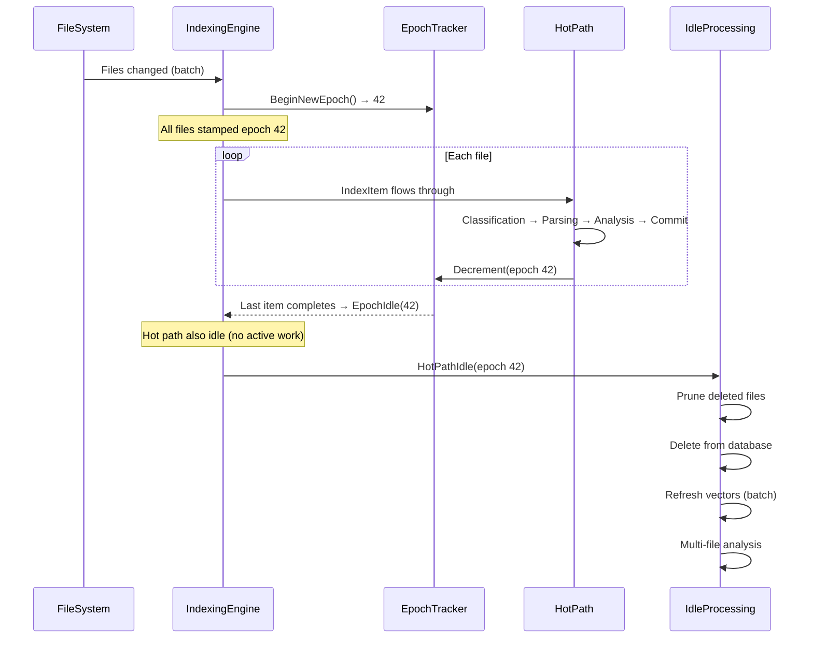
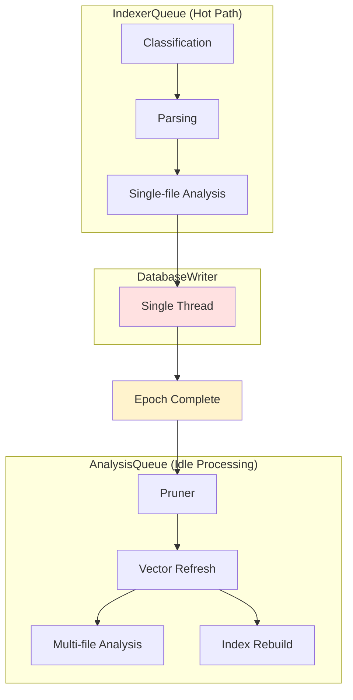
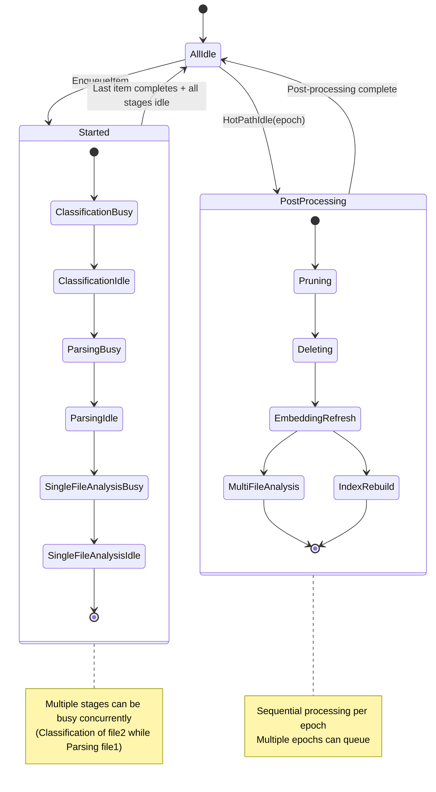

# RepoQL.Indexing Architecture

Why this design exists and what problems it solves.

---

## Core Design Pattern

Files pass through stages that add information to a single object:

```
Classification: Determines file type → sets MediaType
Parsing: Reads content → sets Records (graph structure)
Analysis: Checks for issues → adds Annotations
Commit: Persists to database
```

Each stage adds fields to the IndexItem object. Earlier stages' results are visible to later stages. This is a **flow object pattern**—one object accumulates state rather than creating new immutable objects at each stage.

**Why flow object instead of functional pipeline**: Easier debugging (one object to inspect), simpler testing (check state at any point), processors can reference previous stages' work.

---

## Why RepositoryIndexer Failed

The monolithic `RepositoryIndexer` class (deleted, see git history) had fundamental problems:

### Hard-Wired Topology

```csharp
// Old pattern - hard coded stages
private async Task ProcessDiscoveryQueue() { ... }
private async Task ProcessParsingQueue() { ... }
private async Task ProcessEnrichmentQueue() { ... }
```

Every new format meant editing core orchestration. No seams. No extension points. Adding C# support required modifying the engine.

### Tangled State Management

State flags scattered across methods. Queue depth checks everywhere. Idle detection by polling. State transitions implicit, error-prone, untestable.

```csharp
// Found in multiple places
if (_classificationQueue.Depth == 0 && _parsingQueue.Depth == 0 && _busy == 0) {
    // Maybe idle? Poll again?
}
```

### Post-Processing Bolted On

Vector refresh? Run after enrichment completes, somehow.
Multi-file analysis? Check a flag and maybe start it.
Pruning? Hope nothing breaks.

No structure. No guarantees. Timing bugs in production.

### Testing Nightmare

Can't test stages in isolation. Can't inject fakes. Can't observe internal state. Integration tests only—slow, brittle, incomplete.

---

## Three Insights That Changed Everything

### Design 1: Flow Object Pattern

Old approach (immutable objects per stage):
```csharp
Queue<RepoUri> discoveryQueue;
Queue<ClassifiedArtifact> parsingQueue;
Queue<ParsedArtifact> enrichmentQueue;
```

New approach (mutable flow object):
```csharp
class IndexItem {
    RawArtifact RawArtifact;
    SemanticMediaType? MediaType;      // Set by Classification
    Records? Records;                   // Set by Parsing
    List<Annotation> Annotations;       // Set by Analysis
}
```

**Benefits**:
- Debugging: Set breakpoint, inspect one object, see entire history
- Testing: Create IndexItem, call stage, assert field set
- Context: Processors can read results from previous stages

**Trade-offs**:
- Mutable state requires careful access control
- Processors must be defensive (check null fields)
- Not thread-safe without synchronization (mitigated by single-threaded stage processing)

### Design 2: Epoch-Based Batch Coordination

**Problem**: Files arrive in groups:
- Initial scan: 10,000+ files
- Git pull: 20-50 changed files
- Rapid saves: 3-5 files in 2 seconds

Processing per-file is inefficient:
- Vector embeddings: 100 files = 100 database round-trips
- Multi-file analysis: Can't analyze cross-references until all files indexed
- Pruning: Need full batch to determine what's deleted

**Solution**: Assign epoch number to batches

```csharp
// All files in git pull get epoch 42
var epoch = engine.BeginNewEpoch();
foreach (var file in changedFiles)
    await engine.EnqueueItemAsync(file);  // All stamped epoch 42

// When last file in epoch 42 completes:
HotPathIdle?.Invoke(this, new HotPathIdleEventArgs(42));

// Post-processing runs ONCE for the batch:
await PruneAsync(epoch42Items);          // 1 database query instead of N
await RefreshVectorsAsync(epoch42Items); // Batch embedding computation
await MultiFileAnalysisAsync(epoch42Items); // See complete graph
```

**Benefits**:
- Fewer database round-trips
- Cross-file analysis sees consistent state
- Memory bounded (process by epoch, not all-at-once)

**Trade-offs**:
- Complexity: Track epoch counters, detect completion
- Latency: Wait for batch to complete before post-processing
- Edge case: Long-running files delay entire epoch

### Design 3: Event-Driven Idle Detection

Old approach (polling):
```csharp
while (true) {
    if (_queue.Count == 0 && _activeWorkers == 0) {
        RunPostProcessing();
    }
    await Task.Delay(100);  // Poll periodically
}
```
**Problems**: Delay before detecting idle, CPU cycles wasted polling, imprecise (race conditions between check and work starting).

New approach (event-driven):
```csharp
HotPathIdle += (sender, args) => {
    EnqueueIdleEpoch(args.Epoch);
};

await foreach (var epoch in _analysisEpochChannel.Reader.ReadAllAsync()) {
    await ReleaseAnalysisAsync(epoch);
}
```

**Benefits**:
- Immediate detection: Fires exactly when last item completes
- Zero polling overhead
- Precise: Event fires atomically with state transition
- Testable: Use `TaskCompletionSource` to control timing

**Trade-offs**:
- More complex: Event subscription and channel management
- Debugging harder: Async event handlers can be tricky to trace

---

## How They Work Together

The three insights compose:



**Flow Object** enables processors to see full context.
**Epoch Tracking** groups work into batches.
**Idle Events** trigger batch operations at the right time.

Remove any one → system doesn't work. Keep all → emergent properties arise.

---

## Components

### RepoqlHost → IndexingCoordinator → IndexingEngine

**Separation of concerns**:
- **RepoqlHost**: Lifecycle (IHostedService). Scans filesystem. Subscribes to watchers.
- **IndexingCoordinator**: Orchestration. User-facing API. Reindex operations. Pipeline status.
- **IndexingEngine**: Execution. Work queues. Stage coordination. State management.

Each can be tested in isolation. Each has single responsibility. Clean dependency graph.

### StageContext: Automatic State Management

```csharp
internal readonly struct StageContext {
    IndexingState BusyFlag;
    IndexingState IdleFlag;
    StageProcessor Processor;
}

// Usage
await _classificationStage.RunAsync(item, ct, UpdateState);

// Inside RunAsync:
UpdateState(BusyFlag, IdleFlag, entering: true);   // Set busy, clear idle
try {
    return await Processor(item, ct);
} finally {
    UpdateState(BusyFlag, IdleFlag, entering: false); // Clear busy, set idle
}
```

**Benefits**:
- Never forget to update state
- Consistent pattern for all stages
- Safe even when processor throws
- Automatic telemetry
- Testable state transitions

### DocumentCatalog: Incremental Indexing

```csharp
public sealed class DocumentCatalog {
    ConcurrentDictionary<string, DocumentCatalogEntry> _entries;
    ConcurrentDictionary<string, string> _pendingDigests;

    public DocumentCatalogEvaluation Evaluate(RepoUri uri, string digestHex) {
        // Check if currently processing
        if (_pendingDigests.TryGetValue(uri, out var pending) && pending == digestHex)
            return SkipUpToDate;

        // Check committed state
        if (_entries.TryGetValue(uri, out var entry) && entry.Digest == digestHex)
            return SkipUpToDate;

        return entry != null ? Reindex : Unknown;
    }
}
```

**Three-state model**:
1. **SkipUpToDate**: Digest matches → early return, no work
2. **Reindex**: Digest differs → full pipeline
3. **Unknown**: New file → full pipeline

**Pending digests** prevent duplicate work: If file queued twice with same digest while first is still processing, second returns `SkipUpToDate` immediately.

### Composable Pipelines

```csharp
public class ClassificationPipeline : PipelinePhase {
    IEnumerable<IAsyncPipeline<IDiscoveredArtifact, SemanticMediaType?>> _processors;

    async Task<PipelineResult> ProcessItemAsync(IndexItem item, CancellationToken ct) {
        foreach (var processor in _processors) {
            var result = await processor.ProcessAsync(item, ct);
            if (result != null) {
                item.MediaType = result;
                return PipelineResult.Success;
            }
        }
        return PipelineResult.Filtered;
    }
}
```

**Extension**: Implement `IAsyncPipeline<TIn, TOut>`. Register in DI. Runs automatically. No core changes.

**Convention**: Return null to skip. First non-null wins.

---

## Threading Model



### Why Serial Writer?

DuckDB connections aren't designed for concurrent writes. Options:
1. **Multiple writers + locks**: Slow (lock contention), complex (deadlocks possible)
2. **Single writer**: Fast (no locks), simple (sequential guarantees)

We chose (2). Constraint becomes strength:
- **No locks**: Maximum throughput
- **Sequential**: Happens-before relationships automatic
- **Simple**: No race conditions to debug

Hot path saturates the writer? Parse faster than we can write. This is **good**—CPU bound, not I/O bound. Writer catches up during idle periods.

---

## Idle Processing Sequence

[🔷 Design Decision: Order matters for correctness]

```csharp
private async Task ReleaseAnalysisAsync(long epoch, CancellationToken ct) {
    var pending = GetPendingItems(epoch);

    // 1. Prune: Identify deleted files
    var pruneResult = await _pruner.PruneAsync(pending, ct);
    // Returns: { StaleUris: ["file:///deleted.md"] }

    // 2. Delete: Remove from database
    await DeleteStaleDocumentsAsync(pruneResult.StaleUris, ct);
    // Fires: OnCommitted → Catalog.ApplyDelete

    // 3. Vector: Refresh embeddings
    await _vectorCoordinator.ProcessPendingAsync(pending, pruneResult, ct);
    // - Apply deletes to vector index
    // - Compute embeddings for new/changed docs (batch operation)

    // 4. Multi-file: Cross-reference analysis
    foreach (var item in pending)
        await _analysisQueue.EnqueueAsync(item, ct);

    // 5. Index Rebuild: Secondary indexes
    await _indexRebuildQueue.ProcessAsync(pending, ct);
}
```

**Why this order**:
1. **Prune first**: Identify stale before processing
2. **Delete before vector**: Don't embed deleted documents
3. **Vector before analysis**: Analysis uses embeddings
4. **Analysis last**: Sees clean, current graph

Change order → incorrect results. Maintain order → correctness guaranteed.

---

## State Machine



---

## Invariants

These must NEVER be violated:

### ☑ Writer ALWAYS Single-Threaded

**Why**: DuckDB connection safety. No locks = fast + correct.

**Enforcement**: `DatabaseWriter` has `capacity: 1` in channel options. Tests assert single writer.

**What breaks**: Concurrent writes → database corruption or deadlocks.

### ☑ Catalog Updates ONLY via OnCommitted

**Why**: Catalog must reflect committed state, not in-progress state.

**Enforcement**: `ApplyUpsert`/`ApplyDelete` called only in `OnCommitted` callback.

**What breaks**: Early update → race condition, item could fail to commit but catalog thinks it succeeded.

### ☑ Epochs Monotonically Increasing

**Why**: Idle processing must happen in order. Later epochs could depend on earlier ones completing.

**Enforcement**: `Interlocked.Increment` on `_currentEpoch`. Never reused.

**What breaks**: Duplicate epochs → double processing. Out-of-order → missing dependencies.

### ☑ Pruner Runs BEFORE Vector Refresh

**Why**: Don't compute embeddings for files about to be deleted.

**Enforcement**: Sequential calls in `ReleaseAnalysisAsync`. Tests verify order.

**What breaks**: Waste compute on deleted files. Stale embeddings in index.

### ☑ Analysis Sees ONLY Committed Graph

**Why**: Multi-file analysis needs consistent view. Can't analyze half-updated state.

**Enforcement**: Analysis runs after commit completes. Epoch boundaries guarantee batch committed.

**What breaks**: Race conditions. Analysis sees file A committed but not file B → incorrect cross-references.

---

## What This Enables

Not features—**emergent properties** of the design:

### Extensibility

Add processor → Register in DI → Runs automatically. No core changes. No recompilation of engine.

### Testability

Test stages in isolation. Inject fakes. Assert state at any point. Fast unit tests, not just slow integration tests.

### Observability

Fine-grained state flags. Event-driven telemetry. External systems can wait for specific states. Metrics at every queue.

### Efficiency

Batch operations (vector refresh once per batch, not per file). Concurrent hot path (parse many files in parallel). Serial writer (no lock contention).

### Incremental Indexing

Digest-based change detection automatic. Skip unchanged files. Prune deleted files. Catalog authoritative.

### Debuggability

Flow object visible in debugger. State transitions explicit. Epoch tracking traceable. Single thread for writes = deterministic replay.

---

## Open Questions

### Priority-Based Epochs?

Currently: All files in batch have same priority.
Future: Could critical files (schema changes) get fast-tracked epoch, skip to front of vector refresh?

**Trade-off**: Complexity (multiple queues) vs. latency (critical files indexed faster).

### Catalog Persistence?

Currently: In-memory, hydrates from database on startup.
Future: Could persist snapshots to disk for faster cold start?

**Trade-off**: Complexity (staleness handling) vs. startup time (large repos slow to enumerate).

### Multi-Level Analysis?

Currently: File → (Analysis) → Graph
Future: File → Project → Repository (aggregate insights at multiple levels)?

**Trade-off**: Complexity (dependency tracking) vs. capability (project-level metrics, repository-wide patterns).

### Backpressure on Idle Processing?

Currently: Idle processing runs whenever hot path drains.
Future: Could delay idle processing if system under load, prioritize hot path responsiveness?

**Trade-off**: Complexity (load detection) vs. responsiveness (vector refresh happens immediately).

---

## Notes on Sources

Design decisions documented in `plans/indexer-migration/` and `docs/proposals/indexer-redesign/`.
Code references: Line numbers point to current implementation in `src/Indexing/RepoQL.Indexing/`.
Git history: Old `RepositoryIndexer` deleted in migration (see git log for specifics).

---

**Summary**: This architecture solves three specific problems: (1) difficult debugging and testing with immutable pipelines → flow object pattern, (2) inefficient per-file processing → epoch-based batching, (3) polling overhead and imprecision → event-driven idle detection. Each design decision has measurable benefits and known trade-offs.
