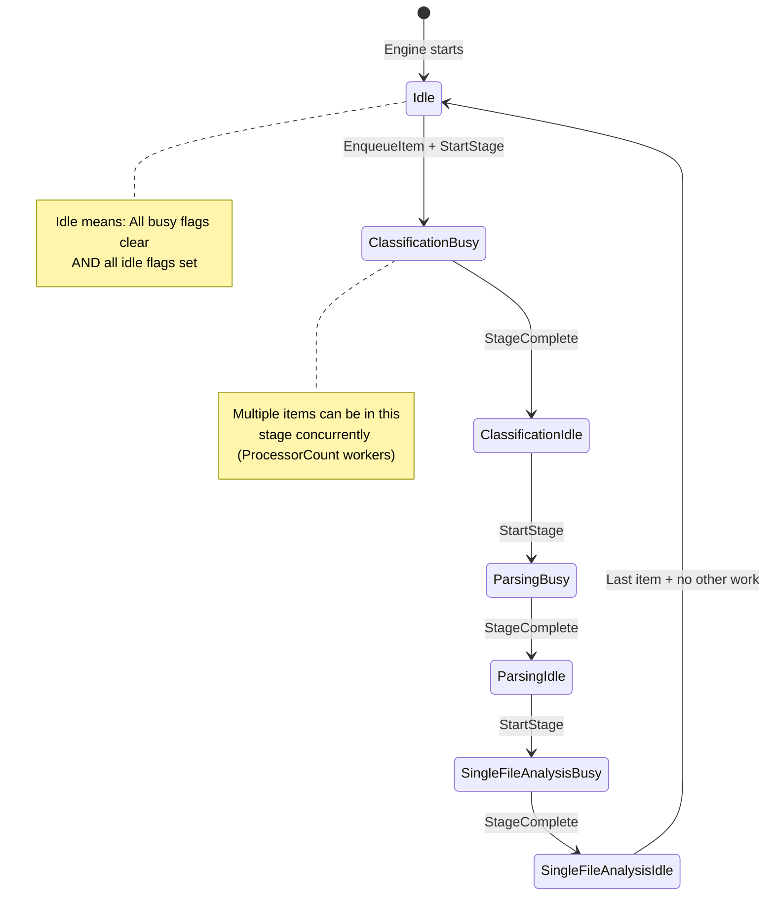
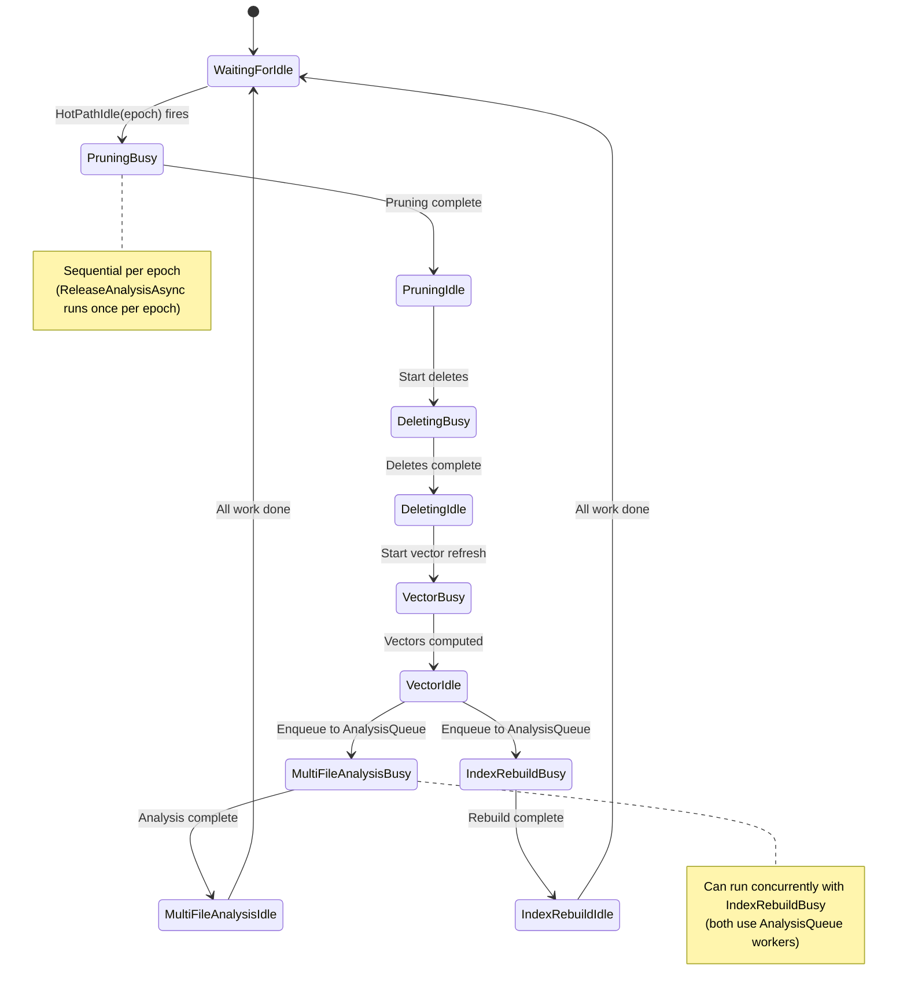
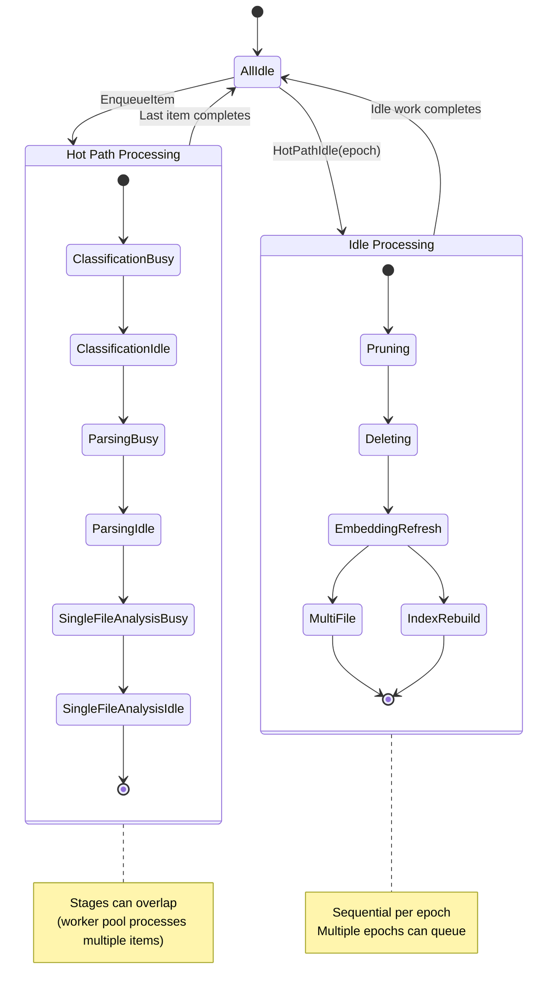
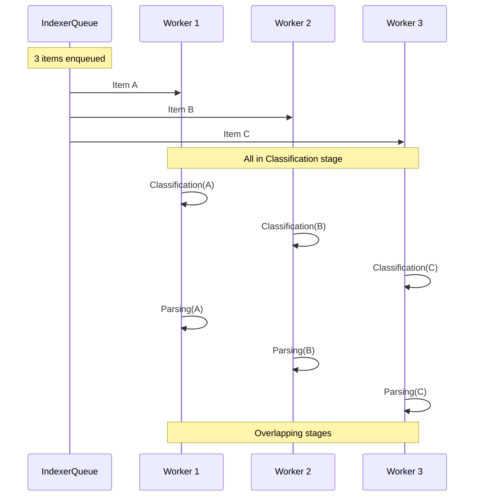
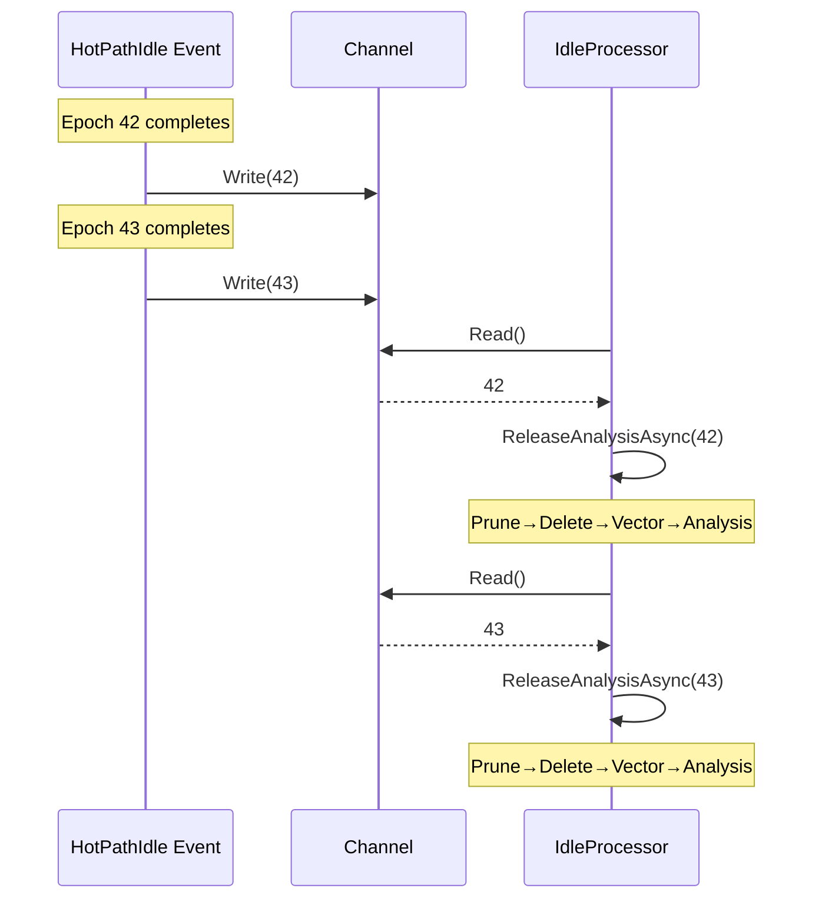
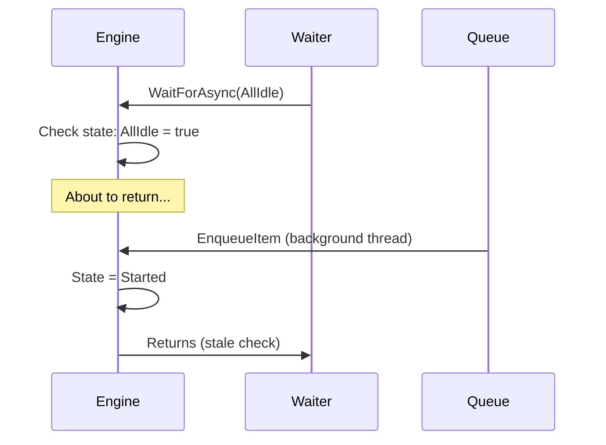

# IndexingState State Machine

Visual representation of state transitions with concrete conditions.

---

## State Flags

State is derived from per-stage counters captured in `IndexingEngine`. Each stage registers a `(busyFlag, idleFlag)` pair and the engine computes `IndexingState` based on whether the counter is greater than zero. Busy and idle are mutually exclusive per stage.

---

## Hot Path State Transitions



---

## Idle Processing State Transitions



---

## Combined State Machine



---

## State Transition Details

### StageContext.RunAsync Pattern

```csharp
public static async Task<PipelineResult> RunAsync(
    this StageContext stage,
    IndexItem item,
    CancellationToken cancellationToken,
    Action<IndexingState, IndexingState, bool> updateState)
{
    // Transition: → Busy
    updateState(stage.BusyFlag, stage.IdleFlag, entering: true);

    try {
        return await stage.Processor(item, cancellationToken);
    } finally {
        // Transition: Busy → Idle (always, even on error)
        updateState(stage.BusyFlag, stage.IdleFlag, entering: false);
    }
}
```

### UpdateState Implementation

            if ((State & BusyMask) == 0) {
                State &= ~IndexingState.Started;
            }
        }

        _stateChangedTcs.TrySetResult(true);  // Wake waiters
    }
}
```

**Note**: Counter-based tracking allows multiple items in same stage simultaneously.

---

## Concurrency Model

### Hot Path: Multiple Items, Multiple Workers



**State during concurrent processing**:
```
Item A: In Parsing stage
Item B: In Classification stage
Item C: In Classification stage

State flags:
  ClassificationBusy = true (2 active)
  ClassificationIdle = false
  ParsingBusy = true (1 active)
  ParsingIdle = false
  Started = true
```

### Idle Processing: Sequential per Epoch



---

## WaitForAsync Implementation

```csharp
public async ValueTask WaitForAsync(IndexingState targetState, CancellationToken ct) {
    while (true) {
        lock (_stateLock) {
            // Check if target state satisfied
            if ((State & targetState) == targetState) {
                return;
            }

            // Not satisfied, wait for state change
            _stateChangedTcs = new TaskCompletionSource<bool>(
                TaskCreationOptions.RunContinuationsAsynchronously);
        }

        await _stateChangedTcs.Task.WaitAsync(ct);
        // StateChanged event fired → check again
    }
}
```

**Usage examples**:
```csharp
// Wait for parsing to complete
await engine.WaitForAsync(IndexingState.ParsingIdle, ct);

// Wait for complete idle
await engine.WaitForAsync(IndexingState.AllIdle, ct);

// Wait for any of multiple flags
await engine.WaitForAsync(
    IndexingState.ParsingIdle | IndexingState.SingleFileAnalysisIdle,
    ct);
```

---

## Edge Cases

### Race Condition: Item Enqueued During Idle Check



**Solution**: TaskCompletionSource + retry loop
```csharp
// Inside WaitForAsync loop
lock (_stateLock) {
    if ((State & targetState) == targetState) {
        return;  // Check inside lock
    }
    _stateChangedTcs = new TaskCompletionSource<bool>(...);
}
await _stateChangedTcs.Task;
// Loop back, check again
```

### Epoch Overflow

```csharp
private long _currentEpoch = 0;

public long BeginNewEpoch() {
    return Interlocked.Increment(ref _currentEpoch);
}
```

**Question**: What happens at `long.MaxValue` (9,223,372,036,854,775,807)?

**Answer**: System would need to process 1 billion epochs/second for 292 years to overflow. Practically impossible.

**If it happened**: Would wrap to negative numbers, break monotonicity, cause issues. Mitigation: Restart service long before reaching limit.

---

## Testing State Transitions

### Unit Test Example (IndexingEngineTests.cs)

```csharp
[Test]
[DisplayName("Skips unchanged artifacts when catalog confirms digest is current")]
public async Task Given_CatalogReportsUpToDate_When_IndexItemAsync_Then_SkipsProcessing()
{
    // Arrange
    var catalog = A.Fake<IDocumentCatalog>();
    A.CallTo(() => catalog.EnsureInitializedAsync(A<CancellationToken>._))
        .Returns(Task.CompletedTask);

    var existing = new DocumentCatalogEntry(
        CreateUri("file:///repo/already-indexed.md"),
        "A1B2C3",
        SemanticMediaType.Parse("text/markdown;kind=markdown.doc"),
        "C:\\repo\\already-indexed.md",
        DateTimeOffset.UtcNow.AddMinutes(-5));

    A.CallTo(() => catalog.Evaluate(A<RepoUri>._, A<string>._))
        .Returns(new DocumentCatalogEvaluation(DocumentCatalogDecision.SkipUpToDate, existing));

    var context = IndexingEngineTestFactory.Create(builder => builder.WithCatalog(catalog));

    var item = IndexingTestItemFactory.CreateIndexItem();

    // Act
    await context.Engine.IndexItemAsync(item, CancellationToken.None);

    // Assert
    catalog.ShouldMatch(item.Uri, CatalogInvocationPlan.SkipProcessing);
    item.ExistingEntry.Should().Be(existing);
}
```

### Integration Test Example (IndexerIntegrationTests.cs)

```csharp
[Test]
[Timeout(60_000)]
public async Task StartAndWaitForIdle_IndexesMarkdownDocument(CancellationToken token)
{
    var uri = RepoUri.Parse("embed:///Resources/Doc1.md");

    await using var repo = await IndexedRepoBuilder.CreateAsync(options =>
    {
        options.Filter = new IncludeOnlyUriFilter(uri);
        options.EnableWatching = false;
        options.RunFullScanOnStartup = false;
        options.AdditionalMounts.Add(
            CompositeFileSystemMount.ForScheme(
                id: "embedded-docs",
                fileSystem: new EmbeddedStore(asm),
                scheme: "embed",
                includeInEnumeration: true));
    });

    await repo.IndexUriAsync(uri, skipUnchanged: false, token);

    // Assert indexed correctly
    var nodes = repo.Store.GetAllNodes().ToArray();
    nodes.Should().NotBeEmpty();
    nodes.Count(n => n.Kind == "document").Should().Be(1);
    nodes.Any(n => n.Kind == "md_heading").Should().BeTrue();
}
```

**Testing tools**:
- Unit tests: `FakeItEasy` for mocking, `AwesomeAssertions` for fluent assertions
- Factory helpers: `IndexingEngineTestFactory.Create()`, `IndexingTestItemFactory.CreateIndexItem()`
- Integration tests: `IndexedRepoBuilder.CreateAsync()` for full pipeline
- Custom assertions: `catalog.ShouldMatch()`, `PipelineInvocationPlan`

**See**: IndexingEngineTests.cs, IndexerIntegrationTests.cs for complete examples.

---

## Summary

**Key characteristics**:
- **Counter-based**: Track active count per stage (allows concurrency)
- **Lock-protected**: All state updates synchronized
- **Event-driven**: StateChanged event wakes waiters
- **Composite flags**: Started/AllIdle computed from individual flags
- **Mutex**: Busy and Idle mutually exclusive per stage

**Common patterns**:
- Check state → not satisfied → wait for event → check again (loop until satisfied)
- Enter stage → set busy, clear idle → process → clear busy, set idle (always in finally)
- Epoch tracking → count pending → last completes → fire event → idle processing

**Guarantees**:
- State transitions atomic (lock-protected)
- Idle flags accurate (counter reaches zero → flag set)
- Events fire exactly once per transition (TaskCompletionSource pattern)
- Waiters wake immediately (RunContinuationsAsynchronously)
