# Mermaid Diagram Guide

**Purpose**: Create information-dense, accessible diagrams that enhance understanding

**Core Principle**: Diagrams reveal relationships that prose cannot express efficiently. If a list or table works, use that instead.

---

## Table of Contents

1. [When to Use Diagrams](#when-to-use-diagrams)
2. [Universal Rules](#universal-rules)
3. [Choosing the Right Diagram Type](#choosing-the-right-diagram-type)
4. [Diagram Type Reference](#diagram-type-reference)
5. [Color and Accessibility](#color-and-accessibility)
6. [Validation Checklist](#validation-checklist)
7. [Summary](#summary)

---

## When to Use Diagrams

### The Decision Test

**Ask these questions before creating a diagram**:

1. **Does it show relationships?** If no relationships, use a table or list.
2. **Are there branches or decisions?** If linear (A→B→C→D), use a numbered list.
3. **Would prose be clearer?** Simple things don't need diagrams.
4. **Is it scannable in 10 seconds?** Complex diagrams waste time.

### Value Proposition

**Good diagrams**:
- Reveal patterns instantly (architecture, flows, relationships)
- Show multiple dimensions simultaneously (actors, time, state)
- Make complex systems comprehensible
- Enable pattern recognition

**Bad diagrams**:
- Waste tokens on information better shown in lists
- Confuse readers with unnecessary complexity
- Look impressive but convey little
- Require more time to understand than prose

---

## Universal Rules

### Rule 1: NEVER Diagram Linear Sequences

This is the cardinal rule that must never be violated.

❌ **NEVER do this**:


✅ **Always use list**:
```markdown
1. Step 1
2. Step 2
3. Step 3
4. Step 4
```

**Test**: If there are no branches, decisions, or parallel paths → use a list, not a diagram.

### Rule 2: Escape All Labels with Spaces

**Critical**: Labels containing spaces MUST be quoted or rendering breaks.

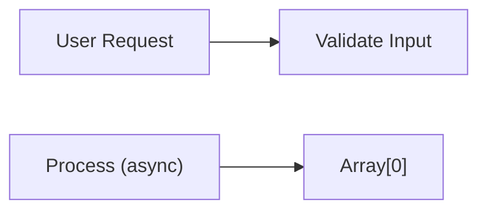

**Characters requiring quotes**:
- Spaces: `"User Request"`
- Parentheses: `"Process (async)"`
- Brackets: `"Array[0]"`
- Colons: `"Key: Value"`
- Commas: `"Name, Inc"`

**NEVER use list-like formats in labels or relationships**:
```mermaid
❌ WRONG: A -->|1. Do thing| B
❌ WRONG: A["1. First step"] --> B["2. Second step"]
✅ RIGHT: A -->|Do thing| B
✅ RIGHT: A["First step"] --> B["Second step"]
```

List numbering (1. 2. 3.) breaks Mermaid syntax. Use plain text or letters if ordering is needed.

### Rule 3: Add Meaning Comments

**Pattern**: Use `%%` to explain non-obvious aspects for AI agents and future maintainers

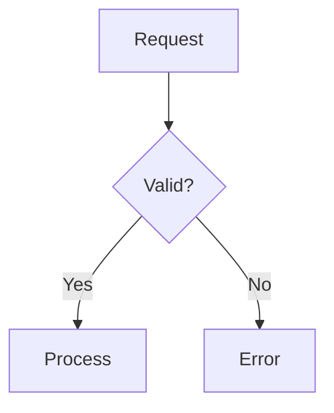

**Essential comments**:
- **MEANING**: What the diagram represents
- **TIMING**: When things happen (sync/async/sequential)
- **GOTCHA**: Edge cases omitted for clarity
- **COLOR**: What colors signify (always explain color usage)
- **NAVIGATION**: How to read the diagram

---

## Choosing the Right Diagram Type

### Decision Tree

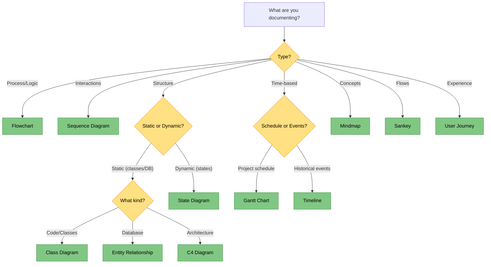

### Quick Reference Matrix

| Need | Use | Avoid |
|------|-----|-------|
| Process with branches/decisions | Flowchart | Linear sequences |
| Multi-party interactions over time | Sequence | Single function calls |
| State transitions | State diagram | One-way workflows |
| Class hierarchy | Class diagram | Database schema |
| Database schema | ER diagram | Code classes |
| Service topology with groups | Architecture diagram | Simple trees (<10 nodes) |
| Project schedule with dependencies | Gantt | Historical events |
| Historical events/releases | Timeline | Future planning |
| Concept hierarchy | Mindmap | Workflows |
| Prioritization (2 dimensions) | Quadrant chart | >2 dimensions |
| Performance/trend data | XY chart | Conceptual data |
| Hierarchical proportional data | Treemap | Flat lists (≤7 items) |
| Quantity flows/transformations | Sankey | Circular flows |
| Workflow/task states | Kanban | Real-time tracking |
| Proportions (≤7 categories) | Pie chart | Trends over time |

---

## Diagram Type Reference

### Flowchart

**Use for**: Processes with branches, decision trees, algorithms

**Don't use for**: Linear sequences (use list), simple hierarchies

**Example**:
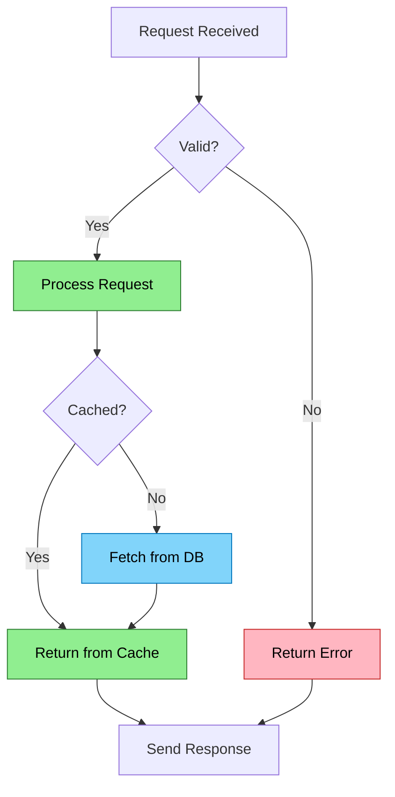

**Value**: Shows all possible paths through logic including error handling.

**Best practices**:
- Use diamonds `{}` for decisions (visually distinct)
- Color-code paths (success/error/info)
- Keep to ≤12 nodes (split complex flows)
- Label edges with conditions `|Yes|` `|No|`

**Advanced: Group-Level Relationships**

When many nodes share a relationship, use subgraphs to represent at group level:

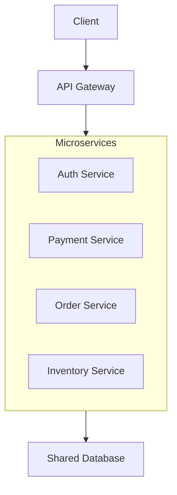

**Common mistakes**:
- ❌ Using for linear sequences (cardinal sin)
- ❌ Too many nodes (>15)
- ❌ Unclear decision conditions
- ❌ Missing error paths

---

### Sequence Diagram

**Use for**: Multi-party interactions, API calls, protocol flows, message exchanges

**Don't use for**: Single function execution, linear workflows

**Example**:
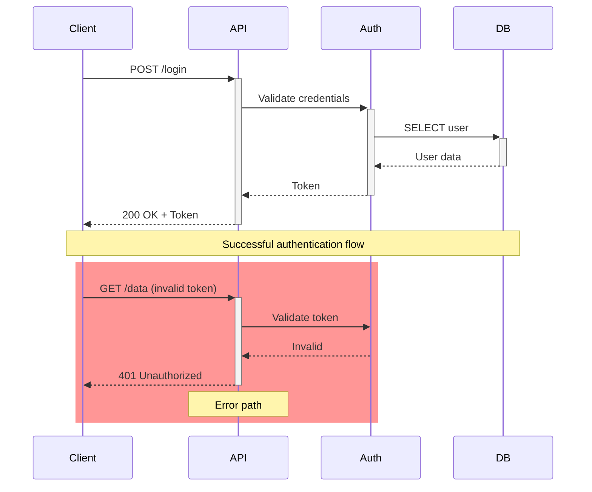

**Value**: Shows temporal ordering and service dependencies. Critical for distributed systems.

**Best practices**:
- Use `rect` to highlight error/alternate scenarios
- Activation boxes (`+`/`-`) show active processing
- Notes for context at key points
- Keep to ≤6 participants

**Common mistakes**:
- ❌ Using for single-function call chain
- ❌ Too many participants (>6)
- ❌ Missing return arrows
- ❌ No error scenarios shown

---

### State Diagram

**Use for**: Lifecycle management, status transitions, state machines

**Don't use for**: Static structure, one-time processes

**Example**:
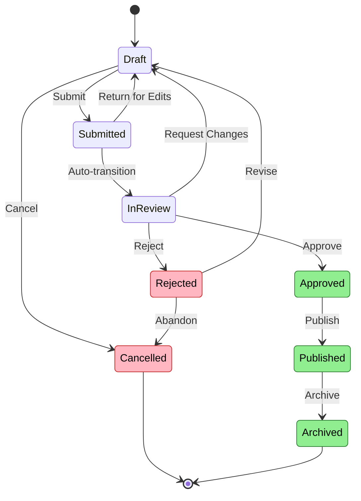

**Value**: Documents all valid state transitions, reveals dead-ends and cycles.

**Best practices**:
- Show ALL valid transitions (completeness matters)
- Color terminal states (success/failure)
- Label transitions with trigger events
- Include reverse transitions

**Common mistakes**:
- ❌ Missing reverse transitions
- ❌ Incomplete state coverage
- ❌ Using for one-directional flow

---

### Class Diagram

**Use for**: Object-oriented design, inheritance hierarchies, interface contracts

**Don't use for**: Database schema (use ER), instances

**Example**:
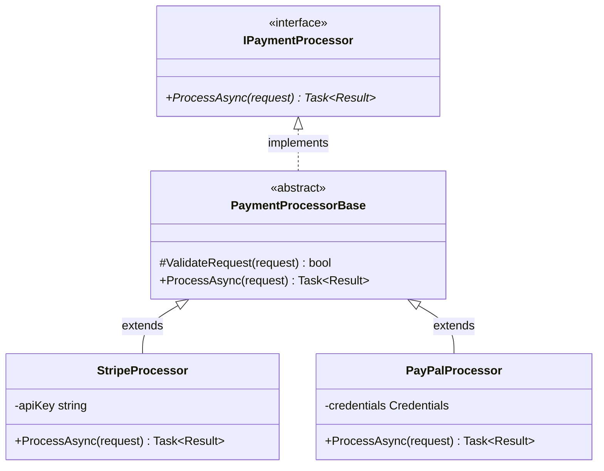

**Value**: Designs API surface before implementation. Identifies reusable base classes.

**Best practices**:
- Use `<<interface>>` and `<<abstract>>` stereotypes
- Show visibility (`+` public, `-` private, `#` protected)
- Include key methods with return types
- Keep to ≤8 classes

**Common mistakes**:
- ❌ Too much implementation detail
- ❌ Too many classes (>10)
- ❌ Using for database tables

---

### Entity Relationship Diagram

**Use for**: Database schema, data models, entity relationships

**Don't use for**: Code classes (use class diagram)

**Example**:
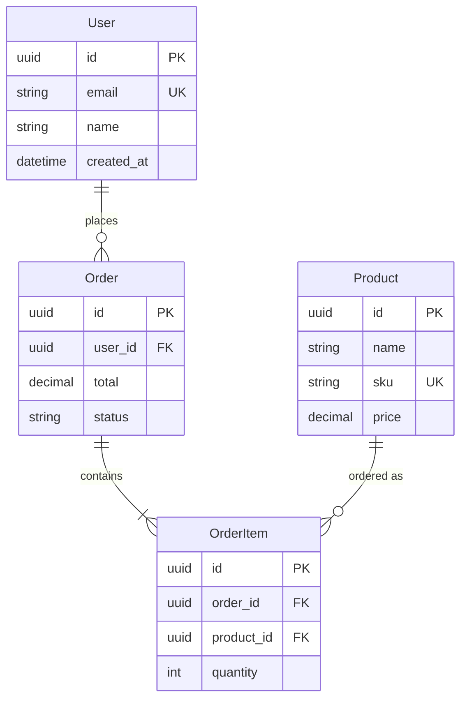

**Value**: Visualizes data model, reveals missing foreign keys.

**Best practices**:
- Show cardinality (one-to-one, one-to-many, many-to-many)
- Mark keys (PK, FK, UK)
- Use descriptive relationship labels
- Include key columns with types

**Common mistakes**:
- ❌ Missing foreign key relationships
- ❌ Unclear cardinality
- ❌ Using for code objects

---

### Gantt Chart

**Use for**: Project schedules, task dependencies, milestone tracking

**Don't use for**: Historical events (use timeline)

**Example**:
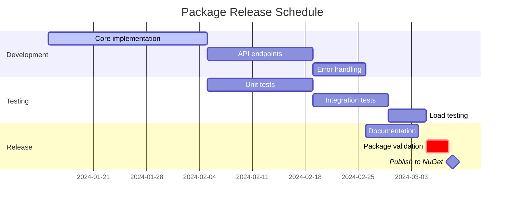

**Value**: Reveals critical path, shows parallelizable work, identifies blockers.

**Best practices**:
- Mark critical tasks with `crit`
- Use sections to group related work
- Show dependencies with `after taskId`
- Mark milestones

**Common mistakes**:
- ❌ Using for historical timeline
- ❌ No dependencies shown
- ❌ Unrealistic durations

---

### Timeline

**Use for**: Historical events, version releases, chronological milestones

**Don't use for**: Project planning (use Gantt)

**Example**:
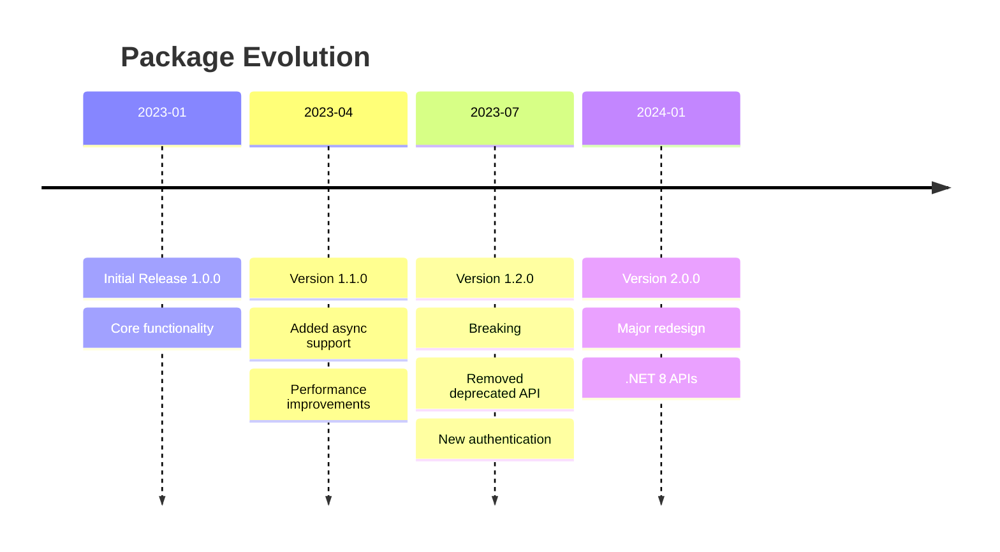

**Value**: Shows progression over time, highlights milestones.

**Best practices**:
- Consistent time intervals
- Multiple events per period allowed
- Highlight breaking changes
- Keep descriptions concise

**Common mistakes**:
- ❌ Using for future planning
- ❌ Inconsistent time granularity
- ❌ Too much detail per event

---

### Mindmap

**Use for**: Concept hierarchies, brainstorming output, topic breakdowns

**Don't use for**: Workflows (use flowchart), code structure

**Example**:
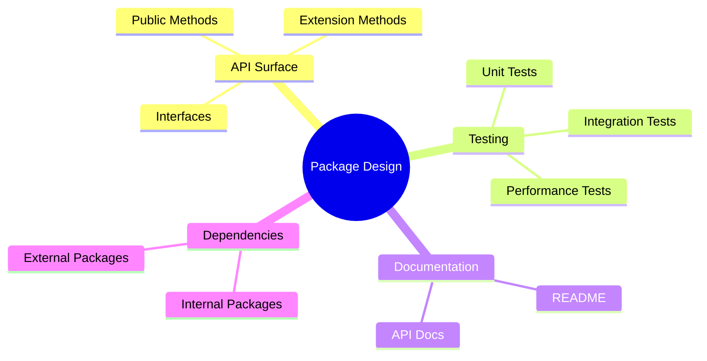

**Value**: Captures hierarchical thinking, shows relationships, identifies gaps.

**Best practices**:
- Keep to 3-4 levels deep
- Balance branches (equal detail)
- Root node in `((double parens))`
- Use for brainstorming capture

**Common mistakes**:
- ❌ Using for sequential workflows
- ❌ Unbalanced depth
- ❌ Too many levels (>5)

---

### Treemap

**Use for**: Hierarchical proportional data, error distributions by service/endpoint, resource usage breakdowns, transaction volumes

**Don't use for**: Flat lists (≤7 items - use pie chart or table), trends over time (use XY chart), flows (use Sankey)

**Example**:
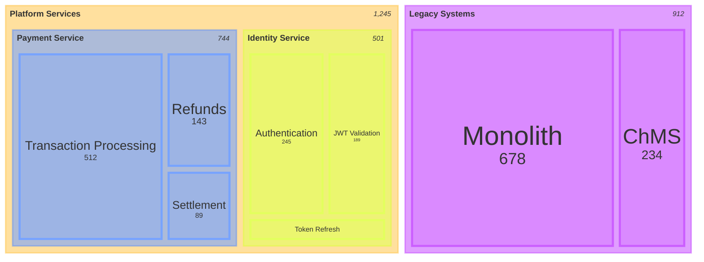

**Value**: Reveals proportional relationships in hierarchical data. Dominant categories and outliers visible instantly.

**Best practices**:
- **Limit depth**: 2-3 levels maximum (deeper becomes illegible)
- **Total nodes**: ≤30 across all levels (aggregate small items into "Other")
- **Visibility threshold**: Minimum 2% of total for readability
- **Consistent indentation**: Use spaces or tabs consistently
- **Positive values only**: No zero or negative numbers allowed

**Syntax essentials**:
```
treemap-beta
    "Parent Node"                 # No value
        "Leaf Node": 100          # Value required
        "Child Section"           # No value
            "Nested Leaf": 50     # Value required
```

**Configuration**:
```yaml
---
config:
  treemap:
    showValues: false     # Hide numbers when labels overlap
    valueFormat: ","      # "," for counts, "$,.2f" for money, ".1%" for percentages
---
```

**When to use vs alternatives**:

| Scenario | Use This | Not That |
|----------|----------|----------|
| Error counts service→endpoint | Treemap (2-level hierarchy) | Pie (loses hierarchy) |
| Error trends over time | XY chart (temporal) | Treemap (static) |
| Flat categories (≤7) | Pie chart or table | Treemap (unnecessary) |
| Exact comparisons needed | Table (precise values) | Treemap (proportional) |
| Flow between categories | Sankey (movement) | Treemap (static proportions) |

**Common mistakes**:
- ❌ Flat structure with no hierarchy (use pie/table instead)
- ❌ Deep nesting >3 levels (becomes unreadable)
- ❌ Zero or negative values (breaks rendering)
- ❌ Wildly different scales (small values invisible - group into "Other")
- ❌ Too many tiny nodes (combine items <2% into aggregate)

**Critical constraints**:
- **Values**: Positive numbers only (> 0)
- **Parent nodes**: Cannot have values (only leaves)
- **Hierarchy**: Indentation-based structure
- **Leaf syntax**: `"Label": value` with colon
- **Readability**: ~30 nodes maximum

**Note**: Experimental (treemap-beta) - syntax may evolve.

---

### Quadrant Chart

**Use for**: Prioritization matrices, 2×2 comparisons, risk assessment

**Don't use for**: >2 dimensions, precise data (use XY chart)

**Example**:
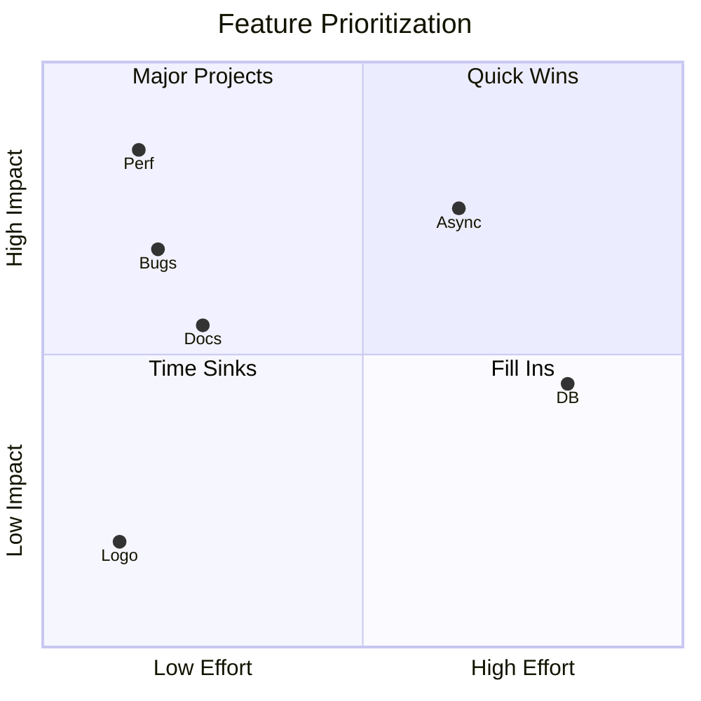

**Value**: Makes prioritization visual, identifies quick wins.

**Best practices**:
- Label quadrants meaningfully
- Upper-left = highest priority
- Use short labels (≤12 chars)
- Keep to ≤10 items

**Critical constraints**:
- **Values: 0.01 < x,y < 0.99** (extremes unreadable)
- **Avoid duplicate coordinates** (items stack)
- **Space items apart** (prevent label collisions)
- **≤7 slices ideal** (more becomes rainbow)

**Common mistakes**:
- ❌ Values at/near 0.0 or 1.0
- ❌ Long labels (overlap)
- ❌ Duplicate coordinates
- ❌ Too many items (>12)

---

### XY Chart

**Use for**: Time-series metrics, performance trends, categorical comparisons, multi-series overlays

**Don't use for**: Conceptual diagrams, scatter plots (not supported)

**Example 1: Numeric Comparison**:
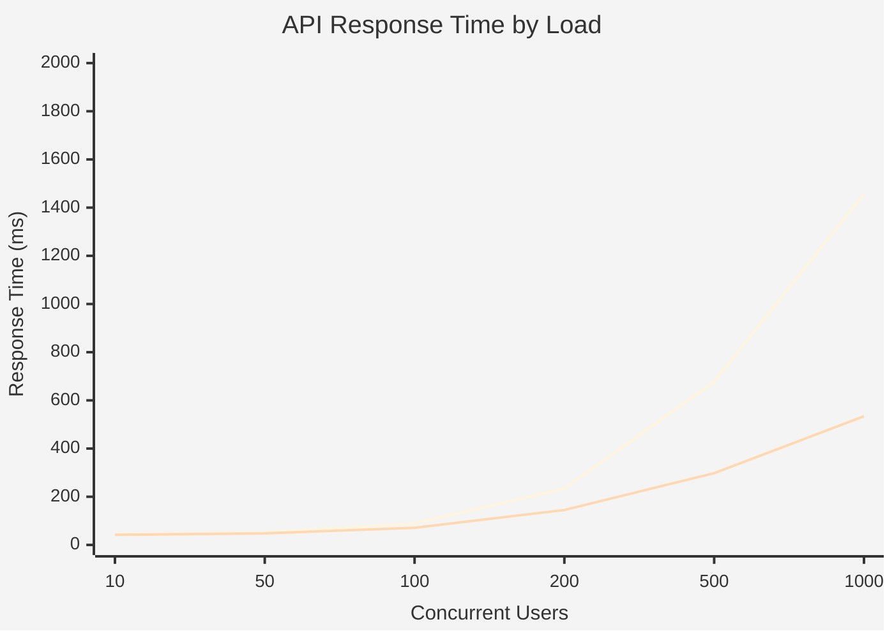

**Example 2: Time-Series with Baseline**:
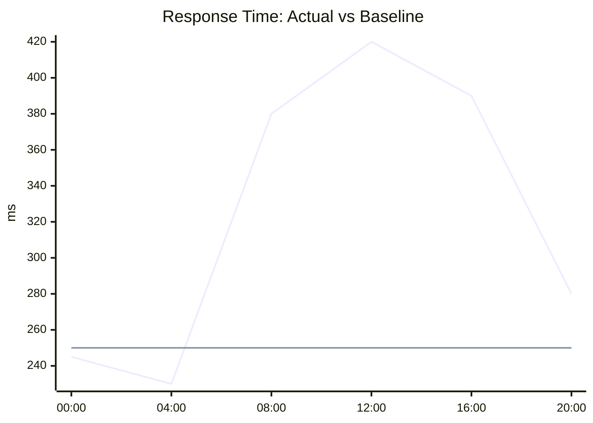

**Value**: Shows measured data, reveals trends, enables before/after comparisons.

**Configuration options**:
```yaml
---
config:
  xyChart:
    width: 900
    height: 400
    showValues: false          # Hide data point labels
    valueFormat: ","           # Format: "," (1,234) or ".1%" (12.5%)
---
```

**Best practices**:
- **Label axes with units** ("ms", "req/s", "%")
- **Quote time labels**: `["00:00", "01:00"]` not `[00:00, 01:00]`
- **Use categorical x-axis** for time-series (sample 6-8 points for readability)
- **Multi-series: ≤4 lines** (more becomes unreadable)
- **Auto-range y-axis** when data bounds unknown (omit range specification)
- **Baseline patterns**: Flat line shows expected/normal for visual reference

**Common mistakes**:
- ❌ Using for conceptual data (use tables/text instead)
- ❌ Unlabeled axes (always show units)
- ❌ Too many lines (>5 series unreadable)
- ❌ Unquoted time labels (`00:00` parses as math expression)
- ❌ Mismatched data points (3 x-values with 4 y-values)
- ❌ Y-axis range too tight (data gets clipped)

---

### Pie Chart

**Use for**: Proportions/parts of whole (3-7 categories only)

**Don't use for**: Trends, >7 categories, precise comparisons

**Example**:
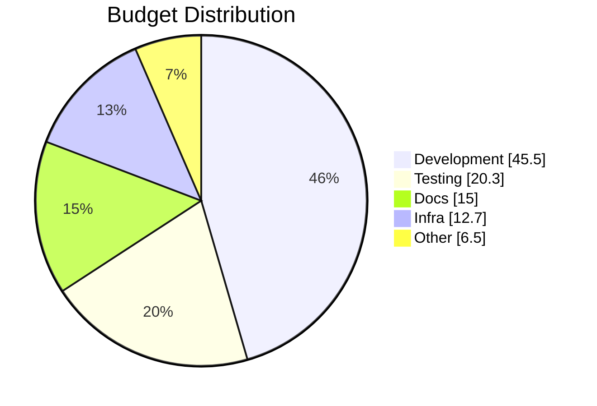

**Value**: Shows dominant categories and proportions.

**Best practices**:
- Limit to 3-7 slices
- Order by size
- Use `showData` for exact values
- Group small (< 5%) into "Other"
- **Consider if table clearer** (often is)

**Critical constraints**:
- **Values must be positive** (> 0)
- **Labels must be quoted**
- **Practical limit: 7 slices**

**Common mistakes**:
- ❌ Using for trends
- ❌ More than 7 slices
- ❌ Similar-sized categories
- ❌ When table would be clearer

---

### Kanban

**Use for**: Workflow state visualization, operational stages (incident→investigating→resolved), service lifecycle tracking

**Don't use for**: Active task tracking (use external tools), complex dependencies, real-time updates

**Example**:
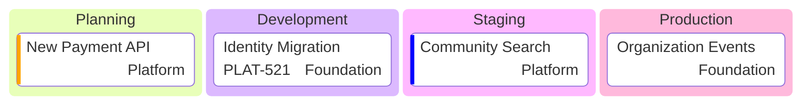

**Value**: Visualizes workflow states and team ownership. Useful for operational documentation, less useful for active project management.

**Syntax essentials**:
```
kanban
  columnId[Column Title]
    taskId[Task Description]
    task2[Another Task]@{assigned: Person, ticket: JIRA-123, priority: High}
```

**Metadata options**:
- `assigned`: Ownership (team/person)
- `ticket`: External tracking ID
- `priority`: Very High, High, Low, Very Low

**Configuration**:
```yaml
---
config:
  kanban:
    ticketBaseUrl: 'https://project.atlassian.net/browse/#TICKET#'
---
```
Converts `ticket: ABC-123` into clickable link.

**Best practices**:
- **Operational workflows**: Use for documenting process stages, not tracking active work
- **Team ownership**: Show which team owns services/features at each stage
- **Consistent metadata**: Apply uniformly (all tasks have same fields or none)
- **Keep focused**: 3-5 columns, 10-15 total tasks maximum

**When to use vs alternatives**:

| Scenario | Use This | Not That |
|----------|----------|----------|
| Document workflow stages | Kanban (operational states) | Gantt (timelines) |
| Show team ownership | Kanban (assigned field) | Flowchart (no metadata) |
| Active sprint tracking | External tool (Jira/Trello) | Kanban (static diagram) |
| Service lifecycle | Kanban (planning→prod) | State diagram (too formal) |

**Common mistakes**:
- ❌ Using for active work tracking (diagrams are static, not live boards)
- ❌ Too many cards (>20 becomes cluttered)
- ❌ Inconsistent metadata (some cards with fields, some without)
- ❌ Forgetting this is documentation, not a tool

**Critical constraints**:
- **Indentation required**: Tasks must be indented under columns
- **Metadata syntax**: `@{key: value, key: value}` with precise formatting
- **Priority values**: Limited to four predefined options
- **Static**: Diagram doesn't update automatically

---

### Architecture Diagram

**Use for**: Service topology (20+ services), infrastructure dependencies, explicit directional flows, hierarchical grouping

**Don't use for**: Simple trees (<10 nodes - use flowchart), data flows (use Sankey), detailed sequences (use sequence diagram)

**Example**:
```mermaid
architecture-beta
    group platform(cloud)[Platform Services]
    group external(internet)[External Systems]

    service identity(server)[Identity] in platform
    service organization(server)[Organization] in platform
    service community(server)[Community] in platform
    service spreedly(cloud)[Spreedly] in external

    identity:R --> L:organization
    identity:R --> L:community
    organization:B --> T:spreedly

    %% MEANING: Foundation services (identity, org, community) with external dependency
    %% GROUPS: Hierarchical organization prevents visual clutter
    %% DIRECTION: T/B/L/R specifies exact connection points
    %% VALUE: Shows service topology and external boundaries clearly
```

**Value**: Hierarchical grouping for complex systems, explicit edge direction, group-level relationships reduce clutter.

**Best practices**:
- **Use groups** for layers/domains/teams (prevents clutter with 20+ services)
- **Explicit direction**: `service1:R --> L:service2` (Right of service1 to Left of service2)
- **Group-level edges**: `service{group}:R --> L:external{group}` for high-level boundaries
- **Declare before use**: All services/groups must be declared before edges reference them
- **Built-in icons**: `cloud`, `database`, `disk`, `internet`, `server`
- **Keep focused**: 10-20 services per diagram (split larger systems)

**Syntax essentials**:
```
architecture-beta
    group groupId(icon)[Display Name]
    service svcId(icon)[Display Name] in groupId
    svcId:T --> B:otherSvc              # Top to Bottom
    svcId{group}:R --> L:other{group}   # Group-level connection
```

**When to use vs alternatives**:

| Scenario | Use This | Not That |
|----------|----------|----------|
| 20+ services with layers | Architecture (groups) | Flowchart (flat, cluttered) |
| Service topology | Architecture | C4 (more formal, multi-level) |
| Data/quantity flow | Sankey | Architecture |
| Process with decisions | Flowchart | Architecture |
| Simple tree (<10 nodes) | Flowchart | Architecture (overkill) |

**Common mistakes**:
- ❌ Edges before service declarations (must declare first)
- ❌ Missing direction modifiers (`api --> db` fails, use `api:R --> L:db`)
- ❌ Too many nodes (>25 becomes unreadable - split into multiple diagrams)
- ❌ Group-service mixing (use `{group}` modifier for group connections)

**Critical constraints**:
- **Version**: Mermaid v11.1.0+ (architecture-beta syntax)
- **Declaration order**: Services/groups before edges
- **Direction required**: T (top), B (bottom), L (left), R (right)
- **Icons**: 5 built-in, custom requires registration

**Note**: Experimental (v11.1.0+) - syntax may evolve.

---

### Sankey

**Use for**: Flow visualization, transformations, quantity movements

**Don't use for**: Circular flows (unsupported), hierarchies

**Example**:
```mermaid
sankey-beta

Budget,Development,450
Budget,Testing,200
Budget,Infrastructure,150

Development,Frontend,180
Development,Backend,200
Development,Database,70

Testing,Unit,80
Testing,Integration,70
Testing,Performance,50

    %% MEANING: Budget allocation and breakdown
    %% FORMAT: Source,Target,Value (CSV)
    %% CONSTRAINT: Positive values only
    %% VALUE: Proportional relationships
```

**Configuration Options**:

Hide numeric values when labels are descriptive enough or when values create visual overlap:

```mermaid
---
config:
  sankey:
    showValues: false
---
sankey-beta

OpenSearch Operations,Search Queries,11519
OpenSearch Operations,Bulk Operations,2481
OpenSearch Operations,Index Operations,1262

Search Queries,CommunityMembers Index,10200
Search Queries,Households Index,1319

    %% CONFIG: showValues: false removes numeric labels from flows
    %% USE WHEN: Long descriptive labels cause value overlap
    %% TRADEOFF: Visual proportions clear, exact values in text/table below
```

**When to hide values**:
- ✅ Long node names cause label/value overlap
- ✅ Values documented in accompanying text or table
- ✅ Focus on proportional relationships over exact numbers
- ✅ Cleaner visual for presentations

**When to show values** (default):
- ✅ Short node names (< 12 characters)
- ✅ Exact quantities are primary message
- ✅ No accompanying table with values
- ✅ Standalone diagram without context

**Value**: Shows how quantities flow and transform.

**Best practices**:
- Keep to 5-15 nodes
- Consistent units
- Aggregate small flows (< 5%) into "Other"
- Meaningful node names (2-4 words)
- Order strategically

**Critical constraints**:
- **CSV format**: `Source,Target,Value`
- **Values: positive only** (> 0)
- **No circular flows** (A→B→C→A breaks)
- **Descendants must be smaller than parents** (child values sum ≤ parent value for conservation)
- **Quote commas**: `"Name, Inc",Target,100`
- **Optimal: 5-15 nodes**

**Common mistakes**:
- ❌ CSV formatting errors
- ❌ Circular flows
- ❌ Negative/zero values
- ❌ Too many nodes (30+)
- ❌ Wildly different scales

**Note**: Experimental (v10.3.0+) - syntax may change.

---

## Color and Accessibility

### Purpose of Color

**Color should convey meaning consistently and remain readable across all viewing conditions.**

Three core principles:
1. **Consistency**: Colors must mean the same thing throughout the diagram
2. **Readability**: Must work in both light and dark modes with sufficient contrast
3. **Documentation**: Always explain what colors represent (semantic or arbitrary)

### Color Approaches

**Both approaches are valid - choose what fits your diagram**:

**Semantic Colors** (status/severity):
- Green = success/valid, Red = error/invalid, Yellow = warning, Blue = info
- Natural interpretation, works well for error flows, validations, health checks
- Example: Authentication flow with success/error paths

**Arbitrary Groupings** (categories):
- Colors represent categories: services, teams, layers, features, modules
- No inherent meaning - document what each color represents
- Example: Microservices grouped by team (Blue = Platform, Green = Payment, Orange = Identity)

**The Rule**: Whatever approach you choose, be consistent within the diagram and document it in comments.

### Suggested Semantic Palette (Optional)

If using semantic colors, these are tested for light/dark mode compatibility:

```css
/* Success / Valid / Recommended */
--success: fill:#90EE90,stroke:#2E7D32,color:#000

/* Error / Invalid / Deprecated */
--error: fill:#FFB6C1,stroke:#C62828,color:#000

/* Warning / Conditional / Caution */
--warning: fill:#FFE082,stroke:#F57C00,color:#000

/* Information / Neutral / Primary */
--info: fill:#81D4FA,stroke:#0277BD,color:#000

/* Disabled / Not Recommended */
--disabled: fill:#E0E0E0,stroke:#616161,color:#000
```

**These are suggestions, not requirements.** Use any colors that meet accessibility standards.

### Accessibility Requirements

**Non-negotiable standards**:
- **Always explain colors** in `%% COLOR:` comment
- **Never rely on color alone** - use shapes, labels, patterns, borders as additional indicators
- **Maintain 3:1 contrast ratio minimum** (WCAG AA) for all text and borders
- **Test in both light and dark mode** - ensure readability in both

**Example 1: Semantic Colors**:
```mermaid
graph LR
    A[Start] --> B{Valid?}
    B -->|✓ Yes| C[Process]:::success
    B -->|✗ No| D[Reject]:::error

    classDef success fill:#90EE90,stroke:#2E7D32,stroke-width:3px,color:#000
    classDef error fill:#FFB6C1,stroke:#C62828,stroke-width:3px,color:#000

    %% COLOR: Green = success path, Red = error path
    %% ACCESSIBILITY: Checkmarks/X + 3px borders provide non-color indicators
```

**Example 2: Arbitrary Groupings**:
```mermaid
graph TD
    Gateway --> AuthSvc:::platform
    Gateway --> PaySvc:::payment
    Gateway --> UserSvc:::identity

    classDef platform fill:#81D4FA,stroke:#0277BD,stroke-width:3px,color:#000
    classDef payment fill:#90EE90,stroke:#2E7D32,stroke-width:3px,color:#000
    classDef identity fill:#FFE082,stroke:#F57C00,stroke-width:3px,color:#000

    %% COLOR: Blue = Platform team, Green = Payment team, Orange = Identity team
    %% GROUPING: Colors represent team ownership, not semantic status
```

**When creating diagrams** (agents/humans):
- Use colors from suggested palette (tested for dual-mode compatibility)
- Include non-color indicators: shapes (diamonds for decisions), labels, borders (3px), symbols (✓/✗)
- Add `%% COLOR:` comment explaining what each color represents
- Ensure text is black on light backgrounds (`color:#000`)

**Before committing** (humans):
- Render and view in both light and dark mode
- Verify contrast ratios if using custom colors: https://webaim.org/resources/contrastchecker/


## Validation Checklist

Before committing any diagram:

### Content ✓
- [ ] **No linear sequences** (use list instead) - CARDINAL RULE
- [ ] All labels with spaces are quoted
- [ ] Meaning comment explains purpose
- [ ] Color usage explained (if used)
- [ ] <12 nodes (or split into multiple diagrams)
- [ ] Right diagram type for the content

### Accessibility ✓
- [ ] Black text on light backgrounds (`color:#000`)
- [ ] 3:1 contrast minimum (WCAG AA)
- [ ] Not relying on color alone (shapes/labels/borders)
- [ ] Readable in both light and dark mode
- [ ] Legend provided (via comment) if colors used

### Clarity ✓
- [ ] Could this be simpler? (list, table)
- [ ] Is relationship/flow clear?
- [ ] Are edge labels descriptive?
- [ ] Scannable in <10 seconds?
- [ ] One clear message/purpose

### Technical ✓
- [ ] Renders without errors
- [ ] Preview in target viewer (GitHub, VS Code)
- [ ] Mobile-friendly (not too wide)
- [ ] Follows syntax rules for diagram type

---

## Summary

### Golden Rules

1. **NEVER diagram linear sequences** - Always use lists (cardinal rule)
2. **Quote all labels with spaces** - Prevents rendering failures
3. **Use color consistently** - Semantic or arbitrary groupings, always document meaning
4. **Add metadata comments** - Explain non-obvious aspects
5. **Test both modes** - Ensure dark/light readability
6. **Keep diagrams focused** - <12 nodes, split if needed
7. **Choose right type** - Use decision tree/matrix
8. **Validate before commit** - Use checklist

### When to Use Each Type

**Process & Logic**:
- Branches/decisions → Flowchart
- Multi-party interactions → Sequence
- State transitions → State diagram

**Structure**:
- Code classes → Class diagram
- Database → ER diagram
- Service topology (20+) → Architecture diagram

**Time-Based**:
- Project schedule → Gantt
- Historical events → Timeline

**Concepts & Hierarchies**:
- Concept breakdown → Mindmap
- Proportional hierarchical data → Treemap

**Flows & Workflows**:
- Quantity flows → Sankey
- Workflow states → Kanban

**Data & Analysis**:
- Prioritization (2D) → Quadrant
- Performance/trends → XY chart
- Proportions (≤7) → Pie chart

### Value Proposition

**Great diagrams**:
- Reveal relationships prose cannot express efficiently
- Show multiple dimensions simultaneously
- Enable instant pattern recognition
- Reduce cognitive load

**Bad diagrams**:
- Waste tokens on information better shown as lists
- Add complexity without clarity
- Look impressive but convey little
- Require more time than prose

**The Test**: Can you delete the diagram and lose critical information? If no → delete it. If yes → it's earning its place.

---

**Philosophy**: Diagrams are expensive (tokens, maintenance, comprehension time). Use them only when they reveal relationships or patterns that would require paragraphs to explain. When you do use them, make them dense with information, accessible to all readers, and instantly scannable. Every diagram must earn its place by providing value no other format can deliver as efficiently.
