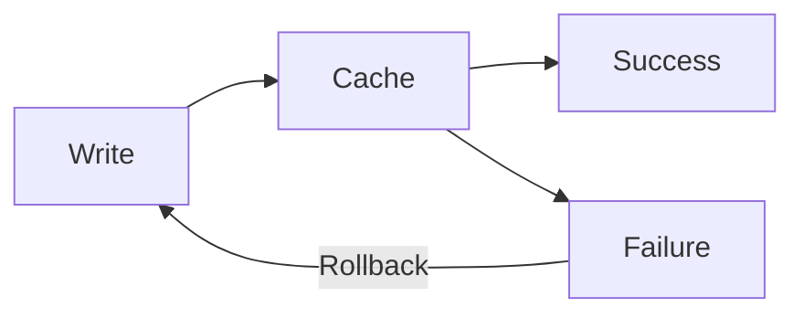

# Writing Documentation as Wisdom Triggers

> **Mission**: Encode durable wisdom in minimal tokens, creating triggers that activate full understanding in any cognitive system.

## Entry Point: Documentation Guides

This is the foundational philosophy. Read this first, then use specialized guides as needed:

- **[writing-capsules.md](./writing-capsules.md)** - Token-efficient concept format (Invariant→Example→Depth)
- **[writing-gestalt-documents.md](./writing-gestalt-documents.md)** - High-density documentation practice (meta-demonstration of principles)
- **[mermaid-diagram-guide.md](./mermaid-diagram-guide.md)** - Visual documentation reference

---

## Documentation Metadata Standard

Every documentation file includes frontmatter defining its purpose and content:

**description** - One-sentence value proposition telling you if this is what you need
- Format: `[What this does] - [key approach/benefit]`
- Should be specific, not vague

**tags** - Specific searchable keywords for concepts, technologies, and techniques covered
- Format: List of concrete terms (no hard limit, but avoid keyword stuffing)
- Should NOT duplicate categories or title
- Default: Use capsule names from the document (preserve CamelCase for token efficiency)

**audience** - Who this is written for (indicates style and density)
- Options: `"LLMs"` (high-density, AI-optimized), `"Humans"` (scannable, motivational)

**categories** - Document type and thematic classification with strength indicators
- Format: 1-2 categories (avoid keyword stuffing)
- Strength: `[0-100%]` indicating theme intensity (doesn't sum to 100%)
- Common types: Philosophy, How-To, Reference, Format-Specification

**verified** (optional) - Only when synthesizing external sources requiring verification
- Format: `verified: <source> <version/commit>`
- Do NOT include when document is itself the source of truth (Git tracks changes)

**The principle**: No redundancy. Each field serves a distinct purpose.

---

## The Foundational Insight

Documentation is not a dump of facts but a **lattice of retrieval cues**. Both humans and AI are pattern-completion systems with limited working memory. The goal is not to say everything, but to say the right thing in the right way such that the reader can reconstruct the rest.

**Traditional docs**: 1000s of tokens → Information overload
**Wisdom triggers**: 10s of tokens → Pattern activation → Full understanding

---

## Core Principles

Each principle includes **Applicability** scores:
- **👤 Human**: How much this improves human comprehension (100% = critical)
- **🤖 LLM**: How much this improves LLM retrieval (100% = critical)

### 1. Shared Cognition: Design for How Minds Work

**Applicability**: 👤 90% | 🤖 85%

Both biological and artificial minds exhibit:

- **Limited working memory** → Use chunks of 3-7 concepts
- **Attention biases** → U-shaped focus (primacy/recency effects)
- **Pattern recognition** → Leverage familiar structures
- **Associative retrieval** → Consistent cues trigger memories

**Example**:
```markdown
❌ HOSTILE: "The system uses various approaches depending on factors..."
✅ FRIENDLY:
  1. PII → Encrypted PostgreSQL
  2. Sessions → Redis (24h TTL)
  3. Analytics → BigQuery (aggregated)
```

**Why this matters**: Both human short-term memory (7±2 items) and transformer attention windows (limited context) benefit from chunking and structure.

### 2. Token Economics: Every Token Must Earn Its Place

**Applicability**: 👤 30% | 🤖 100%

Modern LLMs use subword tokenization (BPE, WordPiece) that affects concept integrity:

- `CamelCase` → Often single token
- `hyphenated-terms` → Usually 3+ tokens
- Common phrases → Fewer tokens than synonyms
- Novel terms → Fragment unpredictably

**Example**:
```markdown
✅ "CircuitBreaker" (1-2 tokens)
❌ "request flow control mechanism" (5-6 tokens)
```

**Why this matters**: Token efficiency directly impacts:
- Context window utilization
- Retrieval precision (fewer tokens = tighter semantic encoding)
- Embedding quality (compact concepts embed better)

### 3. Capsule Architecture: Compress Wisdom Into Invariants

**Applicability**: 👤 95% | 🤖 90%

Distill each concept into a stable, minimal truth that can be expanded when needed.

**Structure**: See [writing-capsules.md](./writing-capsules.md) for complete format specification.

```markdown
### Capsule: ConceptName

**Invariant**
Core truth in ≤30 tokens, timeless, no vendors/dates

**Example**
Concrete instance in ≤5 lines

**Depth**
- Distinction: How this differs from similar concepts
- Trade-off: What you gain vs lose
- NotThis: Common misconceptions
- SeeAlso: Related capsule names
```

**Why this matters**: Capsules leverage progressive disclosure while ensuring core wisdom is never buried. The invariant provides the retrieval cue, the example grounds it, the depth clarifies boundaries.

### 4. Embedding-First Design: Write for Vector Search

**Applicability**: 👤 40% | 🤖 95%

Modern systems chunk documents for embedding search. Design for this:

- **Modular sections** that make sense in isolation
- **Topic sentences** that summarize each chunk
- **Semantic boundaries** at paragraph breaks
- **Self-contained chunks** (each under 300 tokens)

**Example**:
```markdown
## [Performance] Caching Strategy

**Invariant**: Cache immutable data aggressively, mutable data selectively.

Redis for session data (high churn), CDN for assets (immutable).
Always cache after successful DB write to ensure consistency.
```

**Why this matters**: RAG systems retrieve chunks independently. A chunk must convey its meaning without requiring surrounding context.

### 5. Multi-Modal Encoding: Visual + Verbal + Semantic

**Applicability**: 👤 100% | 🤖 70%

Combine text, structure, and visuals to create multiple retrieval paths to the same wisdom.

**Mermaid diagrams with assistive comments**:


**Critical**: Always escape Mermaid labels containing spaces or special characters with quotes:
```mermaid
❌ WRONG: A[User Request] --> B{Complex Task?}
✅ RIGHT: A["User Request"] --> B{"Complex Task?"}
```

See [mermaid-diagram-guide.md](./mermaid-diagram-guide.md) for comprehensive reference.

**Why this matters**: Multiple encoding formats (text, diagram, semantic tags) create redundant retrieval paths. If one fails, others succeed.

---

## The Two-Tier Knowledge Architecture

### Tier 1: Knowledge Base (High Fidelity)

Comprehensive, authoritative documents on specific concepts.

**Characteristics**:
- Deep technical details
- Edge cases and exceptions
- Historical context when relevant
- Implementation guidance
- Location: `/docs/concepts/[concept-name].md`

**Example structure**:
```markdown
# Circuit Breaker Pattern

### Capsule: CircuitBreaker

**Invariant**
Stop calling failing services to prevent cascades and allow recovery.

**Example**
[5-line code example]

**Depth**
[Distinctions, trade-offs, boundaries]

## Detailed Behavior
[Comprehensive explanation]

## Implementation Guide
[Step-by-step with examples]

## Edge Cases
[What happens when...]
```

### Tier 2: Synthesis Documents (Accessible)

Practical guides that combine multiple concepts.

**Characteristics**:
- 80% of value in 20% of tokens
- Clear links to source concepts
- Unified examples showing interaction
- Task-oriented organization
- Location: `/docs/guides/[guide-name].md`

**Example structure**:
```markdown
# Building Resilient APIs (Synthesis)

### Capsule: ApiResilience

**Invariant**
APIs stay available through multiple defensive patterns working together.

**Core Patterns** (details in knowledge base):
- [Rate Limiting](/concepts/rate-limiting.md) - Protect from overload
- [Circuit Breakers](/concepts/circuit-breaker.md) - Prevent cascades
- [Timeouts](/concepts/timeout-patterns.md) - Bound wait times

**Unified Implementation**:
```csharp
// All patterns composed
services.AddRateLimiter(options => ...)
        .AddCircuitBreaker(options => ...)
        .AddTimeout(TimeSpan.FromSeconds(30));
```
```

**Pattern**: Synthesis documents reference knowledge base but don't duplicate. This maintains single source of truth while providing quick access.

---

## Success Metrics

Your documentation succeeds when:

- ✅ Readers grasp concepts in seconds, not minutes
- ✅ AI finds and extracts exactly what's needed
- ✅ Knowledge transfers intact across contexts
- ✅ Updates preserve retrieval while adding detail
- ✅ Complex systems become navigable

---

## Quick Reference

### When to Use Each Format

| Need | Format | Guide |
|------|--------|-------|
| Token-efficient concept | Capsule | [writing-capsules.md](./writing-capsules.md) |
| High-density system overview | Gestalt document | [writing-gestalt-documents.md](./writing-gestalt-documents.md) |
| Comprehensive concept explanation | Knowledge Base (Tier 1) | This guide |
| Quick task-oriented guide | Synthesis (Tier 2) | This guide |
| Visual relationships/flows | Mermaid diagram | [mermaid-diagram-guide.md](./mermaid-diagram-guide.md) |

### Essential Patterns

**Chunking** (3-7 items):
```markdown
✅ Good:
1. Validate input
2. Transform data
3. Cache result
4. Return response

❌ Bad (no structure):
"The system validates, transforms, caches, returns, logs, monitors, retries, and handles errors."
```

**Primacy/Recency** (critical info at start/end):
```markdown
✅ Good:
**Critical**: This operation is irreversible.
[explanation]
Remember: Always backup before running this command.

❌ Bad:
[long explanation]
"Oh by the way, this is irreversible."
```

**Progressive Disclosure** (overview → detail → comprehensive):
```markdown
✅ Good:
README: "Use ProjectReference for internal packages" (with link)
↓
Practical Guide: Why, how, gotchas about ProjectReference
↓
Comprehensive Reference: Complete technical specification

❌ Bad:
Repeating same content at each level
```

### Token Optimization

| Instead of | Use | Tokens Saved |
|------------|-----|--------------|
| "request flow control mechanism" | CircuitBreaker | 3-4 |
| "the process of validating" | validation | 2-3 |
| "in order to" | to | 2 |
| "due to the fact that" | because | 3 |
| "at this point in time" | now | 3 |

### Mermaid Quick Rules

1. **NEVER diagram linear sequences** (use lists)
2. **Quote labels with spaces**: `A["User Request"]`
3. **Add meaning comments**: `%% MEANING: What this represents`
4. **Explain colors**: `%% COLOR: Green = success, Red = error`
5. **<12 nodes per diagram** (split if more)

See [mermaid-diagram-guide.md](./mermaid-diagram-guide.md) for complete reference.

---

## The Meta-Pattern

This guide demonstrates the principles:
- **Capsules** introduce each concept
- **Examples** ground abstractions
- **Two-tier** structure (this guide + specialized guides)
- **Progressive** disclosure throughout
- **Links** instead of duplication

Remember: We're not writing documentation. We're encoding **wisdom triggers** that activate understanding in any mind that encounters them.

---

*Now read the specialized guides and apply these principles.*
