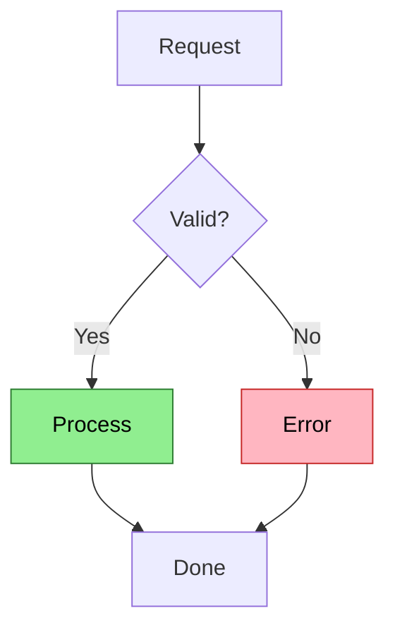
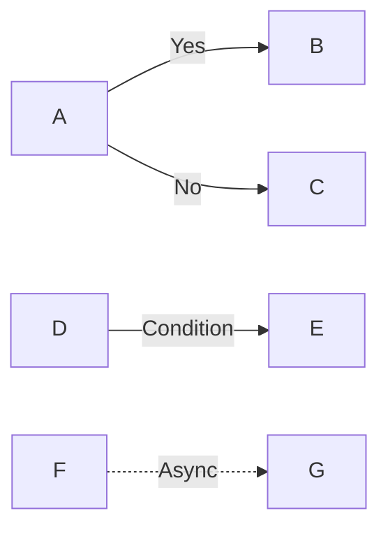
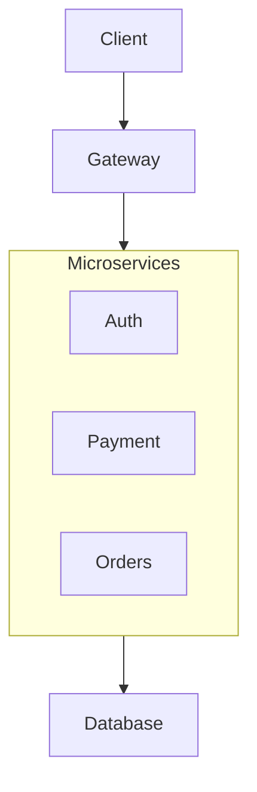
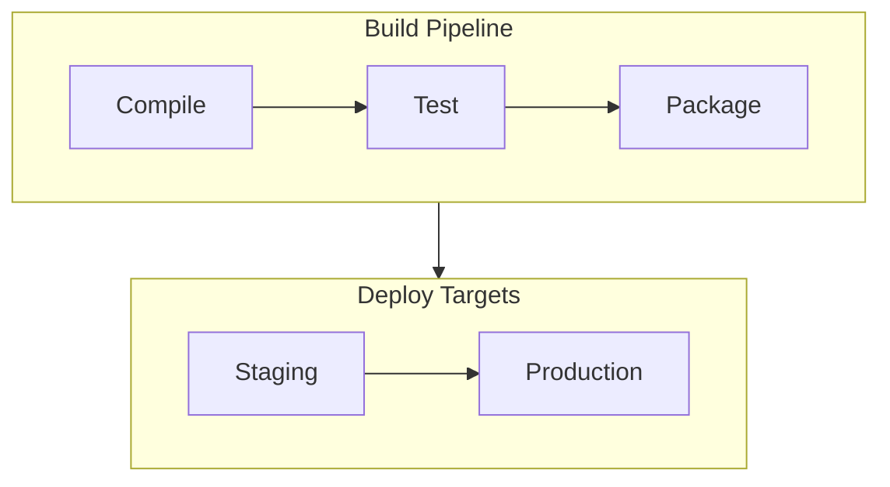
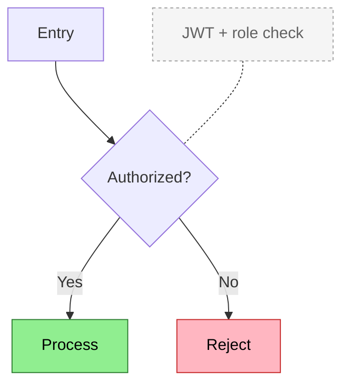

# Flowchart Reference

**Use for**: Processes with branches, decision trees, algorithms, validation logic

**Don't use for**: Linear sequences (list), multi-party interactions (sequence), state transitions (state diagram)

---

## Basic Syntax


*Colors: Green = success path, Red = error path*

---

## Direction Options

| Syntax | Direction |
|--------|-----------|
| `TD` or `TB` | Top to bottom (default) |
| `LR` | Left to right |
| `BT` | Bottom to top |
| `RL` | Right to left |

**Tip**: Use `LR` for cascading decisions, `TD` for process flows with shared sinks.

---

## Node Shapes

| Syntax | Shape | Use for |
|--------|-------|---------|
| `A[text]` | Rectangle | Standard steps |
| `A(text)` | Rounded rectangle | Softer steps |
| `A{text}` | Diamond | Decisions |
| `A([text])` | Stadium | Start/end |
| `A((text))` | Circle | Connectors |
| `A(((text)))` | Double circle | Critical/terminal states |
| `A[[text]]` | Subroutine | Subprocess |
| `A[(text)]` | Cylinder | Database/storage |
| `A{{text}}` | Hexagon | Preparation/setup |
| `A[/text/]` | Parallelogram | Input |
| `A[\text\]` | Parallelogram (alt) | Output |
| `A[/text\]` | Trapezoid | Manual operation |
| `A[\text/]` | Trapezoid (alt) | Inverse manual |
| `A>text]` | Asymmetric | Signal/flag |

**Markdown in nodes** (wrap in backtick-quotes):

```
A["`**Bold** and *italic*`"]
B["`Line one
Line two`"]
```

---

## Edge Labels



| Syntax | Style |
|--------|-------|
| `-->` | Solid arrow |
| `---` | Solid line |
| `-.->` | Dotted arrow |
| `-.-` | Dotted line (for notes) |
| `==>` | Thick arrow |
| `--text-->` | Labeled edge |
| `-->|text|` | Labeled edge (alt) |
| `<-->` | Bidirectional arrow |
| `---o` | Circle endpoint |
| `---x` | Cross endpoint |
| `o--o` | Circle both ends |
| `x--x` | Cross both ends |
| `~~~` | Invisible link (layout only) |

### Link Length Control

Extra dashes push nodes further apart (each extra dash = one additional rank):

| Normal | +1 rank | +2 ranks |
|--------|---------|----------|
| `-->` | `--->` | `---->` |
| `---` | `----` | `-----` |
| `-.->` | `-..->` | `-...->` |
| `==>` | `===>` | `====>` |

Useful when the layout engine places nodes too close together.

### Chaining

Connect multiple nodes in one statement:

```
A --> B --> C --> D
```

Fan-out and fan-in with `&`:

```
A & B --> C & D
```

This creates four edges: A→C, A→D, B→C, B→D.

---

## Group-Level Relationships

When many nodes share a relationship, connect to the subgraph:



### Subgraph Direction Override

Each subgraph can have its own flow direction:



Nested subgraphs are supported — subgraphs can contain subgraphs.

---

## Notes for Context

Add detail without cluttering the flow:


*Colors: Green = success, Red = error, Gray dashed = contextual note*

**Warning**: Notes often cause edge crossings on diverging branches. Alternatives:
1. Put context in node labels with colors
2. Use edge labels instead
3. Move details to prose below diagram

---

## Styling

### Node classes

```
classDef hot fill:#FFB6C1,stroke:#C62828,color:#000
A:::hot --> B
```

Apply to multiple nodes: `class A,B,C hot`

### Link styling (by declaration order, 0-indexed)

```
linkStyle 0 stroke:#ff3,stroke-width:4px
linkStyle 1,2 stroke:blue,color:red
```

### Inline node style

```
style A fill:#f9f,stroke:#333,stroke-width:4px
```

### Icons in nodes

```
A[fa:fa-check Passed]
B[fa:fa-times Failed]
C[fa:fa-spinner Processing]
```

FontAwesome icons render inline with the label text.

---

## Best Practices

- Use diamonds `{}` for decisions (visually distinct)
- Color-code paths (success/error/info)
- Keep to 12 nodes max (split complex flows)
- Label edges with conditions `|Yes|` `|No|`
- Use subgraphs for logical grouping
- Use invisible links `~~~` to fix awkward layouts without visible clutter
- Use `&` chaining for fan-out/fan-in instead of repeating edges
- Use bidirectional `<-->` for mutual dependencies

---

## Special Characters

- Quote labels with spaces or special chars: `A["Process (async)"]`
- Escape `>`, `<` in labels: `-->|"> 1MB"|`
- Avoid bare `end` as a label — use `["End"]` or `["END"]`
- Space before `o` or `x` in labels to avoid triggering circle/cross endpoints: `A["o text"]`
- Entity codes for symbols: `#35;` for `#`, `#quot;` for `"`

---

## Common Mistakes

- Using for linear sequences (cardinal sin)
- Too many nodes (>15)
- Unclear decision conditions
- Missing error paths
- Unlabeled edges leaving decisions

---

## Layout Troubleshooting

If edges overlap:
1. Change declaration order (nodes laid out in declaration order)
2. Try different direction (`LR` vs `TD`)
3. Use ELK layout engine for complex routing:
   ```yaml
   ---
   config:
     layout: elk
   ---
   ```
4. Add intermediate layer between diverge and converge
5. Split into multiple diagrams

---

*Flowcharts show branching logic. No branches = use a list.*
