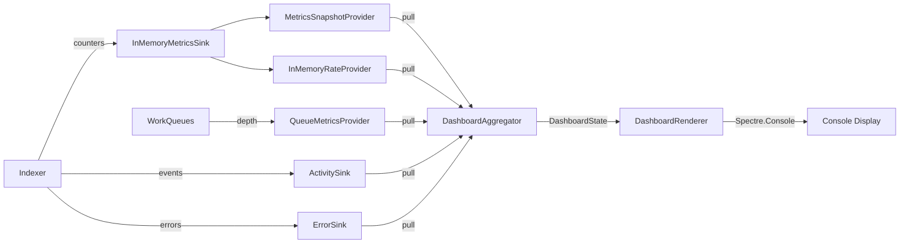

# RepoQL Live Dashboard - Technical Design

## Overview

A real-time console dashboard for RepoQL indexing operations using Spectre.Console, providing live visibility into repository indexing progress, file system events, and system metrics with minimal performance impact.

## Design Principles

1. **Zero Impact**: Dashboard must not degrade indexing performance
2. **Pull-Based**: Aggregator pulls metrics rather than push from hot paths
3. **Bounded Resources**: All buffers and collections have fixed caps
4. **Graceful Degradation**: Dashboard failures never crash the indexer
5. **Single Layout**: One adaptive layout switching between Indexing/Watch modes

## Architecture

### Component Hierarchy

```
┌─────────────────────────────────────────────────────────────┐
│                    DashboardHostedService                    │
│  (IHostedService - manages lifecycle)                        │
├──────────────────────┬──────────────────────────────────────┤
│  DashboardAggregator │         DashboardRenderer            │
│  (Collects metrics)  │      (Spectre.Console UI)            │
├──────────────────────┴──────────────────────────────────────┤
│                    Data Providers Layer                      │
│  ┌────────────────┐ ┌──────────────┐ ┌──────────────┐      │
│  │MetricsSnapshot │ │QueueMetrics  │ │ActivitySink  │      │
│  │   Provider     │ │  Provider    │ │  ErrorSink   │      │
│  └────────────────┘ └──────────────┘ └──────────────┘      │
├──────────────────────────────────────────────────────────────┤
│                   Existing Systems                           │
│  ┌────────────────┐ ┌──────────────┐ ┌──────────────┐      │
│  │IndexingMetrics │ │ WorkQueue<T> │ │ Repository   │      │
│  │InMemorySink    │ │              │ │   Indexer    │      │
│  └────────────────┘ └──────────────┘ └──────────────┘      │
└─────────────────────────────────────────────────────────────┘
```

### Threading Model

- **Indexer Thread Pool**: Existing classification/parsing workers (unchanged)
- **Aggregator Timer**: Single timer thread collecting metrics every 250ms
- **Renderer Thread**: Dedicated thread for Spectre.Console UI refresh (500ms)
- **Main Thread**: ASP.NET Core host and gRPC services

### Data Flow



## Core Components

### 1. DashboardHostedService

**Purpose**: Manages dashboard lifecycle within ASP.NET Core host

```csharp
public sealed class DashboardHostedService : IHostedService
{
    Task StartAsync(CancellationToken cancellationToken);  // Start aggregator, then renderer
    Task StopAsync(CancellationToken cancellationToken);   // Stop renderer, then aggregator
}
```

### 2. DashboardAggregator

**Purpose**: Periodically collects metrics and builds immutable state snapshots

```csharp
public sealed class DashboardAggregator : IAsyncDisposable
{
    Task StartAsync(CancellationToken cancellationToken);
    DashboardState Current { get; }  // Volatile reference, atomically updated
    
    // Internal: Timer-based collection every 250ms
    private async Task CollectMetrics()
    {
        var metrics = _metricsProvider.GetSnapshot();
        var rates = _rateProvider.Sample();
        var queues = _queueProvider.GetAll();
        var activity = _activitySink.Snapshot(50);
        var errors = _errorSink.Snapshot(10);
        
        var newState = new DashboardState { ... };
        Volatile.Write(ref _current, newState);
    }
}
```

### 3. DashboardRenderer

**Purpose**: Renders Spectre.Console UI from state snapshots

```csharp
public sealed class DashboardRenderer
{
    private Layout _layout;  // Reused layout instance
    
    Task StartAsync(Func<DashboardState> getState, CancellationToken token);
    
    // CRITICAL: Updates existing layout regions to prevent flicker
    // Does NOT create new Layout() on each refresh
    private void UpdateLayout(DashboardState state)
    {
        _layout["Header"].Update(RenderHeader(state));
        _layout["Activity"].Update(RenderActivity(state));
        _layout["ModePanel"].Update(RenderModePanel(state));
        _layout["Errors"].Update(RenderErrors(state));
        _layout["Hotspots"].Update(RenderHotspots(state));
    }
}
```

**Visual Output**: Matches DashboardIdeation.md exactly:
- Header with repo path, mode, uptime, DB state, thread count
- KPI line with files, artifacts, nodes, edges, error counts
- Activity panel (left) showing recent operations with color-coded stages
- Mode-adaptive right panel (Progress bars in Indexing, FS events in Watch)
- Errors panel showing last N errors with timestamps
- Hotspots showing slowest files

### 4. DashboardState

**Purpose**: Immutable snapshot of all dashboard data

```csharp
public sealed record DashboardState
{
    public DateTimeOffset Timestamp { get; init; }
    public DashboardMode Mode { get; init; }  // Indexing or Watch
    public TimeSpan Uptime { get; init; }
    
    // Metrics
    public MetricsSnapshot Metrics { get; init; }
    public RateSample Rates { get; init; }
    
    // Queues
    public IReadOnlyList<QueueSnapshot> Queues { get; init; }
    
    // Activity & Errors
    public IReadOnlyList<ActivityItem> RecentActivity { get; init; }
    public IReadOnlyList<ErrorItem> RecentErrors { get; init; }
    
    // Progress (for indexing mode)
    public IndexingProgress Progress { get; init; }
}
```

## Data Providers

### MetricsSnapshotProvider

Wraps existing `InMemoryMetricsSink` to provide point-in-time totals:

```csharp
public interface IMetricsSnapshotProvider
{
    MetricsSnapshot GetSnapshot();
}

public sealed record MetricsSnapshot
{
    public long FilesDiscovered { get; init; }
    public long FilesHashed { get; init; }
    public long FilesParsed { get; init; }
    public long FilesIndexed { get; init; }
    public long NodesExtracted { get; init; }
    public long EdgesCreated { get; init; }
    public long BytesProcessed { get; init; }
    public long ErrorCount { get; init; }
}
```

### QueueMetricsProvider

Reads queue metrics from `InMemoryMetricsSink` (published by `WorkQueue<T>` ObservableGauges):

```csharp
public interface IQueueMetricsProvider
{
    IReadOnlyList<QueueSnapshot> GetAll();
}

public sealed class QueueMetricsProvider : IQueueMetricsProvider
{
    private readonly InMemoryMetricsSink _sink;
    
    public QueueMetricsProvider(InMemoryMetricsSink sink)
    {
        _sink = sink;
    }
    
    public IReadOnlyList<QueueSnapshot> GetAll()
    {
        // WorkQueue<T> publishes metrics as:
        // repoql.queue.{name}.depth
        // repoql.queue.{name}.capacity
        // repoql.workers.active
        
        return new[]
        {
            new QueueSnapshot
            {
                Name = "classification",
                Depth = (int)_sink.GetTotal("repoql.queue.classification.depth"),
                Capacity = (int)_sink.GetTotal("repoql.queue.classification.capacity"),
                ActiveWorkers = (int)_sink.GetTotal("repoql.workers.active") / 2 // Split between queues
            },
            new QueueSnapshot
            {
                Name = "parsing",
                Depth = (int)_sink.GetTotal("repoql.queue.parsing.depth"),
                Capacity = (int)_sink.GetTotal("repoql.queue.parsing.capacity"),
                ActiveWorkers = (int)_sink.GetTotal("repoql.workers.active") / 2
            }
        };
    }
}

public sealed record QueueSnapshot
{
    public string Name { get; init; }        // "classification" or "parsing"
    public int Depth { get; init; }          // Current items in queue
    public int Capacity { get; init; }       // Max capacity
    public int ActiveWorkers { get; init; }  // Workers processing
}
```

### ActivitySink & ErrorSink

Bounded ring buffers for recent events:

```csharp
public interface IActivitySink
{
    void Add(ActivityItem item);  // Non-blocking, drops oldest if full
    IReadOnlyList<ActivityItem> Snapshot(int maxItems);
}

public interface IErrorSink
{
    void Report(Exception ex, string context);
    IReadOnlyList<ErrorItem> Snapshot(int maxItems);
    int TotalCount { get; }
}
```

## Integration Points

**Key Insight**: The dashboard integrates entirely through existing observability mechanisms - no modifications to RepositoryIndexer or WorkQueue required.

### 1. Metrics Integration

```csharp
// In RepoIndexerServiceCollectionExtensions.cs
services.AddSingleton<InMemoryMetricsSink>();
services.AddSingleton<InMemoryRateProvider>();
services.AddSingleton<IMetricsSnapshotProvider, MetricsSnapshotProvider>();
```

### 2. Queue Integration

```csharp
// WorkQueue<T> already publishes metrics via ObservableGauge to the Meter
// These are automatically collected by InMemoryMetricsSink
// QueueMetricsProvider reads from the sink (see Data Providers section above)
```

### 3. Activity Integration

```csharp
// ActivitySink subscribes to RepositoryIndexer's IObservable<IndexerEvent>
public class ActivitySink : IActivitySink, IObserver<IndexerEvent>
{
    public void OnNext(IndexerEvent value)
    {
        var item = value switch
        {
            IRepositoryIndexer.ItemIndexedEvent e => new ActivityItem
            {
                Timestamp = DateTimeOffset.UtcNow,
                Stage = "indexed",
                Subject = e.CurrentUri.ToString(),
                Result = $"OK {e.MediaType}"
            },
            IRepositoryIndexer.ItemDiscoveredEvent e => new ActivityItem
            {
                Timestamp = DateTimeOffset.UtcNow,
                Stage = "discover",
                Subject = e.CurrentUri.ToString(),
                Result = "OK"
            },
            IRepositoryIndexer.ItemClassifiedEvent e => new ActivityItem
            {
                Timestamp = DateTimeOffset.UtcNow,
                Stage = "classify",
                Subject = e.CurrentUri.ToString(),
                Result = e.MediaType.ToString()
            },
            _ => null
        };
        
        if (item != null) Add(item);
    }
}

// In DashboardHostedService.StartAsync:
var subscription = _repositoryIndexer.Subscribe(_activitySink);
```

### 4. Error Integration

```csharp
// Custom logging provider captures errors
public sealed class DashboardLoggingProvider : ILoggerProvider
{
    public ILogger CreateLogger(string categoryName)
    {
        return new DashboardLogger(_errorSink, categoryName);
    }
}
```

## Update Strategy

### Pull-Based Collection

- **Interval**: 250ms for aggregator, 500ms for renderer
- **Rationale**: Predictable overhead, no backpressure on indexer
- **Implementation**: `PeriodicTimer` for aggregator, `AnsiConsole.Live` refresh for renderer

### State Management

```csharp
// Atomic state updates in aggregator
private DashboardState _current = DashboardState.Empty;

private void UpdateState(DashboardState newState)
{
    Volatile.Write(ref _current, newState);
}

// Lock-free reads in renderer
var state = Volatile.Read(ref _aggregator.Current);
```

## Mode Switching

Dashboard adapts layout based on indexing phase:

### Indexing Mode
- Shows progress bars for discover/hash/parse/index stages
- Displays queue depths and worker counts
- Emphasizes throughput rates

### Watch Mode
- Shows file system events feed
- Displays reindexing activity
- Emphasizes event rates and latency

Mode detection:
```csharp
var mode = _queues.Any(q => q.Depth > 100) 
    ? DashboardMode.Indexing 
    : DashboardMode.Watch;
```

## Rendering Strategy (Flicker Prevention)

### Layout Reuse Pattern

The renderer MUST reuse the same `Layout` instance throughout the session to prevent flickering:

```csharp
public sealed class DashboardRenderer
{
    private readonly Layout _rootLayout;
    
    public DashboardRenderer()
    {
        // Create layout structure ONCE at initialization
        _rootLayout = new Layout("Root")
            .SplitRows(
                new Layout("Header").Size(3),
                new Layout("Body").SplitColumns(
                    new Layout("Left").SplitRows(
                        new Layout("Activity").Ratio(3),
                        new Layout("Hotspots").Ratio(1)
                    ),
                    new Layout("Right").SplitRows(
                        new Layout("ModePanel").Ratio(2),
                        new Layout("Errors").Ratio(1)
                    )
                ),
                new Layout("Footer").Size(1)
            );
    }
    
    public async Task StartAsync(Func<DashboardState> getState, CancellationToken token)
    {
        await AnsiConsole.Live(_rootLayout)
            .AutoClear(false)
            .Overflow(VerticalOverflow.Crop)
            .StartAsync(async ctx =>
            {
                while (!token.IsCancellationRequested)
                {
                    var state = getState();
                    UpdateLayoutRegions(state);  // Update regions, not layout
                    ctx.Refresh();  // Refresh with same layout instance
                    await Task.Delay(500, token);
                }
            });
    }
    
    private void UpdateLayoutRegions(DashboardState state)
    {
        // Update ONLY the content of each region
        // Never create new Layout() or structural changes
        _rootLayout["Header"].Update(RenderHeader(state));
        _rootLayout["Activity"].Update(RenderActivity(state));
        _rootLayout["ModePanel"].Update(RenderModePanel(state));
        _rootLayout["Errors"].Update(RenderErrors(state));
        _rootLayout["Hotspots"].Update(RenderHotspots(state));
        _rootLayout["Footer"].Update(RenderFooter(state));
    }
}
```

### Anti-Patterns to Avoid

❌ **Creating new layouts**:
```csharp
// WRONG - causes flicker
ctx.UpdateTarget(new Layout()...);  
```

❌ **Recreating renderables unnecessarily**:
```csharp
// WRONG - creates new table every time
return new Table()...;
```

✅ **Correct approach**:
```csharp
// RIGHT - update existing regions
_layout["Activity"].Update(updatedTable);
```

## Performance Considerations

### Resource Bounds

- **Activity buffer**: 200 items max
- **Error buffer**: 50 items max  
- **Display items**: 10-20 per panel
- **String caching**: Format once per state update
- **Collection reuse**: Minimize allocations

### CPU Budget

- **Aggregator**: <1ms per tick (250ms interval = 0.4% CPU)
- **Renderer**: <10ms per frame (500ms interval = 2% CPU)
- **Total overhead**: Target <3% CPU usage

### Memory Usage

- **State size**: ~10KB per snapshot
- **Ring buffers**: ~50KB total
- **String cache**: ~20KB
- **Total footprint**: <100KB

## Error Handling

### Resilience Strategy

1. **Renderer crashes**: Catch, log, disable UI, continue indexing
2. **Aggregator failures**: Keep last known state, show stale indicator
3. **Console unavailable**: Detect non-TTY, fallback to periodic logs
4. **Metrics read errors**: Use cached values, increment error counter

### Graceful Degradation

```csharp
try 
{
    var metrics = _metricsProvider.GetSnapshot();
    // ... update state
}
catch (Exception ex)
{
    _logger.LogWarning(ex, "Dashboard metrics collection failed");
    // Keep using last known good state
    state = state with { IsStale = true };
}
```

## Startup Sequence

1. **Host starts services**
2. **InMemoryMetricsSink begins collecting**
3. **RepositoryIndexer starts (existing)**
4. **DashboardHostedService.StartAsync**:
   - Create aggregator with providers
   - Start aggregator timer
   - Create renderer with state accessor
   - Start renderer thread
5. **Initial render shows "Initializing..."**
6. **First aggregation provides real data**

## Shutdown Sequence

1. **Host signals shutdown**
2. **DashboardHostedService.StopAsync**:
   - Cancel renderer (final render)
   - Stop aggregator timer
   - Dispose AnsiConsole.Live
   - Restore console state
3. **Indexer continues shutdown (existing)**

## Configuration

```csharp
public sealed class DashboardOptions
{
    public bool Enabled { get; set; } = true;
    public int AggregatorIntervalMs { get; set; } = 250;
    public int RendererIntervalMs { get; set; } = 500;
    public int ActivityBufferSize { get; set; } = 200;
    public int ErrorBufferSize { get; set; } = 50;
    public bool ShowActivityFeed { get; set; } = true;
    public bool ShowHotspots { get; set; } = true;
}
```

## Testing Strategy

### Unit Tests
- Mock providers return deterministic data
- Verify state aggregation logic
- Test bounded buffer overflow behavior

### Integration Tests
- In-memory file system with known file count
- Verify metrics flow end-to-end
- Test mode switching logic

### Performance Tests
- Measure aggregator/renderer CPU usage
- Verify memory bounds are respected
- Test with high-frequency events

## Implementation Phases

### Phase 1: Core Infrastructure
- [ ] DashboardHostedService skeleton
- [ ] DashboardAggregator with timer
- [ ] Basic DashboardState record
- [ ] Wire up InMemoryMetricsSink

### Phase 2: Data Collection
- [ ] MetricsSnapshotProvider
- [ ] QueueMetricsProvider  
- [ ] ActivitySink implementation
- [ ] ErrorSink implementation

### Phase 3: Rendering
- [ ] Port DashboardIdeation layout
- [ ] DashboardRenderer with Spectre.Console
- [ ] Mode switching logic
- [ ] Progress bar calculations

### Phase 4: Integration
- [ ] Hook into RepositoryIndexer events
- [ ] Add logging provider
- [ ] Configuration and options
- [ ] Error handling and resilience

### Phase 5: Polish
- [ ] Performance optimization
- [ ] Hotspot tracking
- [ ] Keyboard shortcuts
- [ ] Documentation

## Success Criteria

1. **Performance**: <3% CPU overhead, <100KB memory
2. **Responsiveness**: Updates visible within 1 second
3. **Reliability**: No indexer crashes due to dashboard
4. **Usability**: Clear progress indication, readable at a glance
5. **Maintainability**: Clean separation from indexer core

## Open Questions

1. Should we add pause/resume controls for the indexer?
2. Do we need historical metrics (last 5 minutes graph)?
3. Should errors be persisted to disk for post-mortem?
4. Is 500ms refresh rate sufficient for smooth progress bars?
5. Should we support multiple concurrent repositories?

## References

- [DashboardIdeation.md](./DashboardIdeation.md) - Original GPT-5 mock implementation
- [Spectre.Console Live Display](https://spectreconsole.net/live/live-display)
- [System.Diagnostics.Metrics](https://docs.microsoft.com/en-us/dotnet/core/diagnostics/metrics)