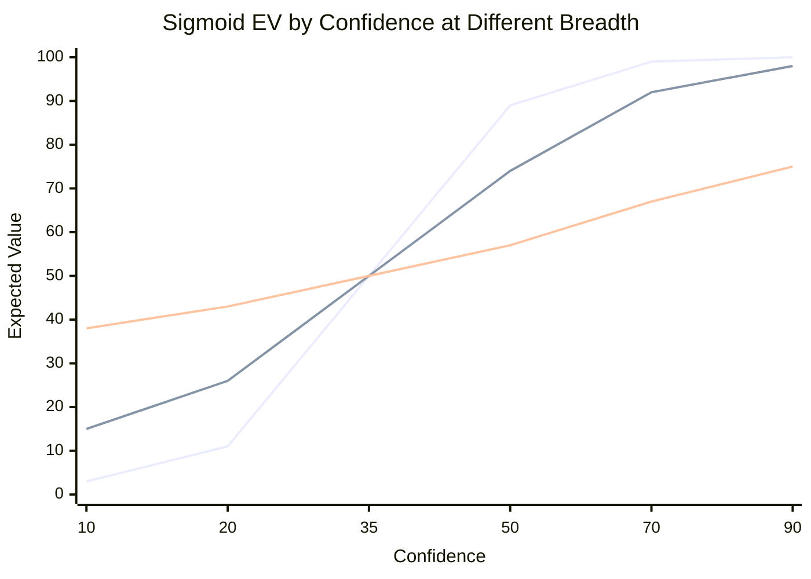
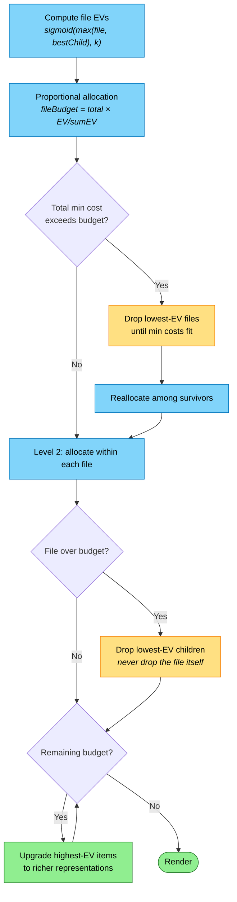
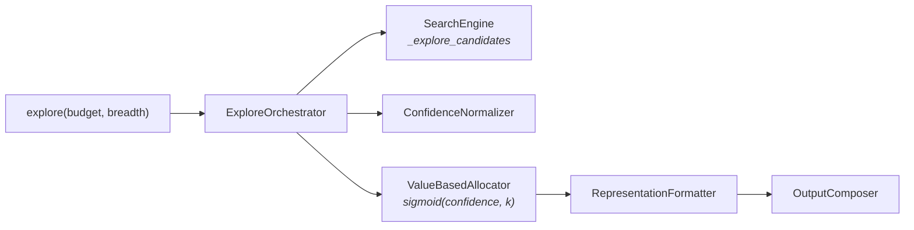

# Explore Design

## Context

Explore is the discovery tool. An agent doesn't know what exists — explore searches wide, ranks by relevance, and allocates token budget to surface what matters. The agent sees the landscape before committing tokens to reading.

Explore is a pure function of two inputs:

1. **Budget** — how many tokens to spend (default 2000)
2. **Breadth** — how to distribute them (1–10, default 5)

Everything else derives from these two numbers.

---

## Scoring Pipeline

Explore delegates scoring to `search_pipeline`, the single scoring authority shared with `search()`. Scores arrive as a weighted blend of three signals:

```
score = 0.30 × bm25 + 0.15 × fuzzy + 0.55 × semantic
```

The `search_pipeline` macro applies floor normalization — subtracts the noise floor (0.33, the output of `Combine()` for zero lexical + weak semantic) and rescales to [0, 1]. This means a score of 0.0 is genuinely irrelevant, not "low confidence."

`_explore_candidates` wraps `search_pipeline` with document promotion: when a child object scores higher than its parent document, the document's score is lifted to `best_child × 0.9`. This ensures high-scoring methods pull their containing file into the results.

`ConfidenceNormalizer` then maps [0, 1] scores to 1–100 integer confidence — a direct `score × 100` scaling. No sigmoid, no bucketing. The scores are already honest.

---

## Budget Allocation

Two-level hierarchical allocation. Breadth controls the curve shape via a sigmoid.

The pipeline, in order:

1. **Search** — `_explore_candidates` scores documents and objects via `search_pipeline`
2. **Normalize** — map floor-normalized [0, 1] scores to 1–100 confidence
3. **Level 1** — files compete for budget proportional to sigmoid EV
4. **Level 2** — within each file, file and children compete for representation
5. **Render** — pick richest representation that fits each item's budget

### The Sigmoid

Breadth controls the steepness of a sigmoid applied to confidence scores before proportional allocation:

```
k = 14.0 − (breadth − 1) × (12.0 / 9.0)
EV(confidence) = 1 / (1 + e^(−k × (confidence/100 − 0.35)))
```



*At breadth 1, a 20% confidence result gets 11% EV while a 70% result gets 99% — the top result takes almost everything. At breadth 10, the same pair gets 43% vs 67% — budget is spread much more evenly.*

### The Allocation Process



*Blue = compute/allocate steps. Yellow = drop steps (budget pressure forces cuts). Green = output and upgrades. Decisions are uncolored diamonds — shape alone distinguishes them.*

### Children Limits

Breadth controls max children shown per file:

| Breadth | Max Children |
|---------|-------------|
| 1–2 | 8 |
| 3–4 | 6 |
| 5–6 | 5 |
| 7–8 | 3 |
| 9–10 | 2 |

When children are omitted, `OmittedChildrenCount` shows how many were cut.

---

## Representation Levels

Four levels, driven by per-result budget — not a global mode.

| Level | Content | Tokens |
|-------|---------|--------|
| **Minimal** | URI only | ~5–15 |
| **Compact** | URI + headline | ~20–80 |
| **Standard** | URI + headline + structure | ~70–280 |
| **Rich** | URI + snippet (code) | ~60–530 |

**Minimal** is only used at high breadth (≥8). At lower breadth, URIs are too valuable to omit — Compact is the floor.

**Rich** omits headline because the snippet IS the content. No redundancy.

Content fallback: `snippet → structure → headline → filename`. Filename always exists, so rendering never fails.

### Per-Result Depth Ceiling

Explore never shows raw code that can't be followed up on. Everything in the output must be a URI or contain the ingredients to construct one.

Maximum useful depth per result: ~500–600 tokens (full structure + addressable `#symbol=Name` URIs with signatures). Beyond that is `read`'s job.

At low breadth with high budget, surplus tokens go to **more results at moderate depth** — not deeper content on the top result.

---

## Search Strategy

Breadth drives search aggressiveness via `QueryStrategy`:

| Breadth | Document Limit | Objects Per Doc | Behavior |
|---------|---------------|-----------------|----------|
| 1–2 | 15 | 8 | Deep — few docs, many objects |
| 3–4 | 20 | 6 | Moderate |
| 5–6 | 25 | 5 | Balanced |
| 7–8 | 35 | 3 | Wide — many docs, few objects |
| 9–10 | 50 | 0 | Inventory — documents only |

High breadth (≥8) without keywords: documents only (inventory scan). Objects are only fetched when there's a question to match against.

Snippet limits are dynamic, derived from breadth and token budget:

```
perFileBudget = tokenBudget / boundedResultCount
snippetsFromBudget = perFileBudget / averageSnippetCost
dynamicLimit = max(minSnippetsPerFile, snippetsFromBudget)
limit = min(maxForBreadth, dynamicLimit)
```

---

## Output Format

### Confidence Display

```
 98% [method] file:///src/Auth/JwtService.cs#line=42,58
```

Right-aligned to 4 chars. Omitted when no search criteria (all scores equal).

### Layout

- Multi-line items (structure, snippet): blank line before and after
- Single-line items (headline): packed tight
- Truncation: `[N more, X-Y%]` with search criteria, `[N more]` without

### Status Footer

```
[1.8k tok | 1.1s | index: ready | semantic: ready]
```

Always present. Shows tokens used, latency, index/semantic readiness.

---

## Examples

### Breadth 2, Budget 2000 (Deep Inspection)

Few results, maximum depth. Top result shows code; second shows structure with children.

     98% [method] file:///src/Auth/JwtService.cs#line=42,58
    public ClaimsPrincipal ValidateToken(string token)
    {
        var handler = new JwtSecurityTokenHandler();
        var principal = handler.ValidateToken(token, _validationParams, out _);
        return principal;
    }

     92% file:///src/Auth/AuthService.cs
    AuthService - Authentication orchestration
      +ValidateCredentials(string, string) → Task<AuthResult>
      +RevokeToken(string) → Task<bool>
       85% [method] #symbol=ValidateCredentials
        Validates user credentials against the store
       78% [method] #symbol=RevokeToken
        Revokes a JWT refresh token

    [3 more, 40-55%]
    [1.9k tok | 0.8s | index: ready | semantic: ready]

### Breadth 5, Budget 2000 (Balanced)

More results, moderate depth. Headlines and top children.

     95% file:///src/Auth/AuthService.cs
    AuthService - Authentication orchestration
       92% [method] #symbol=ValidateCredentials
       85% [method] #symbol=RevokeToken

     88% file:///src/Auth/JwtService.cs
    JwtService - JWT token generation and validation

     82% file:///src/Auth/TokenCache.cs
    TokenCache - Distributed token caching

     75% file:///src/Middleware/AuthMiddleware.cs
    AuthMiddleware - Authentication pipeline middleware

    [8 more, 40-65%]
    [1.8k tok | 0.6s | index: ready | semantic: ready]

### Breadth 9, Budget 1000 (Wide Inventory)

Maximum results, URI-only. Inventory scan.

    file:///src/Auth/AuthService.cs
    file:///src/Auth/JwtService.cs
    file:///src/Auth/TokenCache.cs
    file:///src/Auth/AuthOptions.cs
    file:///src/Middleware/AuthMiddleware.cs
    file:///src/Auth/ClaimsTransformer.cs
    [12 more]
    [0.9k tok | 0.4s | index: ready | semantic: ready]

---

## Architecture



*The orchestrator coordinates three independent concerns: search (what exists), normalization (how confident), and allocation (how much budget). These converge through formatting into rendered output.*

### Key Files

| Component | File |
|-----------|------|
| Orchestrator | `ExploreOrchestrator.cs` |
| Allocator | `ValueBasedAllocator.cs` |
| Composer | `OutputComposer.cs` |
| Formatter | `RepresentationFormatter.cs` |
| Estimator | `ExploreTokenEstimator.cs` |
| Normalizer | `Search/ConfidenceNormalizer.cs` |
| Search | `Search/IExploreSearchEngine.cs` |
| Query Strategy | `Search/QueryStrategy.cs` |
| File Grouper | `Search/FileGrouper.cs` |
| Types | `Search/SearchTypes.cs` |

---

## Design Properties

- **Pure function**: No side effects, no state, deterministic
- **Budget as contract**: Never exceeds declared token budget. Overspend wastes context. Underspend leaves value on the table.
- **Graceful degradation**: Always produces useful output, even with zero search results
- **Composable**: breadth × budget produces the full behavior space
- **Single scoring authority**: `search_pipeline` scores once; explore allocates and renders
- **No global modes**: Representation driven by per-result budget, not a flag
